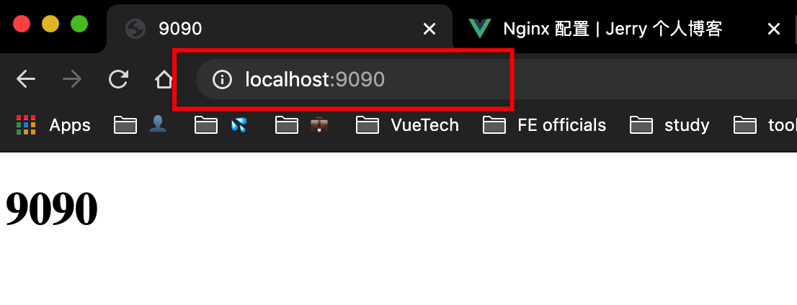
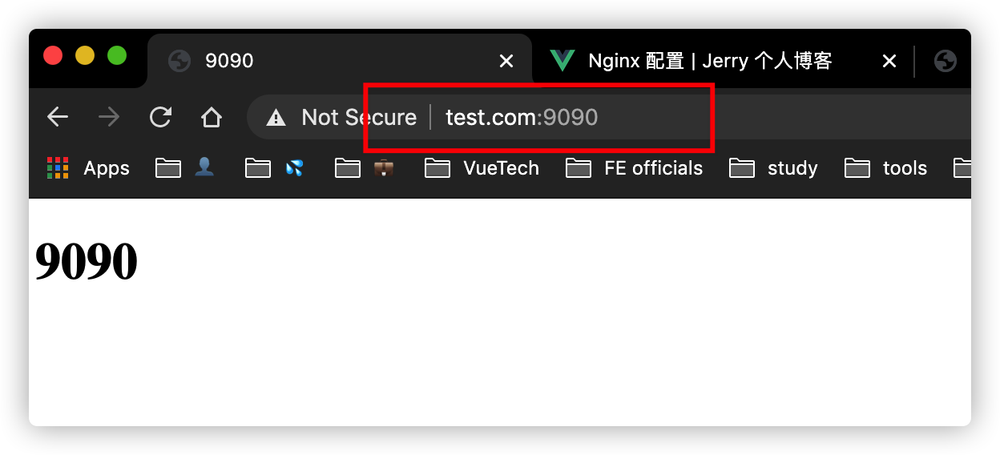
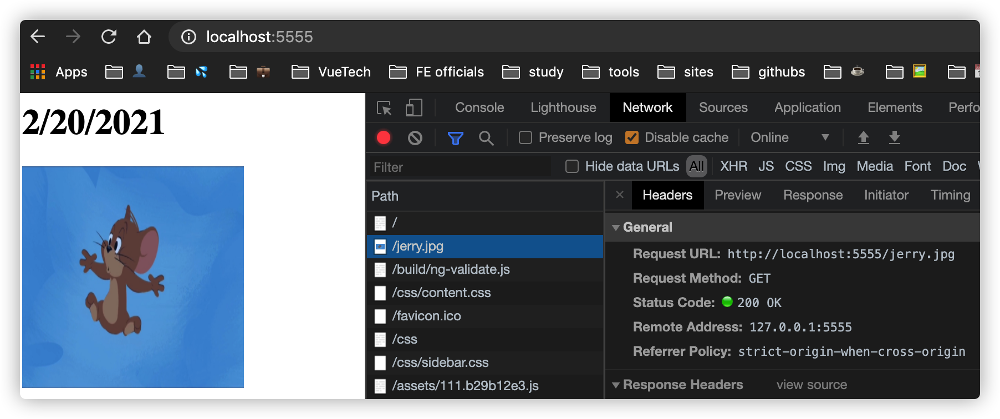

# Nginx 配置

## 配置文件简介

nginx 的配置文件一般是：`/usr/local/etc/nginx/nginx.conf` 文件。它由三大部分组成：

- **全局块**

  主要配置一些影响 nginx 服务器全局整体运行的指令。比如 `worker_processes` 等。

- **events 块**

  主要配置一些影响服务器与用户的网络连接的指令。比如 `worker_connections` 等。

- **http 块**

  是 nginx 中配置最频繁的部分，他也可分为两小部分：
  - **http 全局块**：配置 MIME-TYPE，日志，连接超时时间，gzip 压缩，单连接请求上限等。
  - **server 块**：可以看作是一个虚拟主机，可以配置多个。

## 常见配置实例

**准备工作**：

1. 安装 http-server 来在本地启动 http 服务

```
npm i -g http-server
```

2. 新建一个文件夹 server-9090，在里面新建一个 index.html 文件：

```html
<!-- ...省略其他... -->
<body>
  <h1>9090</h1>
</body>
```

3. 在 server-9090 目录下运行：

```bash
http-server -p 9090
```

接着在浏览器就能看到我们的页面：



4. 修改 hosts 文件

我打算在本地弄一个假的域名来做测试，所以我要修改 /etc/hosts 文件来做本地的 dns 映射，在 hosts 文件上加上这样的一行：

```sh
192.168.1.9 www.test.com
# 192.168.1.9 是我本机的 ip 地址
```

然后使用域名来访问我们之前的网页：



如果修改完 hosts 文件没有生效，尝试刷新 dns 缓存，或者关闭本地的一些代理软件等。刷新 dns 缓存命令：

```bash
sudo dscacheutil -flushcache
```

### 反向代理

打开 nginx.conf 文件，找到 server 块，按照如下内容修改：

```{3,4,12}
# others ...
server {
    listen       80;
    server_name  www.test.com;

    #charset koi8-r;

    #access_log  logs/host.access.log  main;

    location / {
        root   html;
        proxy_pass http://127.0.0.1:9090;
        index  index.html index.htm;
    }
    # others ...
}
```

我们只在原有的基础上修改了三处：

1. 修改了默认的监听端口，从 8080 改到 80
2. 修改 server_name 为我们刚刚配置的域名 www.test.com
3. 在 location 块中添加了一行 proxy_pass 配置

以上配置的大致意思可以简单的理解为：当你访问 www.test.com 的时候，nginx 会为你转发到你 http://127.0.0.1:9090 上来。我们来看一下效果：


可以看到，直接输入域名，正常的访问到了我们 http-server 下的一个服务（9090的那个网页），证明我们的配置生效了。这样，一个简单的反向代理配置就完成了。

### 反向代理2 - 多路径配置

上例中我们演示了一个简单的反向代理的配置。这里我们接着上例，实现根据不同的路径，跳转到不同的端口的服务中去。

假设我们有两个服务，一个在 9090 端口上，一个在 9091 端口上，我们要实现的是在浏览器中输入 `www.test.com:8888/user` 能跳转到 9090 端口下的服务，输入 `www.test.com:8888/order` 能跳转到 9091 下的服务。

首先，我们需要添加一个 9091 的服务。我们新建一个 server-9091 的文件夹，在里面新建一个 index.html 文件：

```html
<!-- 省略其他... -->
<body>
  <h1 style="color: red;">9091 Order List</h1>
</body>
```

接着在 server-9091 文件夹下，运行 `http-server -p 9091` 来开启我们的服务：


可以看到，我们的 9091 端口下的服务正常运行了，下面我们来配置 nginx，最终实现我们的目标任务。

这里我们就要配置一个 server 块了，在 http 块下，我们加入如下配置：

```
server {
    listen 8888;
    server_name www.test.com;

    location /order {
        proxy_pass http://127.0.0.1:9091/;
    }

    location /user {
        proxy_pass http://127.0.0.1:9090/;
    }
}
```

简单的解释一下上述配置：我们监听了 8888 端口，访问域名为 www.test.com；同时我们还配置了两个 location 块，第一个表示匹配 /order 路径，匹配到以后，转发到我们的 http://127.0.0.1:9091/ 上来，即访问 www.test.com:8888/order 就是访问我们的 http://127.0.0.1:9091/，另一个 location 块同理。

我们来看看效果：


可以看到运行成功，表示我们的配置是正确的。

:::tip
上述配置中 proxy_pass 的值，最后的斜杠 / 是有作用的，即 `proxy_pass http://127.0.0.1:9090/` 与 `proxy_pass http://127.0.0.1:9090` 表达的意思是不同的。

- 对于最后不带有 / 的，即只包含 ip + 端口号的这种方式，nginx 在处理转发时会保留 location 中的 path 部分：

```{2}
location /order {
    proxy_pass http://127.0.0.1:9091;
}
```
这里如果访问 www.test.com:8888/order，相当于访问：http://127.0.0.1:9091/order

- 带有 / 的，即在 ip+端口号 后面有 path 的（单个 / 也算），nginx 在处理的时候会直接**从字面上替换 URI**。

```{2}
location /order {
    proxy_pass http://127.0.0.1:9091/;
}
```

这里如果访问 www.test.com:8888/order，相当于访问：http://127.0.0.1:9091/。也就是直接将原始路径替换成了我们配置的 proxy_pass 的值。那假设我们访问的是 www.test.com:8888/order/book ，那么实际上访问的是 **http://127.0.0.1:9091//book**（注意分析这里的双斜杠 // 的原因）
:::

### 负载均衡

当单台服务器的压力过大时，我们会部署多台机器来将请求分摊，以减小服务器的压力。

假设我们需要实现这样的需求，当访问 www.test.com 时，服务器将我们的请求分摊到 9091 和 9090 这两个服务上。在 nginx 中，我们要这样来配置：


首先在 http 块中新增一个 upstream 块：

```
upstream my_server {
    server 127.0.0.1:9090;
    server 127.0.0.1:9091;
}
```

上述配置表示，我们定义了一个名为 my_server 的 upstream 块，它包含两个服务器的配置，一个 9090 一个 9091。接着修改我们 server 块中的 location 配置：

```{7}
server {
    listen       80;
    server_name  www.test.com;

    location / {
        root   html;
        proxy_pass http://my_server;
        index  index.html index.htm;
    }

    # ... 省略其他 ...
}
```

这样一个简单的负载均衡的配置就完成了，我们来看一下效果。


可以看到，每次刷新都得到 9090 或者 9091 的内容，证明我们的请求被分摊到了这两个服务上。负载均衡的默认策略是 **轮询**，每个请求会按时间顺序逐一分配到不同的后端服务器，所以我们的 9091 和 9090 的内容是随着我们的刷新而交替出现的。


### 动静分离

所谓动静分离，是指将动态请求与静态请求分开。比如我们查询一个用户列表，需要服务器去查询数据库然后返回，这就是动态请求；而我们请求图片，字体，样式文件等资源，这些基本都是静态内容，不会改变。将动态请求和静态请求分开能提交请求的效率，比如负责接口的服务器挂了以后，不会影响到我页面 html，css，js 等静态内容的展示。

使用 nginx 配置动静分离，一般是将静态内容交由 nginx 来处理，当一个静态请求过来时，直接到静态资源目录下去获取；而动态请求，则是将请求转发给对应的服务器去处理。在开始配置之前，我们来做如下的准备工作：

首先我们新建一个 images 文件夹用来存放图片资源，在里面放一张图片 jerry.jpg；

接着再新建一个 node-server 目录，在里面新建一个 index.js 文件，搭建一个简单的 node 服务：

```js
const http = require('http')

http.createServer((req, res) => {
  res.writeHead(200, { 'Content-Type': 'text/html' });
  const currentDate = new Date().toLocaleDateString();
  const html = `
    <h1>${currentDate}</h1>
    
  `
  res.end(html);
}).listen(7777)
```

这是一个非常简单的 node 服务，它监听了 7777 端口，在页面上显示了当前时间，和一张图片。我们访问 localhost:7777 看一下效果：


我们的文字部分是显示出来的，但是图片没有。因为这时候请求的图片地址是 localhost:7777/jerry.jpg，而我们根本没有在 index.js 处理这样的资源，所以显示不出来。

下面我们就来配置 nginx，实现这种动静分离的效果。为了更好的解释，我们这里新建一个 server 块来配置。

```{10}
server {
    listen 5555;
    server_name localhost;

    location / {
        proxy_pass http://localhost:7777;
    }

    location ~ .*\.(gif|jpg|jpeg|bmp|png)$ {
        root /Users/jerry/jerryspace/blog/src/nginx/images;
    }

}
```

配置项也不多，我们访问 / 的时候，转发到了我们的 node 服务上，是个动态请求，由 node 服务器来决定要显示什么内容；而当我们访问 png，gif，jpg 等图片的时候，会以本地的 /Users/jerry/jerryspace/blog/src/nginx/images 为 root 来查找对应的资源。

我们来看一下效果：



可以看到我们的文字和图片都正常显示了，证明我们的动静分离配置生效了。