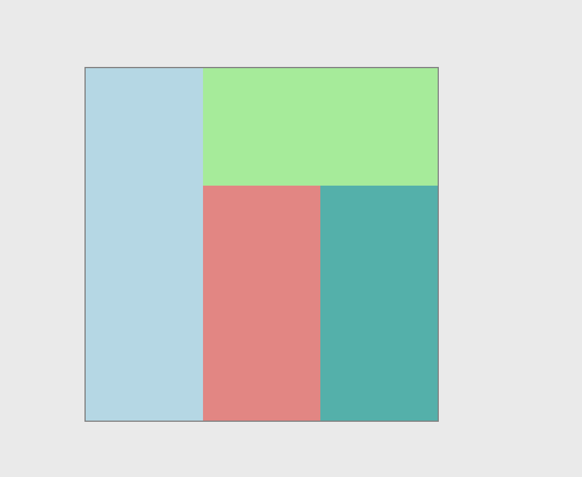
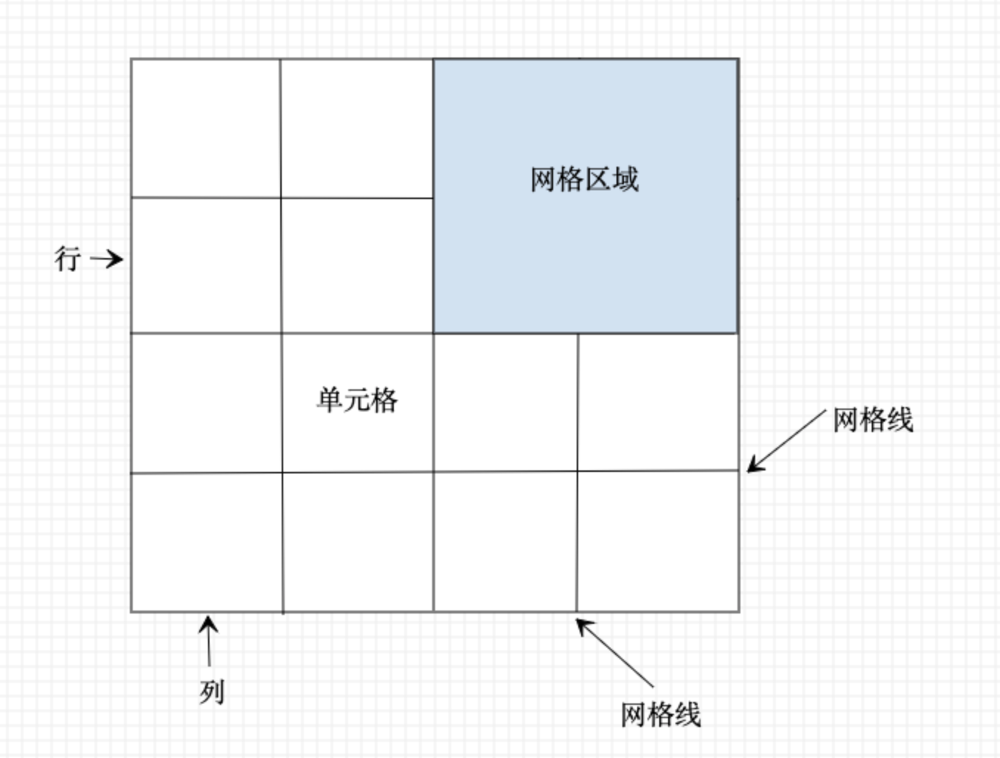
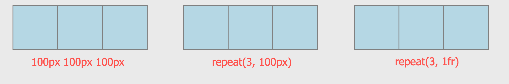
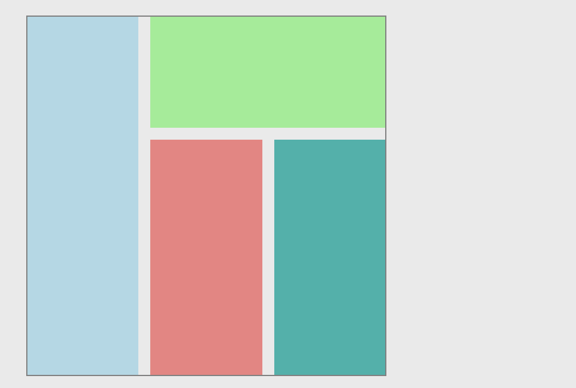
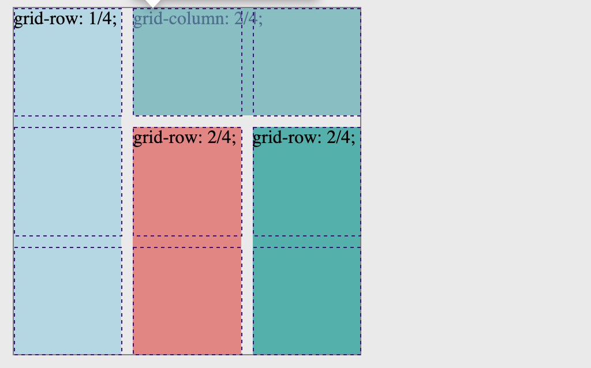
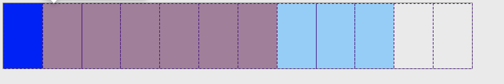

# 神奇的Grid布局

今天介绍的`Grid`布局系统，可以说是CSS有史以来最强大的布局系统了。很多复杂的布局，都可以使用它来轻松的完成。它就像是一个二维的`flex`布局，并且还提供了更强大的功能，一起来看看吧。

## 由一个问题开始

我们先来思考一下，如何实现下面的布局呢？



你可能会使用绝对定位，将每个元素的位置固定在页面上；你也可以使用浮动，只不过要嵌套着几个元素然后再分析它们之间的关系...很多种实现方式，但是看上去都比较的麻烦，因为要确定元素之间的位置关系才能实现最终的布局。比如我们看看下面的实现方式：

```html

<style>
.normal-box{
    width: 300px;
    height: 300px;
    border: 1px solid grey;
    display: flex;
  }
  
  .item1{
    background-color: lightblue;
    height: 100%;
    flex: 1;
  }

  .item2{
    flex: 2;
  }

  .item3{
    background-color: lightgreen;
    height: 100px;
  }

  .item4{
    background-color: lightcoral;
    width: 100px;
    height: 200px;
    float: left;
  }
  .item5{
    background-color: lightseagreen;
    width: 100px;
    height: 200px;
    float: right;
  }
</style>

<div class="normal-box">
  <div class="item1"></div>
  <div class="item2">
    <div class="item3"></div>
    <div class="item4"></div>
    <div class="item5"></div>
  </div>
</div>
```

可以看到，我们使用了`flex`，`float`还有元素的嵌套(div中还有div)，才实现了上面的布局。虽然代码看上去不是很多，但是也已经凸显出面对这种较为复杂的布局，原先的布局方式显得有点力不从心了。我们来看看今天的主角`Grid`是如何解决的。

## Grid 系统的几个概念



根据上图，我们来解释几个概念：

- `容器` 最外层的`4x4`的整个显示区域
- `项目` 每一个小的单元格就是每一个`item`
- `行`、`列`和`单元格` 可以类比成表格(table)中的概念
- `网格线`，它是不可见的，你看到线只是单元格的`border`恰好在线上
- `间隙` 单元格之间的距离，上图由于都是紧挨着，所以间隔为0

## 使用 Grid 解决

先来体验一下如何使用`Grid`解决上面布局问题：
```html
<style>
.box {
  border: 1px solid grey;
  display: grid;
  width: 300px;
  height: 300px;
  grid-template-rows: repeat(3, 100px);
  grid-template-columns: repeat(3, 100px);
}

.box div:nth-child(1) {
  background-color: lightblue;
  grid-row: 1/4;
}

.box div:nth-child(2) {
  background-color: lightgreen;
  grid-column: 2/4;
}

.box div:nth-child(3) {
  background-color: lightcoral;
  grid-row: 2/4;
}

.box div:nth-child(4) {
  background-color: lightseagreen;
  grid-row: 2/4;
}
</style>

<div class="box">
  <div></div>
  <div></div>
  <div></div>
  <div></div>
</div>
```

有几个属性你可能之前没有见过，没问题，我们现在开始学习

## Grid 基础

`Grid`布局的一个核心概念，就是先画出布局，再把元素往里面放。

首先，我们使用`display: grid`定义一个网格容器，然后再将网格划分出对应的行列块。我们使用`grid-template-rows`定义行，使用`grid-template-columns`定义列。它们的指定方式相同，我们以`行`为例：

```css
grid-template-rows: 100px 100px 100px; /* 定义三行，每行高度100px */
```
如果行数过多，可以使用`repeat`函数，比如上例可以写成：
```css
grid-template-rows: repeat(3, 100px); /* 定义三行，每行高度100px */
```
也可以使用百分比：
```css
grid-template-rows: repeat(3, 30%);
```

可以使用`fr`来设置比例，例如 `grid-template-rows: repeat(3, 1fr);` 就表示定义三行，每一行高度相同。我们来看一下上面几种赋值的结果：

```html
<style>
.row{
  border: 1px solid grey;
  width: 300px;
  height: 100px;
  display: grid;
}

.row div{
  background-color: lightblue;
  border: 1px solid grey;
  box-sizing: border-box;
}

.row-1{
  grid-template-columns: 100px 100px 100px;
}

.row-2{
  grid-template-columns: repeat(3, 100px);
}

.row-3{
  grid-template-columns: repeat(3, 1fr);
}
</style>

<div style="display: flex; justify-content: space-evenly;">
  <div class="row row-1">
    <div></div>
    <div></div>
    <div></div>
  </div>
  <div class="row row-2">
    <div></div>
    <div></div>
    <div></div>
  </div>
  <div class="row row-3">
    <div></div>
    <div></div>
    <div></div>
  </div>
</div>
```
结果：



可以看到，三种方式的运行结果都是一样的。最后一种，`repeat(3, 1fr)`表示平均分成三份，由于我们的容器的宽度为`300px`，所以每一列宽度就是`100px`。

还有`minmax(min,max)`和`auto-fill`，读者可以自行尝试。

再来介绍一个基本概念里的`间隔`，我们在最初的例子上修改一下：

```html{7,8,9}
<style>
.box {
  border: 1px solid grey;
  display: grid;
  width: 300px;
  height: 300px;
  grid-template-rows: repeat(3, 1fr);
  grid-template-columns: repeat(3, 1fr);
  gap: 10px;
}
/* 省略各个item的样式，参考最上面的例子 */
</style>

<div class="box">
  <div></div>
  <div></div>
  <div></div>
  <div></div>
</div>
```

结果：



行、列之间都已经有了`10px`的间隙了。

## `Grid` 定位

在基础部分，我们了解到了`Grid`系统有网格线的概念。在一个给定的容器中，如果我们知道一个子元素的开始的线和结束的线，那么就能把这个元素给定位到。所以，提供行开始、行结束、列开始、列结束这四条边界线的话，我们就能很方便的把一个元素放到某个位置中。我们来分析最开始布局的`grid`解法的代码：

```html
<style>
.box div:nth-child(1) {
  background-color: lightblue;
  grid-row: 1/4;
}

.box div:nth-child(2) {
  background-color: lightgreen;
  grid-column: 2/4;
}

.box div:nth-child(3) {
  background-color: lightcoral;
  grid-row: 2/4;
}

.box div:nth-child(4) {
  background-color: lightseagreen;
  grid-row: 2/4;
}
</style>
```

其中，`grid-row`是`grid-row-start`和`grid-row-end`的简写形式，表示行的开始线和结束线。这个编号，就是从左上角开始为1，向下和向右逐渐递加。所以`grid-row: 1/4;` 表示的是，这个元素从第一条行线开始到第四条行线，也就是跨了三行。我们看到没有指定列，那么就是默认的占第一列。所以这个浅蓝色的区域占三分之一。

再来分析第二个，`grid-column: 2/4;`，开始的列线是2，结束的列线是4，也就是说，这个元素从跨了两列，没有指定row的话，说明占一行。那么就会看到绿色的区域占来右上角的区域。

第三个和第四个，读者可以自行分析一下，加深理解。

其实，我们用`Chrome DevTool`可以看出一开始指定的网格系统，很直观：



**你还可以给每一条网格线命名，然后使用这些命名的网格线来定位元素。这里不多赘述了，有兴趣的可以参考一下文章最下方的几个链接，都有介绍。**

## `Grid Item` 偏移

如果你对`bootstrap`或者其他响应式系统比较熟悉的话，那么你就会知道偏移的概念。在我们的`grid`系统中，也有相似的概念`span`，它表示元素向右或者向下“伸展”的大小。我们可以用它来模拟一个简易的栅栏布局。

```html
<style>
.span-box{
  display: grid;
  grid-template-columns: repeat(12, 1fr);
  height: 100px;
  width: 100%;
  border: 1px solid grey;
}

.col-1{
  grid-column: span 1;
}

.col-3{
  grid-column: span 3;
}

.col-4{
  grid-column: span 4;
}

.col-6{
  grid-column: span 6;
}
</style>
<div class="span-box">
  <div class="col-1" style="background-color: blue;"></div>
  <div class="col-6" style="background-color: red;"></div>
  <div class="col-3" style="background-color: lightskyblue;"></div>
</div>
```

结果：



可以看到，在一个12等分的网格中，我们的几个元素一共占了`1+6+3=10`个网格，还剩两个空白的没有占。

由于篇幅问题，本文就先介绍到这里。关于`Grid`，还有`区域`、`子元素布局`、`简写`等相关知识，我们会在下一章节介绍。**推荐以下几篇文章，关于网格系统介绍得很详细。**


### 参考文档

- [https://drafts.csswg.org/css-grid/#propdef-grid](https://drafts.csswg.org/css-grid/#propdef-grid)
- [https://developer.mozilla.org/en-US/docs/Web/CSS/CSS_Grid_Layout/Basic_Concepts_of_Grid_Layout](https://developer.mozilla.org/en-US/docs/Web/CSS/CSS_Grid_Layout/Basic_Concepts_of_Grid_Layout)
- [https://css-tricks.com/snippets/css/complete-guide-grid/](https://css-tricks.com/snippets/css/complete-guide-grid/)