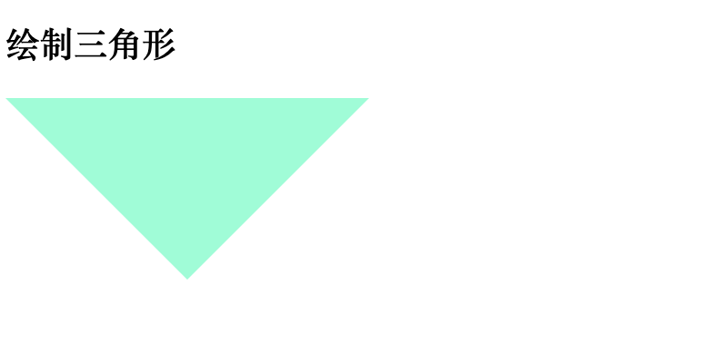
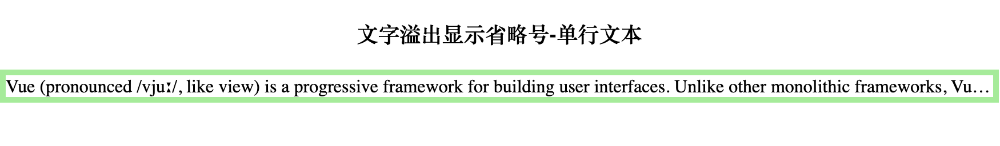

# CSS 常用样式大合集

## 画一个三角形
```html
<style>
.triangle{
  height: 0;
  width: 0;
  border: 100px solid transparent;
  border-top-color: aquamarine;
}
</style>
<div class="triangle"></div>
```
效果：



## 文字溢出显示省略号

单行文本的实现很简单，只要有下面四个属性即可：

```html
<style>
.text-overflow{
  border: 5px solid lightgreen;
  width: 100%; /* 1. 指定宽度 */
  overflow: hidden; /* 2. 容器内部溢出部分省略 */
  text-overflow: ellipsis; /* 3. 文字溢出部分显示省略号 */
  white-space: nowrap; /* 4. 空白不换行 */
}
</style>
<div class="text-overflow">
  Vue (pronounced /vjuː/, like view) is a progressive framework for building user interfaces. Unlike other monolithic frameworks, Vue is designed from the ground up to be incrementally adoptable. The core library is focused on the view layer only, and is easy to pick up and integrate with other libraries or existing projects. On the other hand, Vue is also perfectly capable of powering sophisticated Single-Page Applications when used in combination with modern tooling and supporting libraries.
</div>
```

效果：




## 圣杯布局

## 双飞翼布局