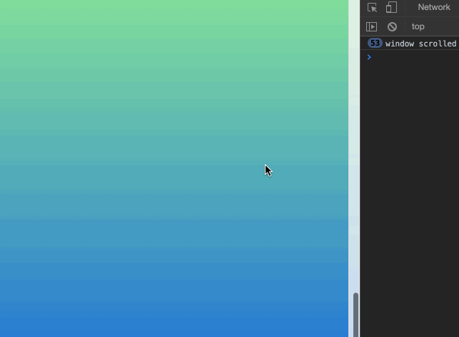
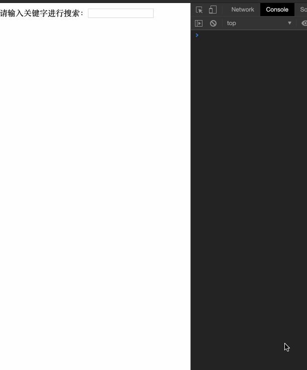
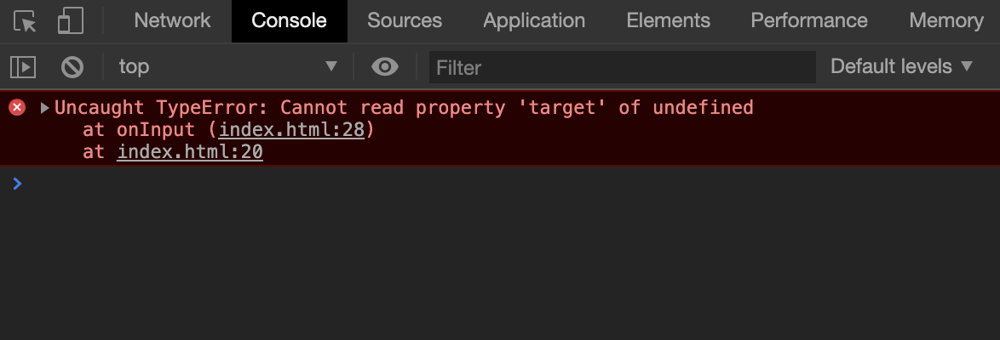
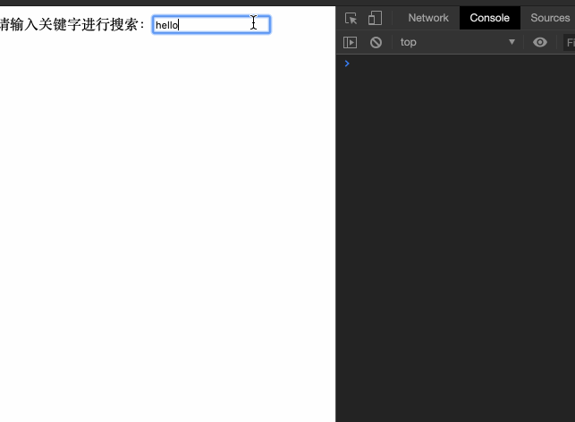

# 函数节流与防抖

节流和防抖函数都属于js中的高阶函数，它在我们的实际开发中也经常用到，它们可以用来限制函数的执行次数，从而提高执行性能。它们也是面试中的高频问题，我们这章就来了解一下它们的工作原理。

## 节流（throttle）

节流函数一般用来限制函数在单位时间内的调用次数。它规定在**给定的时间内，回调函数只能执行一次**，即使触发了多次事件，也只能有一个回调函数执行。举个例子，比我要给页面的滚动事件添加监听函数，函数会做大量的计算，如果不加节流的话，因为不断的触发回调，不断的进行计算会导致页面在滚动的时候就会变得非常卡顿。我们先来看不加节流的情况：

```html
<!DOCTYPE html>
<html lang="en">
<head>
  <meta charset="UTF-8">
  <meta name="viewport" content="width=device-width, initial-scale=1.0">
  <title>函数节流</title>
  <style>
    body{
      height: 2000px;
      background: linear-gradient(grey, lightgreen, blue);
    }
  </style>
</head>
<body>
  
</body>
<script>
  function onScroll(e) {
    console.info('window scrolled')
  }
  window.onscroll = onScroll
</script>
</html>
```

上面的`scroll`没有加节流，会导致`onScroll`被重复的触发很多次：



如果这里的`onScroll`函数是一个特别复杂的运算的话，那么页面就会变得卡顿，极大的影响用户体验，所以此时，该介绍我们的节流函数出场了。

```js
function throttle(fn, delay) {
  let first = true, timer = null
  return (...args) => {
    // 如果是第一次调用的话，直接直接即可
    if (first) {
      fn.apply(this, args)
      first = false
    } else {
    
      // 当前有定时器在跑的话，不做任何操作，直接return
      if (timer) return

      // 否则就将回调函数放到定时器里面来
      timer = setTimeout(() => {
        // 在里面，要清除定时器，重置timer，以免影响后续的判断
        clearTimeout(timer)
        fn.apply(this, args)
        timer = null
      }, delay)
    }
  }
}

```

再改下我们的事件监听代码：
```js
const throtteledScroll = throttle(onScroll, 1000)
window.onscroll = throtteledScroll
```

这下我们的`onScroll`函数就会在页面滚动的时候，每秒执行一次：


其实我们的节流函数不用定时器也是可以的，上面使用定时器的原因，是想让函数可以在脱离事件后也能得到一次执行。

```js
function throttle(fn, delay) {
  let last = null;
  return (...args) => {
    if (!last) {
      fn.apply(this, args)
      last = Date.now()
    } else {
      if (Date.now() - last > delay) {
        fn.apply(this, args)
        last = Date.now()
      }
    }
  }
}
```

## 防抖（debounce）

其实防抖也很好理解，这里的“抖”发生的前提，就是一件事重复很多次，如果我们让它只执行一次，那么它就“抖”不起来了，这也是防抖函数的原理。我们来看看比较正式一点的解释：
**在事件被触发n秒后再执行回调，如果在这n秒内事件又被触发，则重新计时。**

之前看到一个举的很贴切的例子，我们的电梯，当有人进去按下关门按钮的时候，电梯会等2s再关闭，这期间如果有人进来的话，你不得不重新按下关闭按钮，就得再等2s，直到关门这个间隙没有人进来时，电梯才会关门、运转。

类比上面关于防抖函数的解释，我相信你已经开始明白了，下面我们来看具体的实现：

```js

/***
 * @param fn 回调函数
 * @param delay 延时时间，即函数要过多少毫秒才会被调用
 **/
function debounce(fn, delay) {
  let timer = null
  return () => {
    clearTimeout(timer)
    timer = setTimeout(() => {
      fn()
    }, delay)
  }
}

```

结合一个具体的场景，我们来看看它的用处。我们来模拟一个搜索功能，提供一个输入框，当用户输入文字的时候，我们打印出搜索的内容：

```html
<body>
  请输入关键字进行搜索：<input type="text" id="keyword">
</body>
<script>
  const input = document.querySelector('#keyword')
  function onInput(e) {
    console.info('search:', e.target.value)
  }
  input.addEventListener('input', onInput)
</script>
```

我们来看看没有加上防抖的效果：



我们每输入一个字符，都会触发回调，如果这是正式的环境，那么意味这每一次输入都要向服务器发起请求，这对服务器来说无疑产生来很大的压力。我们希望用户在最终输入完时，或者停顿某一个时间长度时，再发起请求，这样显得更加合理，我们利用防抖函数来改进代码：

```html
<script>
  function debounce(fn, delay) {
    let timer = null
    return () => {
      clearTimeout(timer)
      timer = setTimeout(() => {
        fn()
      }, delay)
    }
  }
  const input = document.querySelector('#keyword')
  function onInput(e) {
    console.info('search:', e.target.value)
  }
  const debounceOnInput = debounce(onInput, 1000);
  input.addEventListener('input', debounceOnInput)

</script>
```

运行一下，你会发现一秒后报错了：



原来我们的`debounce`函数没有保存源函数的参数，导致我们的`onInput`方法的参数丢失。我们来修改一下`debounce`函数：

```js
function debounce(fn, delay) {
  let timer = null
  return (...args) => {
    clearTimeout(timer)
    timer = setTimeout(() => {
      fn.apply(this, args)
    }, delay)
  }
}

```

再来运行一下：




### 参考资料

- [https://codeburst.io/throttling-and-debouncing-in-javascript-b01cad5c8edf](https://codeburst.io/throttling-and-debouncing-in-javascript-b01cad5c8edf)