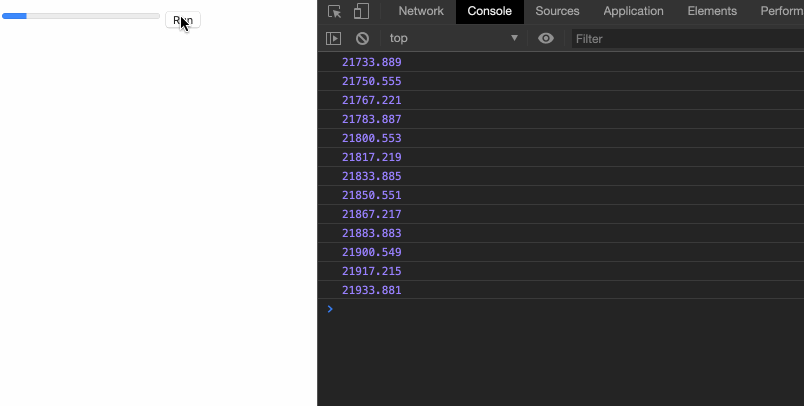

# requestAnimationFrame

我们知道，在web应用中，实现动画有很多方式，比如使用CSS的 `transition` 和 `animation`，或者使用javascript的 `setTimeout` 和 `setInterval`等，然而今天我们要介绍的，则是html5中专门为实现动画设计的API——`requestAnimationFrame`。我们本节就来学习这个方法，看看它为js动画带来了哪些好处。

## CSS 动画原理

在`requestAnimationFrame`出现以前，js实现动画只能靠定时器。我们给定时器设置延迟时间时，需要考虑这个时间的长短。如果太长了，那么动画就会显得很慢，不流畅；如果太短了，那么浏览器可能渲染能力不够，达不到我们的预期。

这里说的渲染能力，要提一下，大部分的电脑的刷新频率是`60Hz`，也就是说，电脑屏幕会在一秒内绘制60次，大约相当于每`1000ms / 60Hz = 16.7`毫秒绘制一次，由于人视觉的残留效果，所以感受不到这种变化，看起来像是连贯的。因此，对于`60Hz`的显示器来说，`16.7ms`是最佳的动画间隔，即上一帧到下一帧间隔为`16.7ms`是最好的。如果超过这个间隔，意味着在下一次刷新的时候，动画还没有执行，看上去的效果就是动画不连贯；如果低于这个时间，也没有意义，因为显示器处理的最短的间隔就是`16.7ms`，你设置成`10ms`的话，甚至可能会出现丢帧的情况。

## requestAnimationFrame的特点

基于定时器动画带来的上述问题，我们的`requestAnimationFrame`都帮忙解决了。它为什么这么厉害呢？**因为它是由浏览器来决定你的动画执行时机**。试问有谁比浏览器本身更能知道如何最优的执行动画呢？

**由浏览器来决定，可以保证你的动画在屏幕每一次的绘制间隔中只被执行一次**。也就是说，你的显示器频率是`60Hz`，那么你的动画就是`16.7ms`执行一次；如果是`50Hz`，那么就是`20ms`执行一次。免去了我们在定时器中手动执行执行间隔的烦恼，也解决了这样会带来的问题。不仅如此，它还有其他好处：

- 对于不可见的元素，由`requestAnimationFrame`指定的动画将会暂停
- 对于处于后台（非激活）的标签页，动画也会暂停

这就大大的提升了性能，同时也提高了电池的寿命，因为少了很多无用的执行。


## 使用案例

说了这么多，这个神奇的API究竟该怎么用呢？其实很简单，你如果会用定时器的话，你也应该很快就会使用它。我们来看个例子：

```html
<body>
  <progress id="box" value="0" max="100"></progress>
  <button id="btn">Run</button>
</body>
<script>
  let box = document.getElementById('box')
  let btn = document.getElementById('btn')
  let progress = 0;

  function run() {
    let val = box.value;
    if (val < 100) {
      box.value += 1;
      window.requestAnimationFrame(run);
    }
  }
  btn.addEventListener('click', () => {
    requestAnimationFrame(run)
  })
</script>
```

分析上面的代码，我们可以看出来，其实跟`setTimeout`差别不是很大，只不过我们没有给它传递时间间隔。我们在点击按钮的时候，利用`requestAnimationFrame`渲染了第一帧动画，这个`run`方法中，也包含着这个`requestAnimationFrame`，所以满足条件的情况下会一直执行，我们来看看效果：


*由于录制软件的原因，上面的图显示的动画图可能看上去不是很连贯，读者可以自行尝试一下。*

这个方法与`setTimeout`类似，返回一个数字`id`，我们可以使用这个`id`取消掉这次的动画： `cancelAnimationFrame(id)`。

还有一个知识点，就是这个`requestAnimationFrame(callback)`中，这个`callback`回调函数，有一个默认的参数，它表示当前被`requestAnimationFrame`排序的回调函数的触发时间。我们修改一下`run`函数来打印下看看：

```js
function run(ts) {
    console.info(ts)
    let val = box.value;
    if (val < 100) {
      box.value += 1;
      window.requestAnimationFrame(run);
    }
  }
```

结果如图：




我们可以将两次的打印时间计算一下，可以得出刚好是`16.667`的，豁然开朗有木有。

## polyfill

对于不支持`requestAnimationFrame`的浏览器，我们可以采用如下方法实现向下兼容：

```js
// Adapted from https://gist.github.com/paulirish/1579671 which derived from 
// http://paulirish.com/2011/requestanimationframe-for-smart-animating/
// http://my.opera.com/emoller/blog/2011/12/20/requestanimationframe-for-smart-er-animating

// requestAnimationFrame polyfill by Erik Möller.
// Fixes from Paul Irish, Tino Zijdel, Andrew Mao, Klemen Slavič, Darius Bacon

// MIT license

if (!Date.now)
    Date.now = function() { return new Date().getTime(); };

(function() {
    'use strict';
    
    var vendors = ['webkit', 'moz'];
    for (var i = 0; i < vendors.length && !window.requestAnimationFrame; ++i) {
        var vp = vendors[i];
        window.requestAnimationFrame = window[vp+'RequestAnimationFrame'];
        window.cancelAnimationFrame = (window[vp+'CancelAnimationFrame']
                                   || window[vp+'CancelRequestAnimationFrame']);
    }
    if (/iP(ad|hone|od).*OS 6/.test(window.navigator.userAgent) // iOS6 is buggy
        || !window.requestAnimationFrame || !window.cancelAnimationFrame) {
         // 上一次动画的执行时间
        var lastTime = 0;
        window.requestAnimationFrame = function(callback) {
            // 当前时间 
            var now = Date.now();
            // 比较上一次时间+16ms后，和当前时间的大小，取较大的值
            var nextTime = Math.max(lastTime + 16, now); 
            return setTimeout(function() { callback(lastTime = nextTime); },
                              nextTime - now);
        };
        window.cancelAnimationFrame = clearTimeout;
    }
}());

```

代码来源：[https://github.com/darius/requestAnimationFrame](https://github.com/darius/requestAnimationFrame)


### 参考资料

- [https://www.cnblogs.com/onepixel/p/7078617.html](https://www.cnblogs.com/onepixel/p/7078617.html)
- [https://developer.mozilla.org/en-US/docs/Web/API/window/requestAnimationFrame](https://developer.mozilla.org/en-US/docs/Web/API/window/requestAnimationFrame)