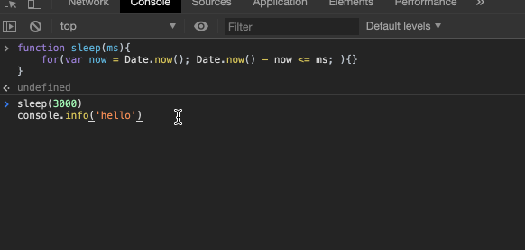
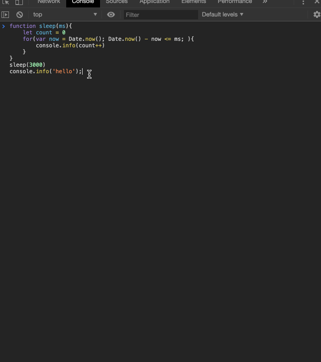
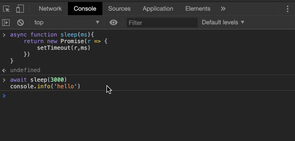

# JS 实现 Sleep 功能

这其实是一个很有意思的题目，因为像一些编程语言中提供了类似休眠的方法，比如`java`的`Thread.sleep(3000)`，就是休息3秒。在js中虽然没有直接提供，但是我们可以通过一些`hack`的手段来实现这个有趣的功能。

## 暴力版

```js
function sleep(ms){
    for(var now = Date.now(); Date.now() - now <= ms; ){}
}

sleep(3000)
console.info('hello')

```

先来看一下效果



我们来分析一下代码，它的机制就是来一段循环，但是这个循环条件是跟我们的当前时间有关的。我们一开始定义了一个当前时间`now`，接着判断最新的时间`Date.now()`与之前的时间的大小，如果小于休眠时间的话，继续循环，直到大于休眠时间为止才不循环了。

说实话，这个想法很巧妙，但是呢，实现的效果却很不好，因为大量的循环会让一些浏览器“卡死”。我们在这段循环中加入一个计数器，看看到底循环了多少次：

```js
function sleep(ms){
    let count = 0
    for(var now = Date.now(); Date.now() - now <= ms; ){
      console.info(count++)
    }
}
sleep(3000)
console.info('hello')
```

执行结果：



**震惊！竟然有3万多次！所以这个方法千万不要在生产环境用！**


## 优雅版 🌟

```js
async function sleep(ms){
  return new Promise(r => setTimeout(r, ms))
}

await sleep(3000)
console.info('hello')
```

我们在Chrome上看看结果：




简单分析一下代码，我们执行`await sleep(30000)`时，会去执行`sleep`方法，我们知道，`await`跟的是一个`Promise`并且这个`Promise`是`pending`状态的话，那么`await`后面的代码都不会执行，所以就相当于休眠了。而我们的`sleep`函数中，返回的`Promise`，会在`3000ms`，也就是指定的睡眠时间之后被`resolve`，所以三秒后`await`后面的`Promise`状态改变，就继续往下执行了，打印`hello`。

由于这种方式几乎没有什么副作用，而且长得也好看，所以是目前的最佳方案。

## AJAX 版

这个方法我也是看别人想到的，觉得真的跟脑筋急转弯一样的。我们知道`XHR`对象发出的请求，可以支持同步，比如：`xhr.open('GET', '/', false)`，也就是我发完了请求后啥也不做，就等请求回来我再干其他的。基于这个思路，我们也很容易的实现这种`sleep`的功能。利用网络的延迟来实现休眠的功能也是一个思路，但是 它有两个缺点：
1. 无法设置固定的超时时长（`timeout`属性是不可以设置在同步请求上的）
2. 对服务器的压力大，并且如果你频繁调用这种无谓请求的话，本身也是一种资源的浪费