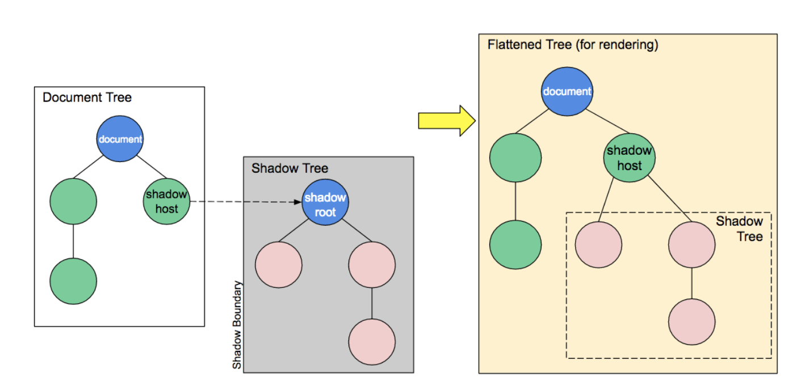
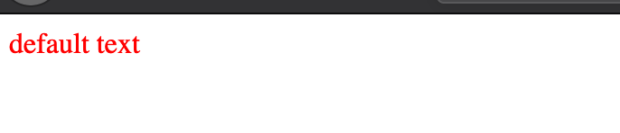
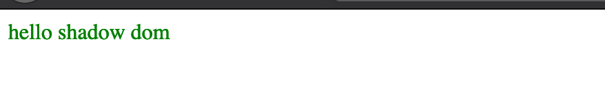
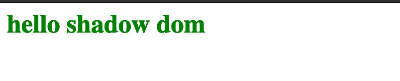
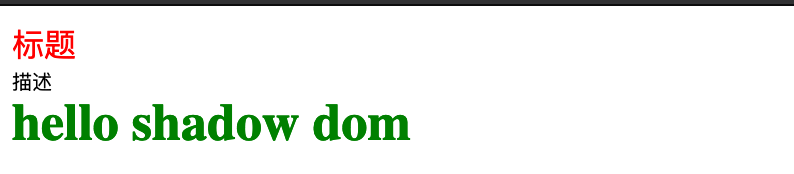

# Web Component

## 什么是 Web Component

`Web Component`，翻译过来就是web组件，它实际上是**一套**让你可以创建可重用元素的技术。它将一个或多个元素封装到一起成为一个“新的”元素，这个新元素的功能、样式都与其他元素相互独立，互不干扰。

这里说的**一套**技术主要是以下三个：
- `Custom Elements` 自定义元素。一组js的API，可以让你定义自定义元素，在界面上使用。
- `Shadow DOM` 影子DOM。 一组js的API，可以将封装好的“影子”DOM添加到元素上。这个“影子”DOM是独立于主文档DOM渲染的，所以你不用担心内部的脚本或者样式会与外部的元素冲突。
- `HTML Templates` HTML模板。`<template>`和`<slot>`元素可以让你编写不需要渲染到页面上的标记模板，它们可以作为自定义元素被重用很多次。

一个简单实现web组件的方法通常如下：

1. 用一个类或者函数来定义你的web组件
2. 使用`CustomElementRegistry.define()`来注册你的自定义元素，给它传递一个元素名称，一个上面定义的类名或者函数名，还有一个可选的继承元素。
3. 如有必要的话，使用`Element.attachShadow()`方法把`shadom dom`添加到自定义元素上。
4. 如有必要的话，使用`<template>`和`<slot>`定义HTML模板。
5. 在页面上使用你新建的自定义元素吧～


## 创建 Web Component

### 几个概念

在学习如何创建组件之前，我们要了解几个相关的术语：

1. `Shadow host` 一个常规DOM节点，Shadow DOM 会被附加到这个节点上
2. `Shadow tree` Shadow DOM内部的DOM树
3. `Shadow boundary` Shadow DOM结束的地方，也是常规 DOM开始的地方，一个概念上的边界
4. `Shadow root` Shadow tree的根节点

我们来看一下MDN上的一张图了解一下`Shadow DOM`与常规DOM的关系：



注意，你可以使用操作常规DOM的方法来操作 `Shadow DOM`，比如添加子节点、设置属性，以及为节点添加自己的样式（例如通过 element.style 属性），或者为整个 Shadow DOM 添加样式（例如在 `<style>` 元素内添加样式）。不同的是，`Shadow DOM` 内部的元素始终不会影响到它外部的元素（除了 `:focus-within`），这为封装提供了便利。

`Shadow DOM` 并不是一项新技术，在过去的很长一段时间里，浏览器用它来封装一些元素的内部结构。比如H5中的 `<video>` 元素，你所能看到的只是一个 `<video>` 标签，实际上在它的 `Shadow DOM` 中，包含来一系列的按钮和其他控制器。`Shadow DOM` 标准允许你为你自己的元素`（custom element）`维护一组 `Shadow DOM`。

接下来我们要创建一个简单的组件，它是一个带颜色的文本，我们可以像这样来使用它：

```html
<colored-text text='hello shadow dom' color='green'></colored-text>
```

### 创建组件

我们使用ES6的类来定义这个组件，让它继承`HTMLElement`类
```js
class ColoredText extends HTMLElement{
  constructor() {
      super()
  }
}
```

一个雏形就出现了，但是很显然，这个组件貌似什么也做不了，我们给它添加相应的功能。我们在`Shadom DOM`里可以像平常一样使用我们的DOM API，所以，我们可以这么来实现：

```js {5,17}
class ColoredText extends HTMLElement {
    constructor() {
      super()
      // 创建 shadow root，关于 mode 我们后面会讲到
      const root = this.attachShadow({ mode: "open" })
      // 创建内部 DOM 树
      const box = document.createElement('span')
      // 获取 text 属性的值，没提供的话显示'default text'
      const text = this.getAttribute('text') || 'default text'
      // 获取 color 属性的值，没提供的话默认红色
      const color = this.getAttribute('color') || 'red'
      // 设置文字
      box.innerText = text
      // 设置颜色
      box.style.color = color
      // 把内部的DOM树（本例就是一个span元素）添加到 Shadow Root上
      root.appendChild(box)
    }
  }
```
我们单纯的组件到此就定义完成了，要把它变成自定义元素，还需要接下来的操作：
```js
customElements.define('colored-text', ColoredText)
```

我们可以使用它啦！什么都不传的话，它会采用默认值，来看看：
```html
<colored-text></colored-text>
```
效果应该是红色的"default text"的文本：



给它传递一些参数试试：
```html
<colored-text text="hello shadow dom" color="green"></colored-text>
```
效果：



Nice！接下来我们可以慢慢的扩充这个例子的功能了。这个文字看上去太小了，我们给他放大一点吧。

### 添加样式

还是一样的，跟常规DOM没什么区别，平平无奇。我们采用两种方法来添加两种样式吧：
```js {13-18,24,26,28}
class ColoredText extends HTMLElement {
    constructor() {
      super()
      // 创建 shadow root，关于 mode 我们后面会讲到
      const root = this.attachShadow({ mode: "open" })
      // 创建内部 DOM 树
      const box = document.createElement('span')
      // 获取 text 属性的值，没提供的话显示'default text'
      const text = this.getAttribute('text') || 'default text'
      // 获取 color 属性的值，没提供的话默认红色
      const color = this.getAttribute('color') || 'red'
      // 使用 style 标签 来修改字体大小
      const style = document.createElement('style')
      style.textContent = `
        .big-font{
          font-size: 26px;
        }
      `
      // 设置文字
      box.innerText = text
      // 设置颜色
      box.style.color = color
      // 用 style 的方式添加字体的 weight
      box.style.fontWeight = 'bold'
      // 添加类
      box.setAttribute('class', 'big-font')
      // 一定要把这style标签添加到box上，不然上面的不会生效
      box.appendChild(style)
      // 把内部的DOM树（本例就是一个span元素）添加到 Shadow Root上
      root.appendChild(box)
    }
  }
```

此时我们的文字应该明显变大变粗了，来看看效果：




当然，你肯定不会喜欢这种糟糕的代码，把结构与样式揉杂在一起。我们可以使用外部样式表，通过创建`link`标签把外部样式引进来，再直接给对应的元素设置样式类就行了：

```js
const linkElem = document.createElement('link');
linkElem.setAttribute('rel', 'stylesheet');
linkElem.setAttribute('href', 'style.css');
// 一定要添加到shadow dom中！！否则不会生效。
root.appendChild(linkElem);
```
自己尝试一下吧！

### 添加事件处理

一样的平平无奇...
```js
//...
// 添加事件处理
box.addEventListener('click', () => {
  alert('click me')
})
//....
```

### 使用 Template 来封装我们的组件

如果你有过vue项目的开发经验，你可能会有这样的疑问，为什么不可以把结构啊、样式啊之类的单独定义呢？就像vue单文件组件的`<template>`一样多么清晰明了啊！嘿！你还别说，还真有，而且，vue还是受到这个启发的。我们来用`template`重写上面的例子：
```html
<colored-text text="hello shadow dom" color='green'></colored-text>
  <template id='color-text-tpl'>
    <style>
      .big-font{
        font-size: 26px;
      }
      span{
        font-weight: bold;
      }
    </style>
  </template>
```

```js
class ColoredText extends HTMLElement {
    constructor() {
      super()
      // 创建 shadow root，关于 mode 我们后面会讲到
      const root = this.attachShadow({ mode: "open" })
      // 获取 template 元素
      const template = document.getElementById('color-text-tpl')
      // 这个 templateContent 是一个 DocumentFragment
      const templateContent = template.content;
      // 创建内部 DOM 树
      const box = document.createElement('span')
      // 获取 text 属性的值，没提供的话显示'default text'
      const text = this.getAttribute('text') || 'default text'
      // 获取 color 属性的值，没提供的话默认红色
      const color = this.getAttribute('color') || 'red'
      // 设置文字
      box.innerText = text
      // 设置颜色
      box.style.color = color
      // 直接使用 <style> 标签里的样式
      box.setAttribute('class', 'big-font')
      // 添加事件处理
      box.addEventListener('click', () => {
        alert('click me')
      })
      // 把 box 添加到 template 中
      templateContent.appendChild(box)
      // 克隆 template 后，追加到 root 上
      root.appendChild(templateContent.cloneNode(true))
    }
  }
```

我们在`<template>`中定义样式，在自定义元素中直接使用这个样式。我们创建的`span`直接是追加到`template`上的，最后把这个`template`克隆后追加到`shadow root`上，其他的没什么变化，效果还是一样的：


我们思考一下，这样做的好处是什么呢？因为代码量看上去没多大的改变啊。

实际上，这里的模板，已经被我们抽取出来了，也就是说它是可以重用的。对于业务场景复杂的情况，我们我们抽取出业务上最基础的模板，被其他自定义组件使用。这无疑是一项很大的突破。并且，我们在模板里编写样式，这个样式仅在模板里起作用，不会污染到外部的DOM，体现了很强的封装性。光这两点就很令人兴奋了。别急，它还有一个更令人兴奋的功能 —— `Slot`插槽！

### Slot 插槽

插槽实际上提供的是一个占位符的功能，它很简单，同时也十分灵活。vue的插槽机制也是借鉴于此，只不过vue是通过VDOM来实现的。我们在原先的例子上添加一个标题和描述信息。

```html
<colored-text text="hello shadow dom" color='green'>
    <div slot="title">标题</div>
    <div slot="desc">描述</div>
  </colored-text>
  <template id='color-text-tpl'>
    <style>
      .big-font{
        font-size: 26px;
      }
      span{
        font-weight: bold;
      }
      [name='title']{
        color: red;
      }
      [name='desc']{
        font-size: 10px;
      }
    </style>
    <slot name="title"></slot>
    <slot name="desc"></slot>
  </template>
```

不需要修改js，只要改动模板即可。我们添加了两个命名插槽，分别设置来不同的样式，并且在使用组件的时候定义了这两个插槽，一起来看看效果：



到此为止，关于如何创建一个`Web Component`的介绍就结束了。目前前端开发的大势也是组件化开发，像`Vue`、`React`等和基于它们的很多优秀插件，都是组件化的最佳实践。它带来的好处不言而喻：重用性更高的代码，更丰富的插件库，维护性更高的系统...我们在实际的开发中，也要利用这种思想，合理的拆分出系统中的各个组件，让系统体会到组件化的优势。

### 几个API的解释

1. `this.attachShadow()`

它给指定的元素挂载一个`Shadow DOM`，并且返回对`ShadowRoot`的引用。它接收一个初始化对象作为参数，这个对象包含以下字段：

- `mode`

这个很简单，值为`open`的话，外部的js可以访问到这个`shadowRoot`对象；为`closed`的话，访问`shadowRoot`的话会得到`null`

- `delegatesFocus`

这是一个布尔值, 当设置为 `true` 时, 指定减轻自定义元素的聚焦性能问题行为。当`shadow DOM`中不可聚焦的部分被点击时, 让第一个可聚焦的部分成为焦点, 并且`shadow host`将提供所有可用的`:focus`样式。这个属性很少用。


要注意的是，不是每一种类型的元素都可以附加到`shadow root`下面。出于安全考虑，一些元素不能使用`shadow DOM`（例如`<a>`），以及许多其他的元素。具体的可以参考MDN文档。

2. `customElements.define()`

用来自定义组件的，它接收三个参数：自定义组件的名称，组件构造函数，一个可选的属性（可以用来指定继承的父元素）。

### 高级 - 组件的生命周期

无论是在`Vue`还是其他的前端框架中，组件肯定都有它的生命周期，我们可以在组件不同的阶段针对性的做不同的事。`Web Component`包含以下几个生命周期：

- `connectedCallback` 当组件与真实的DOM建立连接的时候调用

- `disconnectedCallback` 当组件与真实的DOM失去连接的时候调用

- `adoptedCallback` 当组件被移动到一个新文档的时候调用

- `attributeChangedCallback` 组件的属性修改时调用

具体的读者可以打印出一点东西看看，什么时机会调用什么样的方法。后面我会单独写一篇来介绍这些生命周期的用法。

**参考文档**
- [MDN - Using_templates_and_slots](https://developer.mozilla.org/en-US/docs/Web/Web_Components/Using_templates_and_slots)
- [MDN - Using_custom_elements](https://developer.mozilla.org/en-US/docs/Web/Web_Components/Using_custom_elements)
- [MDN - Using_shadow_DOM](https://developer.mozilla.org/en-US/docs/Web/Web_Components/Using_shadow_DOM)