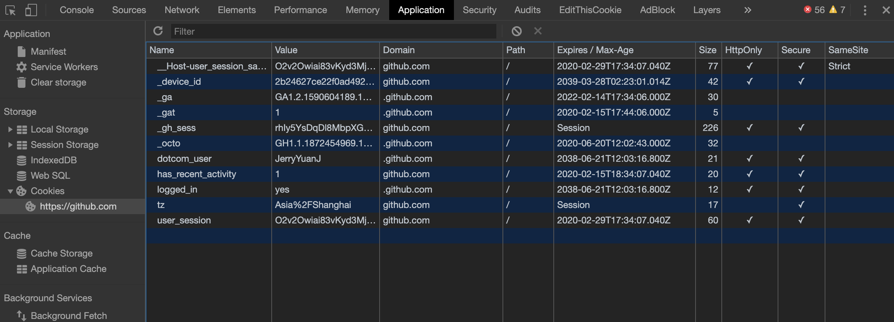

# Cookie

## 什么是Cookie

我们知道，HTTP是无状态的协议，也就是说，如果你在访问某个网站，单从HTTP协议的角度来说，网站的服务器是不知道你的上一次请求情况的。但是我们很多场景都需要我们的服务器记住用户之前的某些操作，举个很常见的例子，当我们登陆淘宝时，浏览不同的页面，淘宝不会让我们重复的登陆，这就说明它记录下了我们的登陆状态。实现这个功能有很多种方式，其中一种就是**Cookie**机制。

HTTP Cookie（也叫Web Cookie或浏览器Cookie）是服务器发送到用户浏览器并保存在本地的**一小块数据**，它会在浏览器下次再次发送请求时，**满足条件的情况下**，随着请求报文一并发送到服务器上。**Cookie 使基于无状态的HTTP协议记录稳定的状态信息成为了可能。**

## Cookie的简单使用

服务器会在响应头部**Set-Cookie**中设置相应的Cookie值，比如：
```yml
Set-Cookie: sid=123456
```
上面的头部就会设置一个名称为`sid`，值为`123456`的Cookie值到我们的浏览器上。浏览器在下一次往相同服务器发送请求时，会在`Cookie`的请求头部上带上这个信息：

```yml
Cookie: sid=123456
```

同时，你可以通过js来获取这个cookie的值：

```js
document.cookie // 输出 sid=123456
```

我们也可以通过Chrome DevTools中的Application面板看到网站的cookies，例如github的网站上的cookies如图所示：




## Cookie详解

关于Cookie，除了名称和值这两个字段外，它有如下几个比较重要的标记信息：

1. **过期时间：`Expire/Max-Age`**

根据Cookie是否携带过期时间，我们通常将Cookie分为两类：**会话期Cookie**和**持久性Cookie**。会话期Cookie的生命周期仅存于会话期，即关闭网页或者浏览器，这个Cookie就会被删除；而持久性Cookie则会在到期之前一直有效，不论浏览器是否关闭，**它的时间是相对于客户端而言的**。

`Expire`和`Max-Age`都是用来表示过期时间的，不同的是，`Expires`的值是一个具体的日期值，它表示该Cookie在该日期之前都有效；`Max-Age`的值是一个数字，它表示经过多少**秒**这个cookie会失效，这个属性在一些老的浏览器不支持。如果`Expires`和`Max-Age`都存在，并且在浏览器都支持的情况下，`Max-Age`的优先级要高。例如：

```yml
Set-Cookie: id=12; Expires=Wed, 21 Jan 2020 07:28:00 GMT
Set-Cookie: id=123; Max-Age=10000
```
上面设置了名为`id`的cookie，它设置的失效时间`Expires`为2020年1月21日07:28:00，生效时长`Max-Age`为10秒，假设浏览器对于这两个属性都支持的话，那么`Max-Age`的值将会被采用，也就是说，这个cookie将会在10秒后失效。

**如果要手动的删除某个某个cookie的值，可以将它的Expires属性设置为一个过去的时间点，或者Max-Age属性设置为0或-1。**

2. **Secure**

设置为`Secure`的Cookie，只会在**https**的环境下被发送给服务端。但是要注意的是，即使在https环境下，敏感信息也**不应该**通过Cookie传输。

3. **HttpOnly**

我们知道，JavaScript的API`document.cookie`可以获取当前网站下的cookie。如果你不想让js来获取某一个cookie值时，给这个cookie加上`HttpOnly`的标记即可，例如：

```yml
Set-Cookie: id=1; Secure; HttpOnly; 
```

这个名称为`id`的cookie，通过js是获取不到的。

4. **Domain**

指定Cookie对于哪个域是有效的。如果没有指定的话，默认值就是当前网页的URL（不包含子域）；反之如果指定的话，那么各个子域也包含这个Cookie。比如：

```yml
Set-Cookie: sid=123; Domain=test.com
```

上例设置了一个名称为`sid`的cookie，它对于域名为`test.com`的域都是有效的，当然也包括它的子域，即我们在`a.test.com`或者`b.test.com`中，都可以访问到这个cookie。

5. **Path**

指定对于域中的某一路径，在这个路径下才会向服务器发送cookie。例如：
```yml
Set-Cookie: sid=123; Path=/test; Domain=www.test.com
```
这里例子中，我们设置了名为`sid`的cookie，它会在域名为`www.test.com`，路径为`/test`的url下才会生效，比如我们请求一个资源，它的路径为`http://www.test.com/test`或者子路径`http://www.test.com/test/images/1.png`，那么这个cookie就会被发送。

6. **SameSite**

这个属性早在Chrome51的时候就被引入了，它的初衷是为了阻止CSRF攻击。`SameSite`的值可以为下面的三个之一：
  
1. Strict

这是要求最严格的，完全禁止第三方Cookie，只有当前网页URL与请求目标一致，才会发送Cookie。这个属性带来的用户体验非常不好，举个例子，你登陆淘宝后，假设淘宝网给你的Cookie设置的是`SameSite=Strict`，这时候你点击网站的商品准备看看详情，Oops，你又得重新登陆才可以继续进行你的操作，因为跳转的时候，淘宝的Cookie是不会附带到请求上去的。

2. Lax

`Lax`的要求则没有这么严格，但是大部分情况下它也是不发送Cookie的，除非是一些导航到目标网址的`GET`请求。这里的重点是：`GET`方法，而且必须是可以造成顶级导航的`GET`方法，只有这样，`Lax`的Cookie才会被发送。

关于什么是“造成顶级导航”，这里解释一下。资源可以通过`img`、`iframe`、`script`标签进行加载，这些都可以通过`GET`请求来获取，但是它们都不会造成顶级的导航改变。基本上，它们不会更改地址栏中的URL，所以它们发出的请求，都不会带上`Lax`的Cookie。可以参考下面的表格：

|   请求类型   |                 示例代码                  | 发送的Cookie   |
|-------------|:---------------------------------------:| --------------:|
| Link        | `<a href="..."></a>`                    |    Normal, Lax |
| Perender    | `<link rel="prerender" href=".."/>`     |    Normal, Lax |
| Form GET    | `<form method="GET" action="...">`      |    Normal, Lax |
| Form POST   | `<form method="POST" action="...">`     |    Normal      |
|  iframe     | `<iframe src="..."></iframe>`           |    Normal      |
| AJAX        | `$.get("...")`                          |    Normal      |
| Image       | ``                       |    Normal      |

3. None

浏览器会在同站请求、跨站请求下继续发送cookie。不过最近由谷歌发出的提议，如果Cookie的`SameSite=None`，那么它必须包含`Secure`标记，比如：

```yml
Set-Cookie: widget_session=abc123; SameSite=None // 这是一个无效的Cookie
Set-Cookie: widget_session=abc123; SameSite=None; Secure // 有效
```

## Cookie的限制


Cookie的限制主要体现在以下几点：

- 需要满足`domain`和`path`的作用域约束
- 每个域的cookie的总数是有限制的，不同浏览器肯可能限制大小有所不同
- 浏览器对cookie的大小也有限制，不同浏览器的上限也不同

Cookie最早是用来作为客户端存储的一种手段的，但是随着[`Storage`API](https://developer.mozilla.org/en-US/docs/Web/API/Storage)的兴起，我们已经不需要它来承担存储性的工作了。


### 参考资料
- [HTTP Headers：Set-Cookie - MDN](https://developer.mozilla.org/en-US/docs/Web/HTTP/Headers/Set-Cookie)
- [Cookies - MDN](https://developer.mozilla.org/zh-CN/docs/Web/HTTP/Cookies)
- [SameSite cookies explained](https://web.dev/samesite-cookies-explained/)
- [Using the Same-Site Cookie Attribute to Prevent CSRF Attacks](https://www.netsparker.com/blog/web-security/same-site-cookie-attribute-prevent-cross-site-request-forgery/)