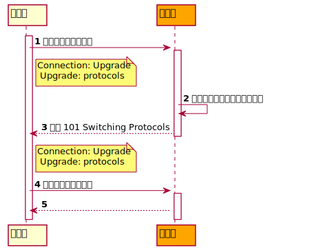
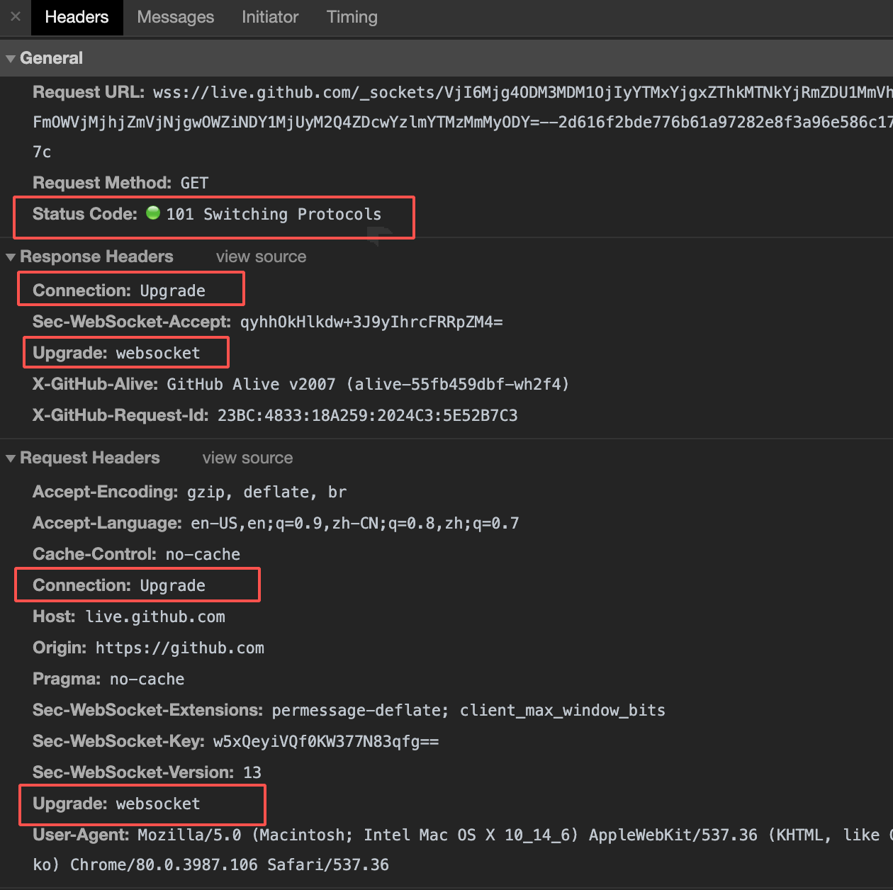
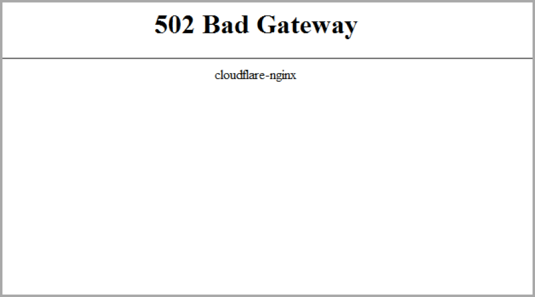

# Status Code

HTTP状态码，是响应报文中起始行的一部分，它是对响应结果的一种说明，通过它，我们很容易的就知道一个请求是否成功的完成了。状态码由三位数字构成，第一位表示着响应的类别，一共有五种类型：

1. `1XX（Informational）`信息类状态码
2. `2XX（Successful）`成功状态码
3. `3XX（Redirection）`重定向状态码
4. `4XX（Client Error）`客户端错误状态码
5. `5XX（Server Error）`服务端错误状态码

状态码一般都伴随着一个**原因短语**，比如`404`对应`Not Found`，`200`对应`Ok`等，原因短语是对请求结果的更加语义化的描述。
随着HTTP的发展，状态码变得越来越多，虽然我们不需要全部都了解，但是对于一些常见的状态码，还是要能够知道它的含义。接下来我们就来看看常见的各个类别的状态码。

## 1XX：信息类状态码

### 101 Switching Protocols
`101`状态码表示服务器针对客户端升级协议的请求对协议进行切换。一般经历的步骤如下：



*图片来源于[掘金](https://juejin.im/post/5d9c6c19e51d4578377fe4d8)*

1. 客户端发起升级协议的请求，这个请求包含两个首部字段：
```yml
Connection: Upgrade
Upgrade: 协议名
```
2. 服务器检查是否支持客户端所要求的协议
3. 如果支持的话，会发送一个状态码为`101 Switching Protocols`的响应，并且加上客户端请求的`Connection`和`Upgrade`的首部
4. 客户端与服务端以新的协议进行数据的传输

可以看一个实际的例子：



## 2XX：成功状态码

### 200 OK

这应该是最常见的状态码了，它表示请求成功。这个“成功”的含义取决于具体的HTTP方法，例如，如果是`GET`方法，那么就表示资源已经在响应正文中被返回；如果是`HEAD`方法，那么就表示实体的首部信息已经在响应体中返回了。

### 201 Created

表示请求成功，并且新创建了一个资源。比如用户注册，就有可能会在服务器中新建一条用户记录，这时候就可以返回`201`表示用户成功创建。

### 204 No Content

表示请求成功，但是没有返回内容。这里的`No Content`指的是响应报文中的内容主体部分，这个状态码的使用场景，一般是只需要客户端发送信息到服务端，而不需要服务端发送信息到客户端。但是在某些情况下，响应中的首部信息会包含一些有用的信息，客户端会根据这个最新的首部信息进行相应的更新。

### 206 Partial Content

当请求报文的首部字段中包含`Range`时，表示这一个请求是部分资源请求，即只请求资源的指定字节范围的内容，这时候应该响应`206`，表示这个部分资源请求已经成功了，返回的内容正式请求的那一个字节范围的资源。

## 3XX：重定向状态码

### 301 Move Permanently

一般我们将`301`状态码的作用称之为**永久重定向**。它表示我们当前所请求的资源，已经被分配了新的URL，以后应该使用这个新的URL来访问这个资源。这个新的URL，会在响应首部的`Location`字段中给出。一般流程如下：

1. 客户端请求资源

```yml
GET /index.html HTTP/1.1
Host: www.test.com
```

2. 服务器接收到请求后，发现这个资源已经被移到另一个地方去了，并且以后都不会变，所以返回的response为：
```yml
HTTP/1.1 301 Move Permanently
Location: http://www.test.com/main.html
```

3. 浏览器接收到这个响应后，会自动重定到`Location`指定的地址，并且会记住这个原始的URL的重定向的地址，**下次如果再次访问原始URL的话，不会向服务器发送`GET /index.html`的请求，而是直接请求`main.html`页面**。

### 302 Found

跟`301`对应的，我们一般称`302`为临时重定向。它表示请求的资源已经被分配了新的URL，希望用户本次能使用新的URL访问。与`301`不同的是，它表示资源只是临时性的被移到了新的地址。也就是说，这个地址以后还可能会变。比如用户访问a页面时，服务器用`302`状态码让它重定向到b页面，但是浏览器这时候不会记住这次重定向的信息，下次再访问a页面时，还是会向a页面发出请求，然后再由服务器决定重定向的地址。

### 303 See Other

`303`状态码表示由于请求对应的资源存在着另一个URI，应使用`GET`方法定向获取请求的资源。它与`302`状态码有着相同的功能，但是**它明确的表明应该使用`GET`方法去获取资源**。

### 304 Not Modified

`304`是一个很有趣的状态码，虽然它是以3开头，但是却与重定向没有没有任何关系。这是一个与缓存相关的头，它告诉客户端，响应的资源没有被修改过，客户端可以继续使用这个响应的本地缓存。**注意，`304`状态码返回时，不包含任何响应的主体部分。** 我们会在[HTTP缓存](./cache.md)一章中进一步的认识这个状态码的作用。

### 307 Temporary Redirect

临时重定向。这个状态码与`302`语义一致，唯一的区别就是客户端不能改变请求的方法：比如第一次是用`POST`请求某一个资源的，在第二次请求，也就是重定向到`Location`的地址时，也必须使用`POST`方法。

### 308 Permanent Redirect

永久重定向。这个状态码与`301`语义一致，区别和上面的`307`与`302`的区别一样，即客户端不能改变请求的方法。

## 4XX：客户端错误状态码

### 400 Bad Request

这个状态码表示请求报文中存在语法错误。当错误发生时，需要修改请求的内容后再次发送请求。

### 401 Unauthorized
表示发送的请求需要有通过HTTP认证（BASIC认证、DIGEST认证）的认证信息。若之前已经进行过一次请求，则表示用户认证失败。它就好像服务器说：“你未经授权，或者授权不正确。请授权后重试。” 对应的，服务器会返回`WWW-Authenticate`首部字段来告诉客户端如何认证。

### 403 Forbidden
表示对请求资源的访问被服务器拒绝了。它与`401`的不同是，服务器知道你的身份，但是你没有响应的权限去访问这个资源。它就像服务器说：“对不起，我知道你是谁，但是你无权访问这个资源。你可以联系管理员去给你授权，在那之前还请你不要再来访问了。” 这个状态码一般是与业务逻辑紧密相关的。

### 404 Not Found

这应该是最常见的状态码之一，它表示我们请求的资源服务器没有找到。

### 405 Method Not Allowed

该状态码表示对于当前的请求，**服务器知道该请求方法，但目标资源不支持该请求方法**。服务器需要生成一个`Allow`的首部字段，它包含着目标资源支持的方法。比如当使用`DELETE`去发送一个删除某资源的请求，但是该资源不支持`DELETE`方法时，可能会得到如下的响应结果：

```yml
405 Method Not Allowed
Allow: GET, POST, HEAD
```

## 5XX：服务端错误状态码

### 500 Internal Server Error

一般服务器出错都会报这个错，表示服务器内部出现了问题。

### 502 Bad Gateway

当服务器作为网关或者代理的时候，接收到请求时，上游服务器返回的响应出错导致了这次请求的失败。我们一般会在`Nginx`的错误页面看到这样的信息：



关于更多`502`状态码的介绍，可以参考这篇文章：[https://www.wpoven.com/blog/need-know-502-error-bad-gateway/](https://www.wpoven.com/blog/need-know-502-error-bad-gateway/)

### 503 Service Unavailable

`503`表示着当前服务器不具备处理请求的能力，这可能有多种原因，比如服务器在维护，或者服务器超负荷了等等。如果发生了这样的情况，最好在响应中加上`Retry-After`的首部字段，告诉用户多长时间后系统恢复正常。

### 504 Gateway Timeout

当服务器作为网关或者代理的时候，接收到请求时，没有及时的收到上游服务器的响应导致了这次请求的失败。

---

最后关于状态码，我们要知道的是，这些状态码并非是强约束，服务器完全可以不按照这种方式来返回。比如服务器内部错误，可以返回`200`，并且将服务器错误的信息作为返回结果给客户端，这些都是可以的。

### 参考资料
- [https://developer.mozilla.org/en-US/docs/Web/HTTP/Status](https://developer.mozilla.org/en-US/docs/Web/HTTP/Status)
- [https://tools.ietf.org/html/rfc7231#section-6](https://tools.ietf.org/html/rfc7231#section-6)