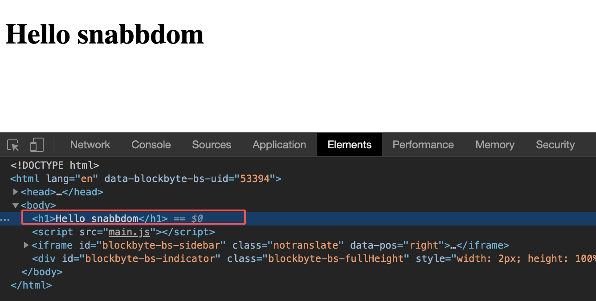
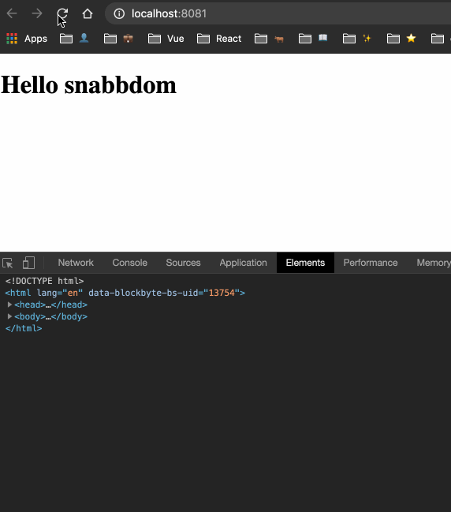
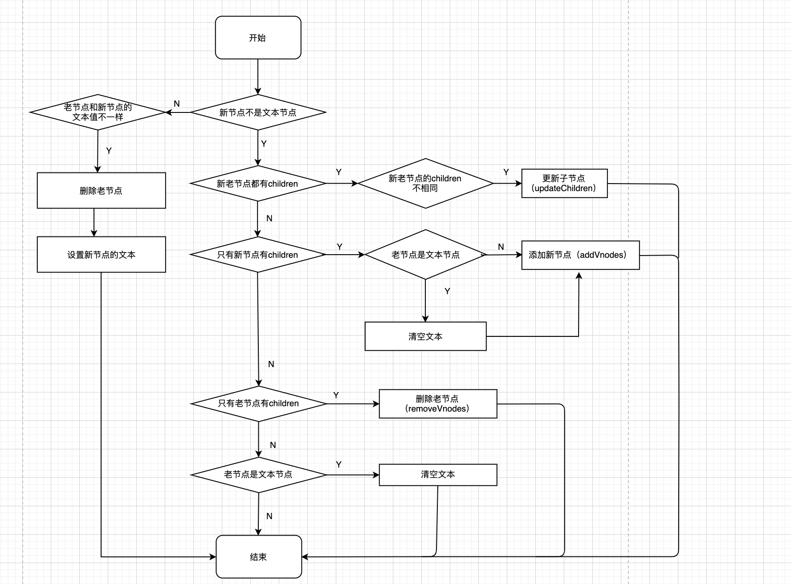

# 神奇的 patch

本节我们将学习虚拟 DOM，并且掌握如果通过 h 函数创建出虚拟 DOM，最后利用 patch 函数挂载节点。

## 从一个简单的例子说起

先来看一下简单的例子：

```js
import { init } from 'snabbdom';
import h from 'snabbdom/h';
// 创建vnode
const vnode = h('h1', {}, 'Hello snabbdom')
// 创建挂载函数
const patch = init([])
// 将vnode挂载到节点上
patch(document.getElementById('container'), vnode)
```

这段代码的运行结果如下图：



可以看到，界面上渲染了 “Hello snabbdom” 的 标题，我们的 DOM 元素也对应的生成了 h1 标签，我们只不过写了几行代码而已，就完成了这样的功能，是不是很神奇？接下来我们就从源码的角度来看看背后的奥秘。

## patch 函数

上一节我们简单的介绍了 h 函数的原理，其实就是调用 vnode 函数生成了虚拟节点，接下来我们介绍 patch 函数，它是通过 snabbdom.init 方法返回的一个函数，位于 src/snabbdom.ts 中：

```ts
export function init (modules: Array<Partial<Module>>, domApi?: DOMAPI) {
  // ...
}
```

init 方法接收两个参数：modules 和 domApi。**modules 就是一些模块，负责扩展 snabbdom 的功能。** domApi 是操作 DOM 元素的 api。上面的例子中我们只传递了一个空数组作为第一个参数。来看一下函数中具体干了什么，首先是：

```js
let i: number;
let j: number;
// 注意，这里是 module hook
const cbs: ModuleHooks = {
  create: [],
  update: [],
  remove: [],
  destroy: [],
  pre: [],
  post: []
};

const api: DOMAPI = domApi !== undefined ? domApi : htmlDomApi;

// 初始化钩子
for (i = 0; i < hooks.length; ++i) {
  cbs[hooks[i]] = [];
  for (j = 0; j < modules.length; ++j) {
    const hook = modules[j][hooks[i]];
    if (hook !== undefined) {
      (cbs[hooks[i]] as any[]).push(hook);
    }
  }
}
```

这段代码是给 cbs 和 api 赋值。由于我们没有传递第二个参数，所以这里就使用了默认的 htmlDomApi，它位于 src/htmldomapi.ts 中，实现的非常简单，就是我们常用的 DOM api，这里就不多赘述。

接着给 cbs 赋值。由于我们传递的 modules 是空数组，所以这里 cbs 的值就是就等于它的初始值：

```js
{
  create: [],
  update: [],
  remove: [],
  destroy: [],
  pre: [],
  post: []
}
```

接着定义了一大堆的内部函数：

```js
// 把一个 DOM 元素转成 vnode
function emptyNodeAt (elm: Element) { ... }
// 创建一个删除的回调函数
function createRmCb (childElm: Node, listeners: number) { ... }
// 创建元素
function createElm (vnode: VNode, insertedVnodeQueue: VNodeQueue): Node { ... }
// 添加 VNode
function addVnodes (
    parentElm: Node,
    before: Node | null,
    vnodes: VNode[],
    startIdx: number,
    endIdx: number,
    insertedVnodeQueue: VNodeQueue
  ) { ... }
// 调用 destory 钩子
function invokeDestroyHook (vnode: VNode) { ... }
// 删除 VNode
function removeVnodes (parentElm: Node,
    vnodes: VNode[],
    startIdx: number,
    endIdx: number): void { ... }
// 更新 Children
function updateChildren (parentElm: Node,
    oldCh: VNode[],
    newCh: VNode[],
    insertedVnodeQueue: VNodeQueue) { ... }
// patch Vnode
function patchVnode (oldVnode: VNode, vnode: VNode, insertedVnodeQueue: VNodeQueue) { ... }
```

我们先对这些函数有个大致的印象，具体逻辑我们稍后就会分析到。

最后返回的我们的 patch 函数，我们来看看它的定义：

```js
return function patch (oldVnode: VNode | Element, vnode: VNode): VNode {
    let i: number, elm: Node, parent: Node;
    const insertedVnodeQueue: VNodeQueue = [];
    for (i = 0; i < cbs.pre.length; ++i) cbs.pre[i]();

    // 如果 old 不是一个VNode的话，把它转化成一个 VNode
    if (!isVnode(oldVnode)) {
      oldVnode = emptyNodeAt(oldVnode);
    }
    // 如果是同一个VNode的话，执行 patch
    if (sameVnode(oldVnode, vnode)) {
      patchVnode(oldVnode, vnode, insertedVnodeQueue);
    } else {
      elm = oldVnode.elm!;
      parent = api.parentNode(elm) as Node;

      createElm(vnode, insertedVnodeQueue);

      if (parent !== null) {
        // 先根据老的节点的位置插入新的节点，再把老的删除
        api.insertBefore(parent, vnode.elm!, api.nextSibling(elm));
        removeVnodes(parent, [oldVnode], 0, 0);
      }
    }

    for (i = 0; i < insertedVnodeQueue.length; ++i) {
      insertedVnodeQueue[i].data!.hook!.insert!(insertedVnodeQueue[i]);
    }
    for (i = 0; i < cbs.post.length; ++i) cbs.post[i]();
    return vnode;
  };
```

通过 init 方法返回的就是上面这个 patch 函数了，当调用它的时候，我们来分析一下它的执行流程：

首先它先执行了一遍模块的 pre 钩子：

```js
for (i = 0; i < cbs.pre.length; ++i) cbs.pre[i]();
```

我们这里没有定义对应的钩子函数，所以继续往下。

```js
if (!isVnode(oldVnode)) {
  oldVnode = emptyNodeAt(oldVnode);
}
```

判断 oldVnode 是不是一个虚拟节点，其实就是看这个对象有没有 sel 属性：

```js
function isVnode (vnode: any): vnode is VNode {
  return vnode.sel !== undefined;
}
```

由于这里我们的 oldVnode 是一个真实的 DOM 元素，所以这里的 `!isVnode(oldVnode)` 为 true，所以给 oldVnode 重新赋值，我们来看看它的过程：

```js
function emptyNodeAt (elm: Element) {
  const id = elm.id ? '#' + elm.id : '';
  const c = elm.className ? '.' + elm.className.split(' ').join('.') : '';
  return vnode(api.tagName(elm).toLowerCase() + id + c, {}, [], undefined, elm);
}
```

其实就是计算出 sel 的名称，例子中的结果明显是：`"div#container"`，最终依据这个 sel 返回一个 VNode，它的值为：

```js
// 这里的 oldVnode = document.getElementById('container')
{ sel: 'div#container', data: {}, children: [], text: undefined, ele: oldVnode, key: undefined }
```

再回到 patch 函数中，继续往下：

```js
if (sameVnode(oldVnode, vnode)) {
  patchVnode(oldVnode, vnode, insertedVnodeQueue);
} else {
  elm = oldVnode.elm!;
  parent = api.parentNode(elm) as Node;

  createElm(vnode, insertedVnodeQueue);

  if (parent !== null) {
    // 先根据老的节点的位置插入新的节点，再把老的删除
    api.insertBefore(parent, vnode.elm!, api.nextSibling(elm));
    removeVnodes(parent, [oldVnode], 0, 0);
  }
}
```

首先判断 oldVnode 和 vnode 是否一样，其实就是对比他们的 key 和 sel 是否一致：

```js
function sameVnode (vnode1: VNode, vnode2: VNode): boolean {
  return vnode1.key === vnode2.key && vnode1.sel === vnode2.sel;
}
```

我们的 vnode 的 sel = 'h1'，很显然，两者不一致，所以执行的是 else 的逻辑。在 else 中，首先拿到 oldVnode 对应到真实 DOM 节点，再通过 `api.parentNode(elm)` 获取它的父亲。接着使用 `createElm(vnode, insertedVnodeQueue);` 创建出一个真实的 DOM 节点，我们来看看：

```js
function createElm (vnode: VNode, insertedVnodeQueue: VNodeQueue): Node {
  let i: any;
  // 调用 vnode 的 init 钩子
  let data = vnode.data;
  if (data !== undefined) {
    const init = data.hook?.init;
    if (isDef(init)) {
      init(vnode);
      // 这里要给 data 重新赋值，因为在 init 过程中可能会对 vnode.data 做操作
      data = vnode.data;
    }
  }
  const children = vnode.children;
  const sel = vnode.sel;
  if (sel === '!') { // 注释节点的语法糖。如果 sel 是 ! 的话，那么就创建一个注释节点。
    if (isUndef(vnode.text)) {
      vnode.text = '';
    }
    vnode.elm = api.createComment(vnode.text!);
  } else if (sel !== undefined) {
    // 解析选择器
    const hashIdx = sel.indexOf('#');
    const dotIdx = sel.indexOf('.', hashIdx);
    const hash = hashIdx > 0 ? hashIdx : sel.length;
    const dot = dotIdx > 0 ? dotIdx : sel.length;
    const tag = hashIdx !== -1 || dotIdx !== -1 ? sel.slice(0, Math.min(hash, dot)) : sel;
    // 创建 DOM 元素
    const elm = vnode.elm = isDef(data) && isDef(i = data.ns)
      ? api.createElementNS(i, tag)
      : api.createElement(tag);
    // 设置 DOM 元素的 id 和 class
    if (hash < dot) elm.setAttribute('id', sel.slice(hash + 1, dot));
    if (dotIdx > 0) elm.setAttribute('class', sel.slice(dot + 1).replace(/\./g, ' '));
    // 调用模块的 create 钩子
    for (i = 0; i < cbs.create.length; ++i) cbs.create[i](emptyNode, vnode);
    if (is.array(children)) { // 遍历 children，创建子元素，并且将子元素 append 到刚创建的 DOM 元素上
      for (i = 0; i < children.length; ++i) {
        const ch = children[i];
        if (ch != null) {
          api.appendChild(elm, createElm(ch as VNode, insertedVnodeQueue));
        }
      }
    } else if (is.primitive(vnode.text)) { // 创建文本节点
      api.appendChild(elm, api.createTextNode(vnode.text));
    }
    // 此时 DOM 元素都创建好了，调用 vnode 的 create 钩子
    const hook = vnode.data!.hook;
    if (isDef(hook)) {
      hook.create?.(emptyNode, vnode);
      // 如果定义了 insert 钩子的话，将当前 vnode 添加到 insertedVnodeQueue 中
      if (hook.insert) {
        insertedVnodeQueue.push(vnode);
      }
    }
  } else {
    // 都不满足的话，创建一个文本节点
    vnode.elm = api.createTextNode(vnode.text!);
  }
  // 返回创建的 DOM 元素
  return vnode.elm;
}
```

代码比较长，但是逻辑很清晰。首先在创建 DOM 之前，调一下 vnode 的 init 钩子。接着，根据 vnode.sel 的值创建不同的元素节点：
- 如果是 "!" 的话，创建注释节点；
- 如果不是 undefined 的话，那么尝试解析 sel 的值，然后调用根据解析出的 tag 创建对应的元素，并且设置 id 和 class，然后又是调用模块的 create 钩子，然后遍历 children，创建子元素并且添加到当前元素上，都创建完成以后，再执行 vnode 的 create 钩子
- 如果是 undefined 的话，那么创建一个文本节点

最后返回这个新创建的 DOM 节点。

再回到我们的 patch 函数中，经过 `createElm(vnode, insertedVnodeQueue);` 后，我们的 `vnode.elm` 已经保存了刚刚创建的 DOM 节点了，最后将这个 DOM 节点追加到父亲上就大功告成了：

```js
if (parent !== null) {
  api.insertBefore(parent, vnode.elm!, api.nextSibling(elm));
  removeVnodes(parent, [oldVnode], 0, 0);
}
```

这里使用 `api.insertBefore` 将 vnode.elm 插到旧节点的前面，接着调用 `removeVnodes` 删除旧节点：

```js
function removeVnodes (parentElm: Node,
  vnodes: VNode[],
  startIdx: number,
  endIdx: number): void {
  for (; startIdx <= endIdx; ++startIdx) {
    let listeners: number;
    let rm: () => void;
    const ch = vnodes[startIdx];
    if (ch != null) {
      if (isDef(ch.sel)) {
        invokeDestroyHook(ch);
        listeners = cbs.remove.length + 1;
        rm = createRmCb(ch.elm!, listeners);
        for (let i = 0; i < cbs.remove.length; ++i) cbs.remove[i](ch, rm);
        const removeHook = ch?.data?.hook?.remove;
        if (isDef(removeHook)) {
          removeHook(ch, rm);
        } else {
          rm();
        }
      } else { // Text node
        api.removeChild(parentElm, ch.elm!);
      }
    }
  }
}
```

我们的例子中，就是单纯的删除一个 oldVnode 节点，所以循环只会走一次。这里要注意的第一个是：
```js
invokeDestroyHook(ch);
```

它负责调用模块钩子和 vnode 本身的钩子：

```js
function invokeDestroyHook (vnode: VNode) {
  const data = vnode.data;
  if (data !== undefined) {
    // 调用它本身的钩子
    data?.hook?.destroy?.(vnode);
    // 再调用模块级别的钩子
    for (let i = 0; i < cbs.destroy.length; ++i) cbs.destroy[i](vnode);
    // 如果它有 children 的话，递归的调用 child 的钩子
    if (vnode.children !== undefined) {
      for (let j = 0; j < vnode.children.length; ++j) {
        const child = vnode.children[j];
        if (child != null && typeof child !== 'string') {
          invokeDestroyHook(child);
        }
      }
    }
  }
}
```

在调用的时候，还会遍历当前 vnode 的 children，对每一个存在的 child 去递归调用自身。所以这里也可以得出一个结论：destroy 钩子的调用，是从父到子的顺序。由于例子中我们两者都没有定义，所以这段代码的执行也就是“走个过场”。

接着会创建一个 rm 函数，然后执行模块的 remove 钩子：

```js
for (let i = 0; i < cbs.remove.length; ++i) cbs.remove[i](ch, rm);
```

接着判断我们的 vnode 有没有定义 remove 钩子，定义的话就执行这个钩子函数；否则执行我们上面定义的 rm 函数。本例中我们的 vnode 没有对应的钩子，所以执行的是 rm 函数，它的值是一个函数：

```js
function rmCb () {
  if (--listeners === 0) {
    const parent = api.parentNode(childElm) as Node;
    api.removeChild(parent, childElm);
  }
};
```

可以看到，在函数调用了 api.removeChild 方法，从 DOM 中移除了当前节点。这里有一个 listeners 变量，它的用处很巧妙，我们先留个悬念，后续会详细介绍。好了，到这里 removeVnodes 函数就执行完了，再回到 patch 函数中，接下来就是一些收尾工作：

```js
for (i = 0; i < insertedVnodeQueue.length; ++i) {
  insertedVnodeQueue[i].data!.hook!.insert!(insertedVnodeQueue[i]);
}
for (i = 0; i < cbs.post.length; ++i) cbs.post[i]();
```

先将 insertedVnodeQueue 遍历一遍，执行它每一项的 insert 方法；接着调用模块的 post 钩子。

最后返回我们新的 vnode，也就是说，patch 函数返回的是我们新的 vnode。到这里，例子中的 patch 方法执行结束了。


## 更新 DOM

在 snabbdom 中，我们对真实 DOM 的修改，是通过操作虚拟 DOM 来实现的。这里我们添加一行代码，让 DOM 在 3秒 后更新：

```js{2}
setTimeout(() => {
  patch(vnode, h('h1', [h('span', 'Jerry')]))
}, 3000);
```

看一下运行结果：




我们再来看一下这里的 patch 方法的实现原理，它的逻辑跟初始化渲染的时候是不一样的。


这时的两个参数分别是：`h('h1', {}, 'Hello snabbdom')` 和 `h('h1', [h('span', 'Jerry')])`，可以看出来，对他们执行 `sameVnode` 函数时会返回 true，因此就会执行另一个分支逻辑：

```js
patchVnode(oldVnode, vnode, insertedVnodeQueue);
```

在这里，会对新旧 vnode 进行比较，差异化的更新 DOM，来看一下实现：

```js
function patchVnode (oldVnode: VNode, vnode: VNode, insertedVnodeQueue: VNodeQueue) {
  // prepatch
  const hook = vnode.data?.hook;
  hook?.prepatch?.(oldVnode, vnode);
  // 既然是同一个节点，那么 旧vnode 对应的 DOM 节点应该也是 新vnode的，这里做一下赋值操作
  const elm = vnode.elm = oldVnode.elm!;
  const oldCh = oldVnode.children as VNode[];
  const ch = vnode.children as VNode[];
  // 如果两个相同，就直接返回
  if (oldVnode === vnode) return;
  // 调用模块的钩子和 vnode 的钩子
  if (vnode.data !== undefined) {
    for (let i = 0; i < cbs.update.length; ++i) cbs.update[i](oldVnode, vnode);
    vnode.data.hook?.update?.(oldVnode, vnode);
  }
  // 新旧比对
  if (isUndef(vnode.text)) {
    if (isDef(oldCh) && isDef(ch)) {
      if (oldCh !== ch) updateChildren(elm, oldCh, ch, insertedVnodeQueue);
    } else if (isDef(ch)) {
      if (isDef(oldVnode.text)) api.setTextContent(elm, '');
      addVnodes(elm, null, ch, 0, ch.length - 1, insertedVnodeQueue);
    } else if (isDef(oldCh)) {
      removeVnodes(elm, oldCh, 0, oldCh.length - 1);
    } else if (isDef(oldVnode.text)) {
      api.setTextContent(elm, '');
    }
  } else if (oldVnode.text !== vnode.text) {
    if (isDef(oldCh)) {
      removeVnodes(elm, oldCh, 0, oldCh.length - 1);
    }
    api.setTextContent(elm, vnode.text!);
  }
  // 调用 vnode 的 postpatch 钩子
  hook?.postpatch?.(oldVnode, vnode);
}
```

这段代码的主要逻辑在于新旧节点对比的时候做的判断，为了便于理解，我画了一张流程图：



根据上面的流程图，我们很清晰的可以看到每一种情况下执行的逻辑。本例中，我们的 vnode 的值为：

```js
{"sel":"h1","data":{},"children":[{"sel":"span","data":{},"text":"Jerry"}]}
```

oldVnode 的值为：

```js
{"sel":"h1","data":{},"text":"Hello snabbdom","elm":{}}
```

这里也可以看出来，之前介绍 h 函数的时候，对于不同参数的处理，最终生成的虚拟节点也是有区别的。

根据 oldVnode 和 vnode 的值，很容易的看到当前执行的逻辑是：

```js
if (isDef(oldVnode.text)) api.setTextContent(elm, '');
addVnodes(elm, null, ch, 0, ch.length - 1, insertedVnodeQueue);
```

首先利用 `api.setTextContent(elm, '')` 将当前 DOM 节点上的文本内容清空，然后再通过 addVnodes 将新节点插入。这里的 ch 是一个数组，addVnodes 函数我们之前介绍过了，就是遍历要插入的节点数组，依次的插入到 DOM 中。


在 patchVnode 的最后，再调用一下 vnode 的 postpatch 的钩子：

```js
hook?.postpatch?.(oldVnode, vnode);
```

至此，我们的 patchVnode 方法就介绍完了。回到 patch 函数中，它之后的逻辑上一节也介绍过了，不赘述。

