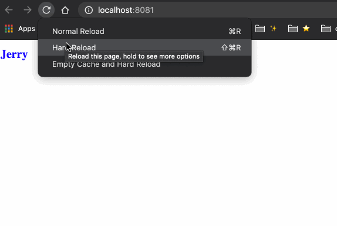
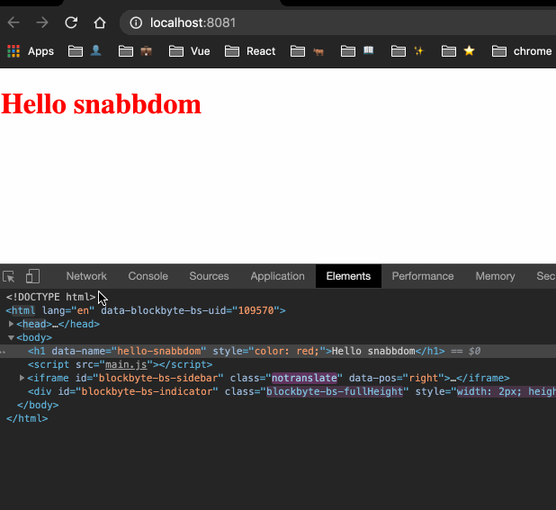
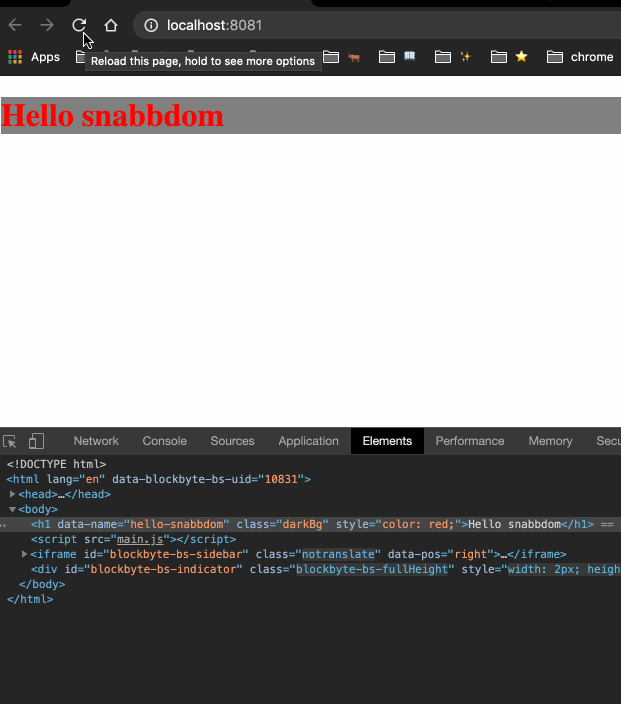
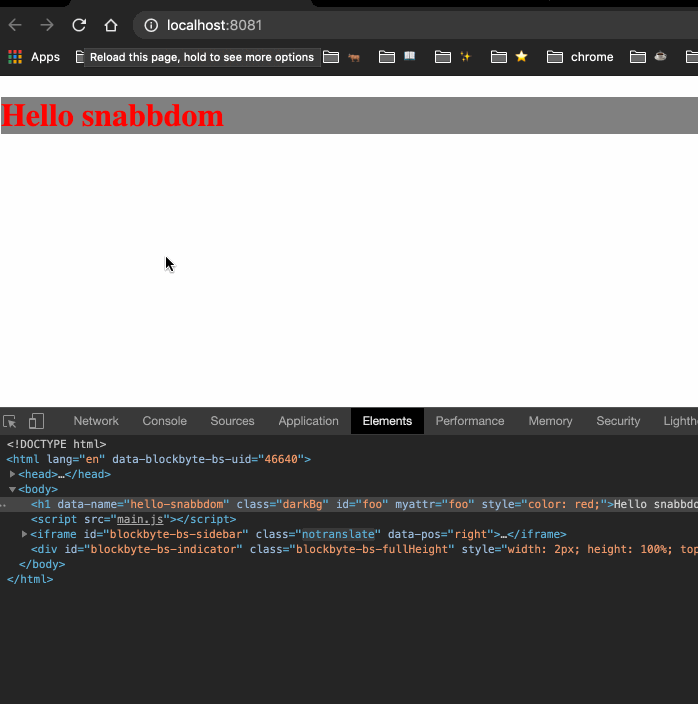
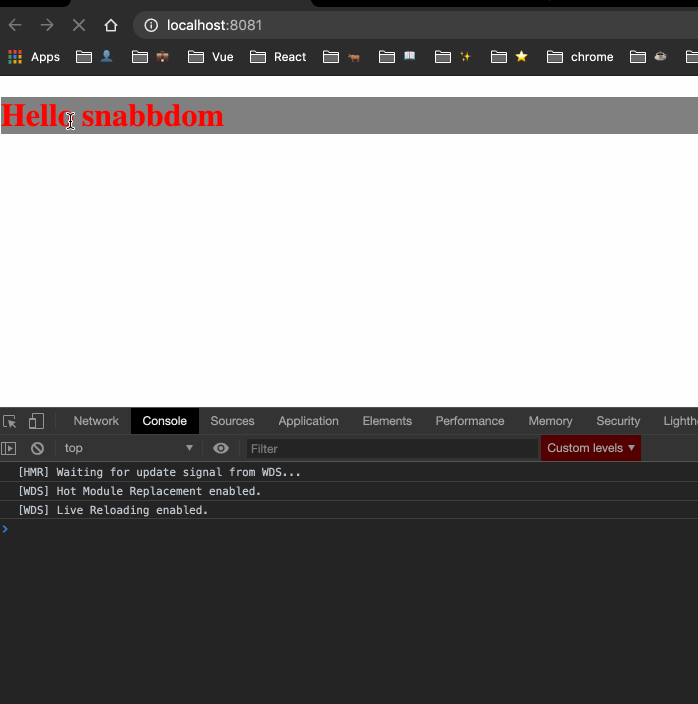

# 锦上添花的 Modules

## style

### 使用方式

关于 style 的使用方式：[snabbdom-module/style](https://github.com/snabbdom/snabbdom#the-style-module)


我们对上一节的栗子做一些小小的修改：

```js{5,7,12}
import { init } from 'snabbdom';
import h from 'snabbdom/h';
import style from 'snabbdom/modules/style'

const patch = init([style])

const vnode = h('h1', { style: { color: 'red' } }, 'Hello snabbdom')

patch(document.getElementById('container'), vnode)

setTimeout(() => {
  patch(vnode, h('h1', { style: { color: 'blue', fontSize: '20px' } }, 'Jerry'))
}, 3000);
```

运行结果：



### 源码解析


首先我们先对导入的 style 模块有个基本的认识，它位于 src/modules/style.ts 中：

```js
export const styleModule: Module = {
  pre: forceReflow,
  create: updateStyle,
  update: updateStyle,
  destroy: applyDestroyStyle,
  remove: applyRemoveStyle
};
```

可以看到，它实际上就是一个包含几个钩子函数的对象。

在上一节的 init 介绍过程中，我们提到了与模块相关的初始化，也就是在 init 的一开始：

```js
let i: number;
let j: number;

const cbs: ModuleHooks = {
  create: [],
  update: [],
  remove: [],
  destroy: [],
  pre: [],
  post: []
};

const api: DOMAPI = domApi !== undefined ? domApi : htmlDomApi;

for (i = 0; i < hooks.length; ++i) {
  cbs[hooks[i]] = [];
  for (j = 0; j < modules.length; ++j) {
    const hook = modules[j][hooks[i]];
    if (hook !== undefined) {
      (cbs[hooks[i]] as any[]).push(hook);
    }
  }
}
```

其中 hooks 的定义为：

```js
const hooks: Array<keyof Module> = ['create', 'update', 'remove', 'destroy', 'pre', 'post'];
```

所以，上面的两层循环执行完以后，我们的 cbs 的结果如下：

```js
{
  pre: [forceReflow],
  create: [updateStyle],
  update: [updateStyle],
  destroy: [applyDestroyStyle],
  remove: [applyRemoveStyle]
}
```

接着，snabbdom 会在合适的时机调用这些钩子，完成相应的功能。

#### pre 钩子

结合上一节的介绍，当第一次调用 patch 的时候，我们来分析一下执行逻辑，首先是 pre 钩子：

```js
for (i = 0; i < cbs.pre.length; ++i) cbs.pre[i]();
```

也就是会先执行我们的 `forceReflow` 方法：

```js
function forceReflow () {
  reflowForced = false;
}
```

很简单，就是重置这个 reflowForced 标记位为 false。关于这个标记位的作用，我们待会会讲到。

#### create 钩子

紧接着，由于是第一次调用，所以这时候执行的是 createElm 。在 `createElm(vnode, insertedVnodeQueue);` 中，我们会执行到：

```js
for (i = 0; i < cbs.create.length; ++i) cbs.create[i](emptyNode, vnode);
```

也就是会执行 updateStyle 方法：

```js
function updateStyle (oldVnode: VNode, vnode: VNode): void {
  var cur: any; // 循环时使用的变量
  var name: string; // 循环时使用的变量
  var elm = vnode.elm; // DOM 节点
  var oldStyle = (oldVnode.data as VNodeData).style; // 旧的 style
  var style = (vnode.data as VNodeData).style; // 新的 style

  if (!oldStyle && !style) return; // 都没有定义的话，直接 return
  if (oldStyle === style) return; // 相等的话，直接 return
  oldStyle = oldStyle || {};
  style = style || {};
  var oldHasDel = 'delayed' in oldStyle; // oldStyle 中是不是有 delayed 属性

  for (name in oldStyle) {
    if (!style[name]) {
      if (name[0] === '-' && name[1] === '-') {
        (elm as any).style.removeProperty(name);
      } else {
        (elm as any).style[name] = '';
      }
    }
  }
  for (name in style) {
    cur = style[name];
    if (name === 'delayed' && style.delayed) {
      for (const name2 in style.delayed) {
        cur = style.delayed[name2];
        if (!oldHasDel || cur !== (oldStyle.delayed as any)[name2]) {
          setNextFrame((elm as any).style, name2, cur);
        }
      }
    } else if (name !== 'remove' && cur !== oldStyle[name]) {
      if (name[0] === '-' && name[1] === '-') {
        (elm as any).style.setProperty(name, cur);
      } else {
        (elm as any).style[name] = cur;
      }
    }
  }
}
```

这里的 oldVnode 是一个空的 Vnode：emptyNode，它的值为 `vnode('', {}, [], undefined, undefined);`；vnode 则是刚刚创建的：`h('h1', { style: { color: 'red' } }, 'Hello snabbdom')`。代入这两个值，我们来看看这里的流程：

首先声明了一堆变量，接着进入第一个 for 循环：

```js
for (name in oldStyle) {
  if (!style[name]) {
    if (name[0] === '-' && name[1] === '-') {
      (elm as any).style.removeProperty(name);
    } else {
      (elm as any).style[name] = '';
    }
  }
}
```

很显然，这段逻辑的主要作用，是将 oldStyle 中有但是 style 中没有的样式或者样式属性删除。由于我们此时的 oldStyle 是个空对象，所以这段循环内的代码也不会被执行。


接着我们来看第二段循环：

```js
for (name in style) {
  cur = style[name];
  if (name === 'delayed' && style.delayed) {
    for (const name2 in style.delayed) {
      cur = style.delayed[name2];
      if (!oldHasDel || cur !== (oldStyle.delayed as any)[name2]) {
        setNextFrame((elm as any).style, name2, cur);
      }
    }
  } else if (name !== 'remove' && cur !== oldStyle[name]) {
    if (name[0] === '-' && name[1] === '-') {
      (elm as any).style.setProperty(name, cur);
    } else {
      (elm as any).style[name] = cur;
    }
  }
}
```

这里是遍历新的 style 对象，拿到每一个属性进行处理。首先判断属性的名称是不是 delayed，并且 style.delayed 有值，满足条件的话，再继续遍历这个 delayed 对象，再拿到它的每一个属性，如果 oldStyle 中没有 delayed 属性，或者当前属性的值与 oldStyle 中对应的属性的值不想等，那么执行：

```js
setNextFrame((elm as any).style, name2, cur);
```

这个 setNextFrame 实现也很简单，就是利用浏览器的异步机制将当前属性的赋值延迟到下一次事件循环中：

```js
var raf = (typeof window !== 'undefined' && (window.requestAnimationFrame).bind(window)) || setTimeout;
var nextFrame = function (fn: any) {
  raf(function () {
    raf(fn);
  });
};
var reflowForced = false;

function setNextFrame (obj: any, prop: string, val: any): void {
  nextFrame(function () {
    obj[prop] = val;
  });
}
```

由于我们这里没有 delayed 属性，所以这里执行的其实是第二个判断：

```js
else if (name !== 'remove' && cur !== oldStyle[name]) {
  if (name[0] === '-' && name[1] === '-') {
    (elm as any).style.setProperty(name, cur);
  } else {
    (elm as any).style[name] = cur;
  }
}
```

首先判断名称不是 remove，因为我们会对 remove 属性做特殊处理；并且这个属性 oldStyle 中没有，因为我们只操作新增的样式。满足条件的话，就进行具体的值的设置了，如果发现是样式属性的话（即 --bgColor 之类的），就调用 DOM api `setProperty` 设置这个属性和值；如果是正常的样式的话，就直接给这个样式赋值即可。对于我们的例子，应该是直接给样式赋值，也就是给这个新创建的 h1 元素的 style 属性添加一个 `color: red` 样式。

好了，此时 updateStyle 方法介绍完了，整个流程还是很简单的，就是根据对应的条件，删除一些旧样式，添加一些新样式。

#### destroyed 钩子

第一个 patch 函数的最后，我们从之前章节的介绍中了解到，还有插入新节点、移除旧节点的操作：

```js
if (parent !== null) {
  // 先根据老的节点的位置插入新的节点，再把老的删除
  api.insertBefore(parent, vnode.elm!, api.nextSibling(elm));
  removeVnodes(parent, [oldVnode], 0, 0);
}
```

我们主要看 removeVnodes 的操作，它会遍历要移除的 vnodes，然后调用模块的 destroyed 钩子：

```js
invokeDestroyHook(ch);
```

这个函数我们在 patch 这节也有过介绍，其实就是调用 vnode 的 destroy 钩子和模块的 destroy 钩子，我们来看一下这个 style 模块的 destroy 钩子函数：

```js
function applyDestroyStyle (vnode: VNode): void {
  var style: any;
  var name: string;
  var elm = vnode.elm;
  var s = (vnode.data as VNodeData).style;
  if (!s || !(style = s.destroy)) return;
  for (name in style) {
    (elm as any).style[name] = style[name];
  }
}
```

这段逻辑主要是，如果当前 vnode 没有定义 style，或者 style.destroy 的没有值的话，那么直接返回；否则遍历这个 destroy 对象，把这里面的属性赋值给当前元素的 style 的对应属性。由于我们栗子中的 vnode 没有 style，所以这里直接返回了。

#### remove 钩子

接着回到 removeVnodes 中，接下来会执行到：

```js
for (let i = 0; i < cbs.remove.length; ++i) cbs.remove[i](ch, rm);
```

来执行我们模块的 remove 钩子。**remove 钩子是要和 CSS Transitions 一起使用的，它会在我们删除元素时执行对应的过渡动画**。我们来看看 style 对应的钩子函数的定义：

```js
function applyRemoveStyle (vnode: VNode, rm: () => void): void {
  var s = (vnode.data as VNodeData).style;
  if (!s || !s.remove) {
    rm();
    return;
  }
  if (!reflowForced) {
    // eslint-disable-next-line @typescript-eslint/no-unused-expressions
    (vnode.elm as any).offsetLeft;
    reflowForced = true;
  }
  var name: string;
  var elm = vnode.elm;
  var i = 0;
  var compStyle: CSSStyleDeclaration;
  var style = s.remove;
  var amount = 0;
  var applied: string[] = [];
  for (name in style) {
    applied.push(name);
    (elm as any).style[name] = style[name];
  }
  compStyle = getComputedStyle(elm as Element);
  var props = (compStyle as any)['transition-property'].split(', ');
  for (; i < props.length; ++i) {
    if (applied.indexOf(props[i]) !== -1) amount++;
  }
  (elm as Element).addEventListener('transitionend', function (ev: TransitionEvent) {
    if (ev.target === elm) --amount;
    if (amount === 0) rm();
  });
}
```

首先这里的 rm 函数是通过 `createRmCb(ch.elm!, listeners)` 创建出来的。如果发现没有 style 或者 style 对象没有定义 remove 的话，那么直接执行这个 rm 函数后返回即可。

接着判断 reflowForced 这个变量的值，我们在 pre 钩子中已经将它的值设为 false 了，所以这里这里要强制的**回流**一次，方式很简单，就是或许一个 DOM 的   offsetLeft 的值，然后将 reflowForced 设置为 true。

然后获取 remove 属性的值，遍历这个对象，将每一个属性添加到 applied 数组中，又给这个 DOM 元素的 style 添加这个属性。

接着又调用 `getComputedStyle(elm)` 来获取当前元素的计算样式的值 compStyle，通过这个 compStyle 来获取它的 `transition-property` 属性数组，再遍历这个数组，检查里面的元素是不是在之前定义的 applied 数组中，在的话给 amount 自增。

最后就是给我们的 `transitionend` 添加监听事件，在动画结束的时候执行 rm() 函数。

这里的逻辑可能解释起来比较抽象，读者可以自己写一个栗子尝试一下，就明白了这里的流程了。

#### update 钩子
还剩一个 update 钩子函数。当我们在 setTimeout 中第二次调用 patch 的时候，会执行 patchVnode 函数，在这个函数中会执行我们的 update 钩子：

```js
if (vnode.data !== undefined) {
  for (let i = 0; i < cbs.update.length; ++i) cbs.update[i](oldVnode, vnode);
  vnode.data.hook?.update?.(oldVnode, vnode);
}
```

由于 create 和 update 钩子对应的都是 updateStyle 函数，所以这里的执行流程也是一样的，读者可以根据 create 自行理解一下这里的流程。


## dataset

### 使用方式

我们对 style 一节对栗子添加一些代码：

```js{4,6,10,18}
import { init } from 'snabbdom';
import h from 'snabbdom/h';
import style from 'snabbdom/modules/style'
import dataset from 'snabbdom/modules/dataset'

const patch = init([style, dataset])

const vnode = h('h1', { 
  style: { color: 'red' }, 
  dataset: { name: 'hello-snabbdom' } 
}, 'Hello snabbdom')

patch(document.getElementById('container'), vnode)

setTimeout(() => {
  patch(vnode, h('h1', { 
    style: { color: 'blue', fontSize: '20px' }, 
    dataset: { name: 'world' } 
}, 'Jerry'))
}, 3000);
```

运行结果：



可以在调试工具的 Elements 面板中看到，一开始的元素有一个 data-name 的属性，它的值是 "hello-snabbdom"，三秒后变成了 "world"。接下来我们就来看看这个过程的实现原理。

### 源码解析

它的源码位于 src/modules/dataset 中：

```js
import {VNode, VNodeData} from '../vnode';
import {Module} from './module';

export type Dataset = Record<string, string>;

const CAPS_REGEX = /[A-Z]/g;

function updateDataset(oldVnode: VNode, vnode: VNode): void {
  let elm: HTMLElement = vnode.elm as HTMLElement,
  oldDataset = (oldVnode.data as VNodeData).dataset, // 旧的 dataset
  dataset = (vnode.data as VNodeData).dataset, // 新的 dataset
  key: string;

  if (!oldDataset && !dataset) return; // 都没有定义的话，直接返回
  if (oldDataset === dataset) return; // 相等的话，直接返回
  oldDataset = oldDataset || {};
  dataset = dataset || {};
  const d = elm.dataset; // 真实 DOM 元素上的 dataset

  // 遍历旧的 dataset
  for (key in oldDataset) {
    // 新的里面没有这个 key
    if (!dataset[key]) {
      // 如果 DOM 元素有 dataset 的话，直接操作这个 dataset 对象，删除掉这个 key
      if (d) {
        if (key in d) {
          delete d[key];
        }
      } else {
        // 否则调用 DOM API 来删除这个 dataset 的 key
        elm.removeAttribute('data-' + key.replace(CAPS_REGEX, '-$&').toLowerCase());
      }
    }
  }
  // 遍历新的 dataset
  for (key in dataset) {
    // 对应某个key的值，新旧不相等
    if (oldDataset[key] !== dataset[key]) {
      // 如果 DOM 元素有 dataset 的话，那么直接操作这个 dataset 对象，给它添加属性即可
      if (d) {
        d[key] = dataset[key];
      } else {
        // 否则利用 DOM API 添加这个属性的值
        elm.setAttribute('data-' + key.replace(CAPS_REGEX, '-$&').toLowerCase(), dataset[key]);
      }
    }
  }
}

export const datasetModule = {create: updateDataset, update: updateDataset} as Module;
export default datasetModule;
```

它导出了两个钩子：create 和 update，这两个钩子都指向同一个函数：updateDataset。这个函数的实现也非常的简单，两个循环就搞定了。详细解释都在代码注释中了，大致流程是：第一个循环，删除不用的 dataset 属性，第二个循环，添加新增的 dataset 属性。其中，如果能通过 DOM 获取到 dataset 对象的话，说明这个元素已经定义了 dataset，那么直接操作这个对象即可，**对这个对象的修改会实时的反应到 DOM 上。**


## class

### 使用方式

我们继续修改上面的栗子，添加我们的 class 模块

```js{5,7,12,21}
import { init } from 'snabbdom';
import h from 'snabbdom/h';
import style from 'snabbdom/modules/style'
import dataset from 'snabbdom/modules/dataset'
import klass from 'snabbdom/modules/class'

const patch = init([style, dataset, klass])

const vnode = h('h1', { 
  style: { color: 'red' }, 
  dataset: { name: 'hello-snabbdom' } ,
  class: { darkBg: true }
}, 'Hello snabbdom')

patch(document.getElementById('container'), vnode)

setTimeout(() => {
  patch(vnode, h('h1', { 
    style: { color: 'blue', fontSize: '20px' }, 
    dataset: { name: 'world' },
    class: { darkBg: false }
}, 'Jerry'))
}, 3000);
```

还要在我们的 index.html 中添加一个样式：

```html
<style>
  .darkBg{
    background-color: grey;
  }
</style>
```

运行结果：



可以看到，一开始的 h1 是有灰色背景色的，三秒后就没有了。我们来看一下它背后的实现原理。

### 源码解析

源码位于 src/modules/class.ts 中：

```js
import {VNode, VNodeData} from '../vnode';
import {Module} from './module';

export type Classes = Record<string, boolean>

function updateClass(oldVnode: VNode, vnode: VNode): void {
  var cur: any, name: string, elm: Element = vnode.elm as Element,
      oldClass = (oldVnode.data as VNodeData).class,
      klass = (vnode.data as VNodeData).class;

  if (!oldClass && !klass) return;
  if (oldClass === klass) return;
  oldClass = oldClass || {};
  klass = klass || {};

  for (name in oldClass) {
    if (!klass[name]) {
      // 删除旧的中有，而新的中没有的样式
      elm.classList.remove(name);
    }
  }
  for (name in klass) {
    // 新样式的值
    cur = klass[name];
    // 如果新旧样式的值不相等的话，比如我们栗子中的 darkBg，一个是 false，一个是 true
    if (cur !== oldClass[name]) {
      // 根据 cur 的值来确定我们是 新增 还是 删除 这个样式
      (elm.classList as any)[cur ? 'add' : 'remove'](name);
    }
  }
}

export const classModule = {create: updateClass, update: updateClass} as Module;
export default classModule;
```

首先，看一下他的导出的 classModule 依然是只有 create 和 update 钩子，并且两者指向同一个函数：updateClass。这个函数的实现也非常的简单，与我们上面介绍的 dataset 非常类似，也是通过两个 for 循环解决问题。第一个循环，删除了不需要的样式；第二个循环，针对新样式对象中的值来删除或者新增某些样式。


## props & attributes

由于这两个实现基本类似，所以我放到了一起，仅以 props 为例。

关于 properties 和 attributes 的区别，可以参考这一篇文章：[what-is-the-difference-between-properties-and-attributes-in-html](https://stackoverflow.com/questions/6003819/what-is-the-difference-between-properties-and-attributes-in-html/6004028)

### 使用方式

老样子，根据上一节的栗子，我们添加 props 和 attributes 的代码：

```js
import { init } from 'snabbdom';
import h from 'snabbdom/h';
import style from 'snabbdom/modules/style'
import dataset from 'snabbdom/modules/dataset'
import klass from 'snabbdom/modules/class'
import props from 'snabbdom/modules/props'
import attr from 'snabbdom/modules/attributes'

const patch = init([style, dataset, klass, props, attr])

const vnode = h('h1', { 
  style: { color: 'red' }, 
  dataset: { name: 'hello-snabbdom' } ,
  class: { darkBg: true },
  props: { id: 'foo' },
  attrs: { myAttr: 'foo' }
}, 'Hello snabbdom')

patch(document.getElementById('container'), vnode)

setTimeout(() => {
  patch(vnode, h('h1', { 
    style: { color: 'blue', fontSize: '20px' }, 
    dataset: { name: 'world' },
    class: { darkBg: false },
    props: { id: 'bar' },
    attrs: { myAttr: 'zoo' }
}, 'Jerry'))
}, 3000);
```

运行结果：



可以观察一下调试工具里的元素，它的 id 属性和 myAttr 特性前后都发生了变化。

### 源码解析

它们的源码位于 src/modules/props.ts 和 src/modules/attributes.ts 中，这里我们分析 props 的实现：

```js
import {VNode, VNodeData} from '../vnode';
import {Module} from './module';

export type Props = Record<string, any>;

function updateProps(oldVnode: VNode, vnode: VNode): void {
  var key: string, cur: any, old: any, elm = vnode.elm,
      oldProps = (oldVnode.data as VNodeData).props,
      props = (vnode.data as VNodeData).props;

  if (!oldProps && !props) return;
  if (oldProps === props) return;
  oldProps = oldProps || {};
  props = props || {};

  for (key in oldProps) {
    if (!props[key]) {
      delete (elm as any)[key];
    }
  }
  for (key in props) {
    cur = props[key];
    old = oldProps[key];
    if (old !== cur && (key !== 'value' || (elm as any)[key] !== cur)) {
      (elm as any)[key] = cur;
    }
  }
}

export const propsModule = {create: updateProps, update: updateProps} as Module;
export default propsModule;
```

它导出了 create 和 udpate 钩子，两个钩子也是同一个函数：updateProps。它的实现也非常简单，就是删除旧的 props，增加新的 props。其实这里的实现跟 jQuery 的 prop() 方法很像，这里不多做赘述了。

关于 attributes 的实现，它与 props 不同的是，它使用 setAttribute 和 removeAttribute 来设置和删除属性，并且还考虑到了命名空间（setAttributeNS）的问题。

## eventlisteners

eventlisteners 模块提供了非常强大的功能让我们可以为元素绑定事件，我们这一小节就来看看它的用法和原理。

### 使用方法

我们添加一些事件绑定的代码：

```js
import { init } from 'snabbdom';
import h from 'snabbdom/h';
import style from 'snabbdom/modules/style'
import dataset from 'snabbdom/modules/dataset'
import klass from 'snabbdom/modules/class'
import props from 'snabbdom/modules/props'
import attr from 'snabbdom/modules/attributes'
import eventlisteners from 'snabbdom/modules/eventlisteners';

const patch = init([style, dataset, klass, props, attr, eventlisteners])

function clickBefore() {
  console.info('click before')
}

function clickAfter() {
  console.info('click after')
}

const vnode = h('h1', {
  style: { color: 'red' },
  dataset: { name: 'hello-snabbdom' },
  class: { darkBg: true },
  props: { id: 'foo' },
  attrs: { myAttr: 'foo' },
  on: {
    click: clickBefore
  }  
}, 'Hello snabbdom')

patch(document.getElementById('container'), vnode)

setTimeout(() => {
  patch(vnode, h('h1', {
    style: { color: 'blue', fontSize: '20px' },
    dataset: { name: 'world' },
    class: { darkBg: false },
    props: { id: 'bar' },
    attrs: { myAttr: 'zoo' },
    on: {
      click: clickAfter
    }  
  }, 'Jerry'))
}, 3000);
```

我们定义了两个事件：clickBefore 和 clickAfter，然后分别赋值给旧的和新的 vnode。看一下运行效果：



一开始我们点击的时候，控制台打印的是 “click before”，三秒后再次点击，打印的是 “click after”。接下来我们来看看它是如何实现的。


### 源码解析

源码位于 src/modules/eventlisteners.ts 中，它的代码相对较多，我们逐步拆解的来看。

首先看一下导出的部分：

```js
export const eventListenersModule = {
  create: updateEventListeners,
  update: updateEventListeners,
  destroy: updateEventListeners
} as Module;
export default eventListenersModule;
```

它导出了三个钩子函数：create，update 和 destroy，不过它们三个都指向同一个 updateEventListeners 函数，我们就先来看看这个函数的实现：

```js
function updateEventListeners(oldVnode: VNode, vnode?: VNode): void {
  var oldOn = (oldVnode.data as VNodeData).on,
      oldListener = (oldVnode as any).listener,
      oldElm: Element = oldVnode.elm as Element,
      on = vnode && (vnode.data as VNodeData).on,
      elm: Element = (vnode && vnode.elm) as Element,
      name: string;

  // optimization for reused immutable handlers
  if (oldOn === on) {
    return;
  }

  // remove existing listeners which no longer used
  if (oldOn && oldListener) {
    // if element changed or deleted we remove all existing listeners unconditionally
    if (!on) {
      for (name in oldOn) {
        // remove listener if element was changed or existing listeners removed
        oldElm.removeEventListener(name, oldListener, false);
      }
    } else {
      for (name in oldOn) {
        // remove listener if existing listener removed
        if (!on[name]) {
          oldElm.removeEventListener(name, oldListener, false);
        }
      }
    }
  }

  // add new listeners which has not already attached
  if (on) {
    // reuse existing listener or create new
    var listener = (vnode as any).listener = (oldVnode as any).listener || createListener();
    // update vnode for listener
    listener.vnode = vnode;

    // if element changed or added we add all needed listeners unconditionally
    if (!oldOn) {
      for (name in on) {
        // add listener if element was changed or new listeners added
        elm.addEventListener(name, listener, false);
      }
    } else {
      for (name in on) {
        // add listener if new listener added
        if (!oldOn[name]) {
          elm.addEventListener(name, listener, false);
        }
      }
    }
  }
}
```

代码逻辑很清晰，作者的注释也写的很详细，我们一点点来看。首先它先拿到了旧的 oldOn 对象和 oldElm 对象以及新的 on 和 elm 对象，这其中还有一个 `oldListener = (oldVnode as any).listener,`，你也许会很奇怪，我们的 Vnode 接口中明明没有定义这个 listener 属性啊。不要急，下面的分析会说到这个属性的由来。

接着判断了 oldOn 与 on 是不是同一个对象，如果是的话，那么也没必要做任何事了，直接返回即可。

继续往下，碰到第一个 if 分支，先判断 oldOn 和 oldListener 有没有值，如果都有的话，再判断 on 有没有值，如果 on 没有值的话，那么意味着这时候元素上要么被修改了，要么被删除了，那么之前它上面绑定的事件监听函数也没什么用了，所以就删除 oldOn 中所有的事件监听函数；如果 on 有值的话，那么我们就删除 oldOn 中有、但是 on 中没有的事件监听函数。

然后第二个 if 是判断 on 存不存在，如果存在的话，首先执行这两行：

```js
// reuse existing listener or create new
var listener = (vnode as any).listener = (oldVnode as any).listener || createListener();
// update vnode for listener
listener.vnode = vnode;
```


是的，这里就是给我们 vnode 的 listener 属性赋值，也就是函数一开始获取的那个 oldListener 最原始的由来。如果旧的 vnode 有这个属性的话，就重用它；否则调用 createListener 创建一个监听函数。在第一个 patch 函数执行的时候，oldVnode.listener 肯定是 Falsy 的，所以这里会执行 createListener，我们来看一下它的实现：

```js
function createListener() {
  return function handler(event: Event) {
    handleEvent(event, (handler as any).vnode);
  }
}
```

它返回一个 handler 函数，函数内部调用了 handleEvent 方法，它接受两个参数，一个是事件对象，一个是 handler.vnode。我们知道，事件对象在运行时会赋值为对应的 DOM 事件，但是这个 handler.vnode 是从哪里来的呢？

它其实是后赋值的，也就是在执行完 createListener 后的这行代码：`listener.vnode = vnode;`。

好了，我们来看一下这个 handleEvent 函数吧：

```js
function handleEvent(event: Event, vnode: VNode) {
  var name = event.type,
      on = (vnode.data as VNodeData).on;

  // call event handler(s) if exists
  if (on && on[name]) {
    invokeHandler(on[name], vnode, event);
  }
}
```

其实也就是做了简单的判断，看这个事件处理函数存不存在，存在的话就调用 invokeHandler 执行，它接受三个参数：事件处理函数、vnode 和 DOM 事件对象，其中后两个是可选的。来看一下 invokeHandler 的实现：

```js
function invokeHandler(handler: any, vnode?: VNode, event?: Event): void {
  if (typeof handler === "function") {
    // call function handler
    handler.call(vnode, event, vnode);
  } else if (typeof handler === "object") {
    // call handler with arguments
    if (typeof handler[0] === "function") {
      // special case for single argument for performance
      if (handler.length === 2) {
        handler[0].call(vnode, handler[1], event, vnode);
      } else {
        var args = handler.slice(1);
        args.push(event);
        args.push(vnode);
        handler[0].apply(vnode, args);
      }
    } else {
      // call multiple handlers
      for (var i = 0; i < handler.length; i++) {
        invokeHandler(handler[i], vnode, event);
      }
    }
  }
}
```

这里主要是对我们事件的统一处理了。首先我们要了解，在 on 中，事件处理可以这么写：

```js
// 第一个参数是 name, 后面两个是 snabbdom 为你添加了，一个是事件对象，一个是 vnode 对象
function handleClick(name, event, vnode) {
  // handle click with name & event & vnode
}

function handleOther(e, vnode) {
  // handle others
}

on: {
  mouseover: handleOther, // case1: 最简单的使用
  click: [handleClick, 'Jerry'] // case2: ‘Jerry’ 作为 handleClick 的第一个参数
  mousedown: [[handleClick, 'Jerry'], () => alert('Hello!!'), handleOther] // case3: 可以定义多个处理事件
}
```

对于这五花八门的写法，都是在这个 invokeHandler 中做处理的。

首先，如果 handle 是一个函数，也就是这种情况：`mouseover: handleOther,` 下，那么直接调用这个函数：

```js
// 可以看到，执行 handler 的时候，它的两个参数一个是 event 一个是 vnode
handler.call(vnode, event, vnode);
```

否则，如果这个 handler 是个对象的话，判断它的第一项是不是函数，如果是的话，执行以下逻辑：

```js
if (typeof handler[0] === "function") {
  // special case for single argument for performance
  if (handler.length === 2) {
    handler[0].call(vnode, handler[1], event, vnode);
  } else {
    var args = handler.slice(1);
    args.push(event);
    args.push(vnode);
    handler[0].apply(vnode, args);
  }
}
```
这里判断了 `handler[0]` 是不是一个函数，是的话，判断 handler 的 length，如果是 2 的话，就直接调用函数 `handler[0].call(vnode, handler[1], event, vnode);`，否则取出所有的参数，再拼接上 event 和 vnode后调用 `handler[0].apply(vnode, args);`。这里判断 `handler.length === 2` 的目的，是出于性能考虑。我们的这个栗子：`click: [handleClick, 'Jerry']` ，就是满足了 length === 2 的条件。


如果不满足 `typeof handler[0] === "function"` 条件的话，也就是我们的 case3 的栗子了：

```
mousedown: [[handleClick, 'Jerry'], () => alert('Hello!!'), handleOther]
```

（因为这个时候 `typeof handler[0]` 的值为 "object"，所以不满足条件）。这个时候就遍历这个 handler 对象，递归的调用 invokeHandler：

```js
for (var i = 0; i < handler.length; i++) {
  invokeHandler(handler[i], vnode, event);
}
```

这样我们每一个函数就都会在事件触发时被执行。

好了，createListener 介绍完了，再回到我们的 updateEventListeners 上来，之后做的就很明朗了：

```js
// if element changed or added we add all needed listeners unconditionally
if (!oldOn) {
  for (name in on) {
    // add listener if element was changed or new listeners added
    elm.addEventListener(name, listener, false);
  }
} else {
  for (name in on) {
    // add listener if new listener added
    if (!oldOn[name]) {
      elm.addEventListener(name, listener, false);
    }
  }
}
```

其实就是根据具体的条件添加事件处理函数了：如果之前没有定义 oldOn，那么添加这个新的 on 中所有的监听函数；如果之前有，那么我们就添加之前没有添加过的。就是这么简单！