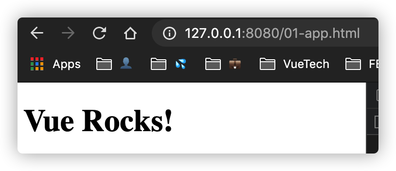
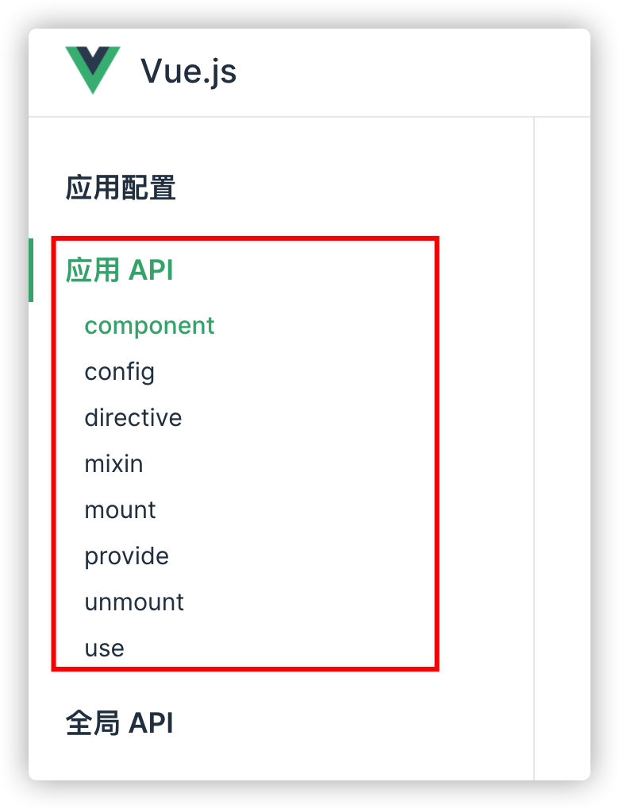
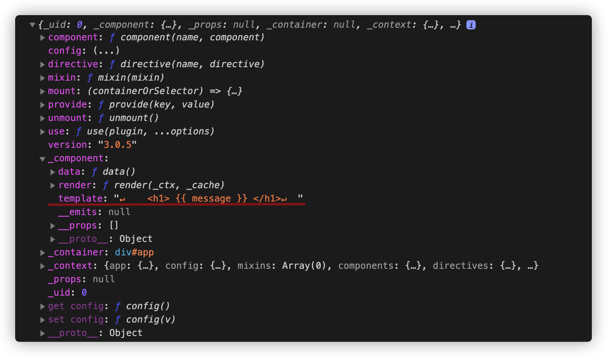

# 初始化

本节内容我们将通过一个简单的例子来引入，介绍 Vue 的初始化流程。

## 一个简单的例子

```js
<body>
  <div id="app">
    <h1> {{ message }} </h1>
  </div>
</body>

<script type="module">
  import { createApp } from "./vue.esm-browser.js";

  const app = createApp({
    data() {
      return {
        message: "Vue Rocks!"
      }
    }
  })

  app.mount('#app')

</script>
```

我们看到，一个 Vue3 的例子特别简单，只需要两步即可：首先调用 `createApp` 来创建一个 app 实例，接着调用这个 app 实例的 mount 方法，挂载到我们 **ID 为 app** 的 DOM 元素中去。我们看一下运行效果：



可以看到，页面上正确的显示了我们 message 的内容。下面我们就进入源码，去了解 Vue 的初始化究竟做了哪些工作。

## 从 `createApp` 说起

`createApp` 的源码位于：packages/vue/runtime-dom.ts 中：

```js
export const createApp = ((...args) => {
  // 获取渲染器，创建 app
  const app = ensureRenderer().createApp(...args)

  if (__DEV__) {
    injectNativeTagCheck(app)
  }

  const { mount } = app
  app.mount = (containerOrSelector: Element | ShadowRoot | string): any => {
    const container = normalizeContainer(containerOrSelector)
    if (!container) return
    const component = app._component
    if (!isFunction(component) && !component.render && !component.template) {
      component.template = container.innerHTML
    }
    // clear content before mounting
    container.innerHTML = ''
    const proxy = mount(container)
    if (container instanceof Element) {
      container.removeAttribute('v-cloak')
      container.setAttribute('data-v-app', '')
    }
    return proxy
  }

  return app
}) as CreateAppFunction<Element>
```

我们先来分析一下整体流程：

1. 首先，调用了 `ensureRenderer` 方法来获取一个渲染器，然后调用这个渲染器的 `createApp` 方法，创建一个 app 实例；
2. 获取这个 app 实例的 mount 方法，然后对其进行二次加工（装饰器模式）；
3. 返回这个 app 实例

流程看上去很清晰，那么我们就来一步一步的剖析它的实现吧。

### 1. 获取渲染器

**渲染器是负责将我们的 vnode 渲染到页面上的**。它是通过 `ensureRenderer` 方法获取的：

```js

const rendererOptions = extend({ patchProp, forcePatchProp }, nodeOps)
let renderer: Renderer<Element> | HydrationRenderer

function ensureRenderer() {
  return renderer || (renderer = createRenderer<Node, Element>(rendererOptions))
}
```

之所以用一个函数来获取 `renderer` 对象，是因为有时候我们可能不需要渲染器，比如只用到了响应式系统的一些功能，这个时候我们就不需要给 `renderer` 赋值。所以，使用函数的好处是能做到 **延时加载**，避免创建不必要的对象，同时也 **有利于 Tree-Shaking**。

它的内部调用了 `createRenderer` 函数来创建渲染器，它接受一个 `rendererOptions` 参数，它存了一些我们在渲染期间用到的一些工具方法，其实根据名字就能猜到它们大概负责的功能：比如 `patchProp` 是用来做 prop 的 patch 的，`nodeOps` 是操作 DOM 节点的。我们会在分析到渲染的时候再具体介绍每个函数的功能。

接着到我们的 `createRenderer` 方法，它位于 packages/runtime-core/src/renderer.ts 中：

```js
export function createRenderer<
  HostNode = RendererNode,
  HostElement = RendererElement
>(options: RendererOptions<HostNode, HostElement>) {
  return baseCreateRenderer<HostNode, HostElement>(options)
}
```

它实际上是对 `baseCreateRenderer` 函数的一层包装，这个 `baseCreateRenderer` 是 **核心的创建渲染器的方法**，非常重要，代码量也非常多，我精简了一下：

```js
function baseCreateRenderer(
  options: RendererOptions,
  createHydrationFns?: typeof createHydrationFunctions
): any {
  // ... 一堆渲染相关的函数: render, patchXXX, mountElement 等
  return {
    render,
    hydrate,
    createApp: createAppAPI(render, hydrate)
  }
}
```

这里是 **渲染器** 的核心逻辑，我们在后面说到渲染相关的逻辑的时候会详细的介绍。这个函数返回了一个对象，它有三个属性：`render` 就是我们得到的渲染器函数；`hydrate` 则是与 SSR 相关的，这里不讨论；还有一个就是负责创建 app 的 `createApp` 函数，它是由 `createAppAPI` 而来。到这里，我们已经得到一个渲染器对象了。下面我们来分析 Vue 实例的创建，即 `createAppAPI` 的实现。

### 2. 创建 Vue 实例

`createAppAPI` 函数位于 packages/runtime-core/src/apiCreateApp.ts 中，由于它的代码量也不少，所以这里还是精简一下：

```js
export function createAppAPI<HostElement>(
  render: RootRenderFunction,
  hydrate?: RootHydrateFunction
): CreateAppFunction<HostElement> {
  return function createApp(rootComponent, rootProps = null) {
    // 检查 rootProps，它必须是对象
    if (rootProps != null && !isObject(rootProps)) {
      __DEV__ && warn(`root props passed to app.mount() must be an object.`)
      rootProps = null
    }
    // app 的上下文，它保存着这个 Vue 实例上相关的配置，组件、指令等数据
    const context = createAppContext()
    // 存放组件的集合，用 Set 是防止重复注册
    const installedPlugins = new Set()
    // 一个挂载的标记，会在 mount 与 unmount 中用到
    let isMounted = false

    const app: App = (context.app = {
      _uid: uid++, // 一个自增的 ID，从 0 开始
      _component: rootComponent as ConcreteComponent, // 根组件
      _props: rootProps, // 传入的 props 对象
      _container: null, // 实例挂载的容器
      _context: context, // 上下文

      version, // 版本

      get config() { // 配置的 getter，其实是 context.config 的一个引用
        return context.config
      },

      set config(v) { // 配置的 setter ，不允许直接替换 config 做修改
        if (__DEV__) {
          warn(
            `app.config cannot be replaced. Modify individual options instead.`
          )
        }
      },

      use() {}, // 插件相关
      mixin() {}, // 混入
      component() {}, // 创建组件
      directive() {}, // 创建指令
      mount() {}, // 挂载方法
      unmount() {}, // 卸载方法
      provide() {} // provide & inject 相关
    }
  }
}
```

`createAppAPI` 返回正是我们在一开始的例子中用到的 `createApp` 方法，这个 `createApp` 方法的逻辑还是非常清晰的，它实际上就是返回了一个 app 对象，它包含着一些实例方法，我们应该对这些方法不陌生，只不过在 vue2 的时候，他们是作为全局 API 挂在 Vue 下面的，而现在改成了每个 Vue 实例的实例方法。我们会在用到的时候具体分析这些方法，这里我们只要知道一件事，那就是 **通过调用 `createApp` 函数，我们能拿到一个 Vue 实例**。

在 Vue3 的官网上，我们可以看到 Vue 实例暴露出来的这些方法：




好了，到这里我们可以稍微喘口气，Take a Coffee！还记得我们一开始分析的整理流程中的三个步骤吗？到这里已经完成了第一个步骤，即创建了一个 Vue 实例。我们可以打印一下看看它到底长啥样：



可以看到，这里的对象就是我们刚刚介绍的。至于这里的划红线的部分，多了一个 `template` 属性，这是因为 `console.info` 打印的值是动态的，这个 `template` 属性是我们在 mount 方法调用时添加的。下面我们就来看看这个 `mount` 函数。

### 3. 包装 mount 函数

之前介绍过，在 `createApp` 中，对 mount 函数做了一层包装：

```js
const { mount } = app
app.mount = (containerOrSelector: Element | ShadowRoot | string): any => {
  const container = normalizeContainer(containerOrSelector)
  if (!container) return
  const component = app._component
  if (!isFunction(component) && !component.render && !component.template) {
    component.template = container.innerHTML
  }
  // clear content before mounting
  container.innerHTML = ''
  const proxy = mount(container)
  if (container instanceof Element) {
    container.removeAttribute('v-cloak')
    container.setAttribute('data-v-app', '')
  }
  return proxy
}
```

这里的 `app.amount` 其实就是我们例子中调用的函数，它接受一个参数作为容器。函数的执行流程也很清晰：

1. 调用 `normalizeContainer` 函数获取容器作为挂载点，这个函数的实现很简单，就是调用了 DOM API ： `document.querySelector(container)` 来对应的 DOM 元素；

2. 获取当前 Vue 实例的  _component 属性，这个属性其实就是我们的在调用 `createApp` 时传的第一个参数：

```js
{
  data() {
    return {
      message: "Vue Rocks!"
    }
  }
}
```

这里就是一个包含 data 函数的对象，它既不是函数，也没有 render 函数，也没有 template，那么就命中了我们的 if 条件，这里就会给这个 _component 赋值，它的值就是我们上一步得到的容器的 innerHTML 属性，也就是：

```js
"↵    <h1> {{ message }} </h1>↵  "
```

注意这里也包括换行符。**这就解释了我们之前打印的 app 对象为何多了一个 template 属性。**

3. 清理 container，直接使用 innerHTML 来将容器内的内容清空

4. 执行 mount 挂载 vnode 到 container 上

5. 设置或移除一些属性：如果 container 是 DOM 元素的话，那么就移除 container 上的 `v-clock` 属性，并且设置一个标记 `data-v-app`

6. 返回当前组件的代理对象，这个对象是从哪里来的，我们后面会分析。


在第四步，我们执行了 mount 方法，它源自于我们在 createAppAPI 中返回的函数中的 app 对象，这里我结合最开始的例子，精简一下函数：

```js
mount(rootContainer: HostElement, isHydrate?: boolean): any {
  if (!isMounted) { 
    // 创建 VNode
    const vnode = createVNode(
      rootComponent as ConcreteComponent,
      rootProps
    )
    vnode.appContext = context
    // 渲染 VNode
    render(vnode, rootContainer)
    // 标记为已挂载
    isMounted = true
    app._container = rootContainer
    ;(rootContainer as any).__vue_app__ = app
    return vnode.component!.proxy
  }
}
```

它的流程也很清晰，主要有两步：创建 VNode，将 VNode 渲染到我们的容器中，最后返回 component 的代理对象。这里我们不对创建 VNode 和 render 做具体分析，因为他们涉及的东西很多，而本节我们的主要内容是对 Vue 的初始化有个大概了解。我们会在后面深入的介绍。


好了，到这里我们 mount 函数就介绍完了。其实 mount 函数的功能非常明确，**就是将我们的 VNode 挂载到真实的 DOM 中**。


## 挂载到 DOM

再回到我们一开始的例子，创建完 app 后，我们调用了 `app.mount('#app')` 就可以在 DOM 上显示对于的内容。基于上面对 mount 函数的介绍，相信这里你肯定心如明镜，就不赘述了。


## 小节

本节我们根据一个简单的例子，分析了一个 Vue 应用初始化的过程。其实整体看来，无非就是创建一个 Vue 实例，然后调用它的 mount 方法挂载到真实的 DOM 中去。
本节只是一个引子，后面的章节我们将深入分析 Vue 的内部工作机制。