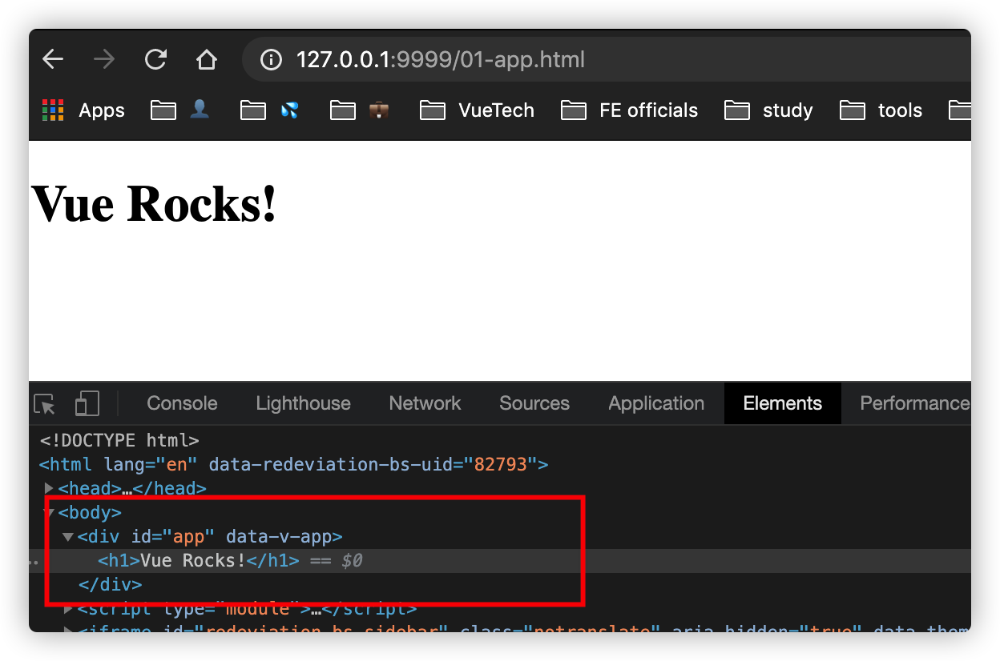
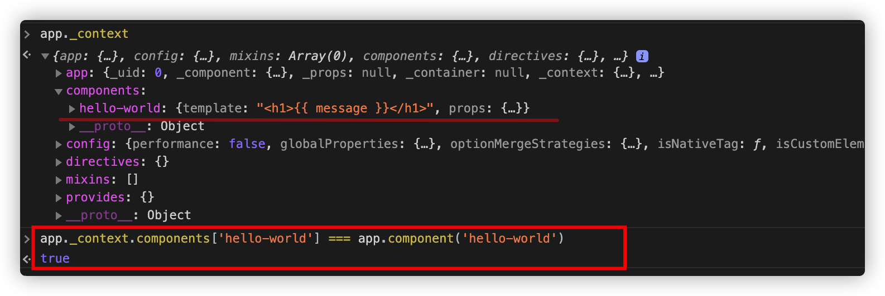
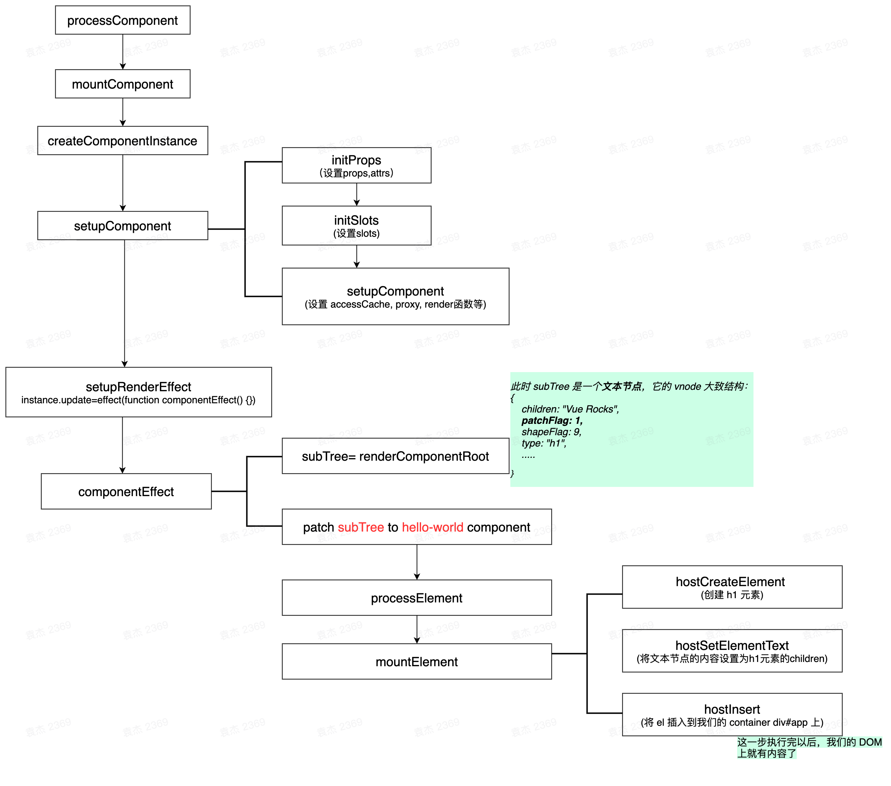

## 一个简单的例子

我们在上一节的例子上做点修改，增加一个简单的 `hello-world` 组件。它接收一个名为 message 的 prop，并且我们在页面上引用这个组件。

```html{16,17,18,19,20,21}
<body>
  <div id="app">
    <hello-world :message="message"></hello-world>
  </div>
</body>
<script type="module">
  import { createApp } from "./vue.esm-browser.js";

  const app = createApp({
    data() {
      return {
        message: "Vue Rocks!"
      }
    }
  })
  app.component('hello-world', {
    template: '<h1>{{ message }}</h1>',
    props: {
      message: String
    }
  })
  app.mount('#app')

</script>
```



可以看到，组件正确的渲染到了页面上。接下来我们就来看看组件是如何注册和渲染的。


## 组件注册

还记得上一章我们介绍的 `createAppAPI` 吗？当时我们讲了 `createApp` 函数返回的对象实例中，包含很多方法，其中有一个就是用来注册组件的，我们来看一下它的实现：

```js
component(name: string, component?: Component): any {
  if (__DEV__) {
    validateComponentName(name, context.config)
  }
  if (!component) {
    return context.components[name]
  }
  if (__DEV__ && context.components[name]) {
    warn(`Component "${name}" has already been registered in target app.`)
  }
  context.components[name] = component
  return app
},
```

它的实现非常简单。`component` 函数接收两个参数，第一个是组件名，第二个是组件定义对象。如果只传了第一个参数的话，那么就看作是获取组件对象的一个 getter 函数。如果都传递了，那么将组件名作为 key，组件定义作为值，设置到 `context.components` 对象上。其中，context 是当前 Vue 实例 app 的上下文对象，我们可以通过 `app._context` 访问到，可以打印一下看看（这里打印的是没有 mount 之前的对象）：




可以看到，此时的 `app._context` 对象已经包含了定义的组件了，那么可以推测，负责组件的 **模版编译**、**VNode 渲染** 等工作的逻辑，都是在接下来的 mount 函数中处理的。

## mount 函数

上一章我们简单介绍过 mount 函数，知道它是通过装饰器模式做了功能增强，而原始的 mount 函数我们之前也简单的分析过，这里就不多赘述了。在 mount 函数中，重要的步骤有如下两个：

```js
// 1. 创建 Vnode
const vnode = createVNode(
  rootComponent as ConcreteComponent,
  rootProps
)

// 2. 渲染
render(vnode, rootContainer)
```

由于我们的例子比较简单，所以这了的 createVNode 函数也很简单，没有太多的分支逻辑可以走，所以它此时的值基本上都是保持着初始值：

```js
{
  anchor: null,
  appContext: null,
  children: null,
  component: null,
  dirs: null,
  dynamicChildren: null,
  dynamicProps: null,
  el: null,
  key: null,
  patchFlag: 0
  props: null,
  ref: null,
  scopeId: null,
  shapeFlag: 4
  ssContent: null,
  ssFallback: null,
  staticCount: 0
  suspense: null,
  target: null,
  targetAnchor: null,
  transition: null,
  __v_isVNode: true,
  __v_skip: true,
  // 注意，这里的 type 其实就是我们 createApp 传进去的参数。
  // template 属性还记得是从哪里来的吗？
  type: {
    template: "↵    <hello-world :message="message"></hello-world>↵  ",
    data() {
      return {
        message: "Vue Rocks!"
      }
    }
  }
}
```

这个对象会在下面很长时间内用到，所以你要有一个大概的印象。这里值得一提的是 `shapeFlag`，它的值是通过一系列的三元运算得来的：

```js
const shapeFlag = isString(type)
    ? ShapeFlags.ELEMENT
    : __FEATURE_SUSPENSE__ && isSuspense(type)
      ? ShapeFlags.SUSPENSE
      : isTeleport(type)
        ? ShapeFlags.TELEPORT
        : isObject(type) // 对象类型 => 组件
          ? ShapeFlags.STATEFUL_COMPONENT
          : isFunction(type)
            ? ShapeFlags.FUNCTIONAL_COMPONENT
            : 0
```

`shapeFlag` 的作用体现在渲染的过程中。简言之，它是方便我们判断一个元素的类型，比如是普通的 DOM 元素，还是组件，还是 Suspense 等。我们后面会详细介绍。


有了 VNode 以后，接下来就要开始渲染了。这里的 render 函数，是在 `baseCreateRenderer` 中定义的，通过函数参数的形式传递给了 `createAppAPI` 函数。来看一下它的定义（runtime-core/src/renderer.ts）：

```js
const render: RootRenderFunction = (vnode, container) => {
  if (vnode == null) {
    if (container._vnode) {
      unmount(container._vnode, null, null, true)
    }
  } else {
    patch(container._vnode || null, vnode, container)
  }
  flushPostFlushCbs()
  container._vnode = vnode
}
```

它接收两个参数，第一个参数表示要渲染的 VNode，第二个参数表示渲染的目标容器。由于我们的 vnode 不是 null，所以此时会执行 patch 逻辑。此时由于是第一次渲染，所以我们的 container._vnode 没有值，所以 patch 的第一个参数是 null。patch 函数也在当前文件中定义，它的实现较长，老样子这里我精简一下，只分析能执行到的代码：

```js
const patch: PatchFn = (
  n1,
  n2,
  container,
  anchor = null,
  parentComponent = null,
  parentSuspense = null,
  isSVG = false,
  optimized = false
) => {
  // ... 其他逻辑

  const { type, ref, shapeFlag } = n2
  switch (type) {
    case Text:  // 处理文本节点
    case Comment: // 处理注释节点
    case Static: // 处理静态节点
    case Fragment: // 处理片段
    default:
      if (shapeFlag & ShapeFlags.ELEMENT) {
        // 处理元素节点 ...
      } else if (shapeFlag & ShapeFlags.COMPONENT) {
        processComponent(
          n1, // null
          n2, // vnode
          container, // div#app
          anchor,
          parentComponent,
          parentSuspense,
          isSVG,
          optimized
        )
      } else if (shapeFlag & ShapeFlags.TELEPORT) {
        // 处理 teleport
      } else if (__FEATURE_SUSPENSE__ && shapeFlag & ShapeFlags.SUSPENSE) {
        // 处理 suspense
      } else if (__DEV__) {
        warn('Invalid VNode type:', type, `(${typeof type})`)
      }
  }

  // set ref
  if (ref != null && parentComponent) {
    setRef(ref, n1 && n1.ref, parentSuspense, n2)
  }
}
```

可以看到，这里执行了 `processComponent` 函数。这个 patch 可以看作是一个逻辑分发器。我们来看一下 `processComponent` 的实现：

```js
const processComponent = (
  n1: VNode | null,
  n2: VNode,
  container: RendererElement,
  anchor: RendererNode | null,
  parentComponent: ComponentInternalInstance | null,
  parentSuspense: SuspenseBoundary | null,
  isSVG: boolean,
  optimized: boolean
) => {
  // n1 为 null 表示是第一次渲染，那么执行 挂载 逻辑
  if (n1 == null) {
    if (n2.shapeFlag & ShapeFlags.COMPONENT_KEPT_ALIVE) {
      // 处理 keep-alive 的逻辑
    } else {
      // 挂载组件
      mountComponent(n2, container, anchor, parentComponent, parentSuspense, isSVG, optimized)
    }
  } else {
    // 否则说明是更新
    updateComponent(n1, n2, optimized)
  }
}
```

这里也是一个简单的逻辑分发。本例中我们 n1 为 null，所以会执行 `mountComponent` 来挂载，继续往下看它的实现：

```js
const mountComponent: MountComponentFn = (
  initialVNode,
  container,
  anchor,
  parentComponent,
  parentSuspense,
  isSVG,
  optimized
) => {
  const instance: ComponentInternalInstance = (initialVNode.component = createComponentInstance(
    initialVNode,
    parentComponent,
    parentSuspense
  ))
  // dev 下的一些处理 ...
  // keep-alive 的一些处理 ...

  setupComponent(instance)

  // 处理 suspense 的逻辑，由于此时我们的 aysncDep 为 null，所以这段逻辑也不会走
  if (__FEATURE_SUSPENSE__ && instance.asyncDep) {
    parentSuspense && parentSuspense.registerDep(instance, setupRenderEffect)

    if (!initialVNode.el) {
      const placeholder = (instance.subTree = createVNode(Comment))
      processCommentNode(null, placeholder, container!, anchor)
    }
    return
  }

  setupRenderEffect(
    instance, initialVNode, container, anchor, parentSuspense, isSVG, optimized
  )

}
```

这里主要做了三件事：

1. 创建组件实例：`createComponentInstance`；<br>
2. 设置组件：`setupComponent`；<br>
3. 设置渲染副作用：`setupRenderEffect`

我们先看第一步，它位于 packages/runtime-core/src/component.ts 中：

```js
export function createComponentInstance(
  vnode: VNode,
  parent: ComponentInternalInstance | null,
  suspense: SuspenseBoundary | null
) {
  const type = vnode.type as ConcreteComponent
  // 获取 appContext 对象
  // 由于我们此时的 parent 为 null，所以这里的 appContext 就是当前 vnode 的 appContext 对象
  const appContext =
    (parent ? parent.appContext : vnode.appContext) || emptyAppContext

  const instance: ComponentInternalInstance = {
    uid: uid++, // 组件id
    vnode, // 组件对于的 vnode
    type, // 组件类型，这里是 { template: xxx, data() { ... } }
    parent, // 父
    appContext, // app 上下文
    root: null!, // 根
    next: null, // ？
    subTree: null!, // 子树，会在组件创建后立即赋值
    update: null!, // 更新函数，会在组件创建后立即赋值
    render: null, // 渲染函数
    proxy: null, // 代理对象
    exposed: null, // 对外暴露的对象
    withProxy: null, //  with块下的代理对象
    effects: null, // 副作用
    provides: parent ? parent.provides : Object.create(appContext.provides),
    accessCache: null!, // 访问缓存
    renderCache: [], // 渲染缓存

    // local resovled assets
    components: null, // 子（局部）组件
    directives: null, // （局部）指令

    // propsOptions: 本例中是 [] 空数组
    propsOptions: normalizePropsOptions(type, appContext),
    // emitsOptions: 本例中是 null
    emitsOptions: normalizeEmitsOptions(type, appContext),

    // emit
    emit: null as any, // 是个函数，在下面赋值
    emitted: null,

    // 状态相关的属性
    ctx: EMPTY_OBJ,
    data: EMPTY_OBJ,
    props: EMPTY_OBJ,
    attrs: EMPTY_OBJ,
    slots: EMPTY_OBJ,
    refs: EMPTY_OBJ,
    setupState: EMPTY_OBJ,
    setupContext: null,

    // suspense related
    suspense,
    suspenseId: suspense ? suspense.pendingId : 0,
    asyncDep: null,
    asyncResolved: false,

    // 生命周期相关属性和钩子
    isMounted: false,
    isUnmounted: false,
    isDeactivated: false,
    bc: null,
    c: null,
    bm: null,
    m: null,
    bu: null,
    u: null,
    um: null,
    bum: null,
    da: null,
    a: null,
    rtg: null,
    rtc: null,
    ec: null
  }
  if (__DEV__) {
    instance.ctx = createRenderContext(instance)
  } else {
    // 将当前组件实例对象作为 ctx 属性存下来
    instance.ctx = { _: instance }
  }
  instance.root = parent ? parent.root : instance
  instance.emit = emit.bind(null, instance)

  return instance
}
```

它就是简单的返回了一个组件实例对象，很多属性在初始化的时候都没有值，它们会在生命周期的不同阶段赋值。这里有两个函数提一下：`normalizePropsOptions` 和 `normalizeEmitsOptions`，我们会在执行到 `hello-world` 组件初始化的再介绍。

此时，我们已经拿到了 component 实例了，然后会把它赋值给 `initialVNode`（也就是一开始的 vnode） 的 component 属性。接下来，要执行 `setupComponent(instance)` 来初始化我们的 component，来看一下它的定义：

```js
export function setupComponent(
  instance: ComponentInternalInstance,
  isSSR = false
) {
  isInSSRComponentSetup = isSSR

  const { props, children } = instance.vnode
  const isStateful = isStatefulComponent(instance)
  initProps(instance, props, isStateful, isSSR)
  initSlots(instance, children)

  const setupResult = isStateful
    ? setupStatefulComponent(instance, isSSR)
    : undefined
  isInSSRComponentSetup = false
  return setupResult
}

// 判断是否是有状态的组件
export function isStatefulComponent(instance: ComponentInternalInstance) {
  return instance.vnode.shapeFlag & ShapeFlags.STATEFUL_COMPONENT
}
```

这里首先获取了 vnode 上的 props 和 children 属性，本例中这两个都是 null（注意，这里还没有分析到 `hello-world` 组件，所以不要弄混淆了）。

接着判断了当前组件是否是有状态的组件，这个之前提到过，它的 shapeFlag 为 `ShapeFlags.STATEFUL_COMPONENT`，所以是有状态组件，即 isStateful 是一个 truthy 的值。接着它调用了 `initProps` 来初始化 props，他的定义在 packages/runtime-core/src/componentProps.ts 中：

```js
export function initProps(
  instance: ComponentInternalInstance,
  rawProps: Data | null,
  isStateful: number, // result of bitwise flag comparison
  isSSR = false
) {
  const props: Data = {}
  const attrs: Data = {}
  // 设置 attrs.__vInternal = 1，使用 def（defineProperty）是不想让这个属性被枚举
  def(attrs, InternalObjectKey, 1)
  setFullProps(instance, rawProps, props, attrs)
  
  // 开发环境下的校验
  if (__DEV__) { validateProps(props, instance) }

  if (isStateful) {
    // stateful
    instance.props = isSSR ? props : shallowReactive(props)
  } else {
    if (!instance.type.props) {
      // functional w/ optional props, props === attrs
      instance.props = attrs
    } else {
      // functional w/ declared props
      instance.props = props
    }
  }
  instance.attrs = attrs
}
```

这个函数主要作用就是用来初始化 props 的。首先它定义了两个空对象：props 和 attrs，然后给 attrs 添加属性 `__vInternal`；接着调用 `setFullProps` 函数来设置 props，由于本例中我们的 rawProps 为 null，并且 instance.propsOptions 为空数组，所以这个函数本质上不会执行实质性的逻辑；然后就是比较重要的一行代码：

```js
instance.props = isSSR ? props : shallowReactive(props)
```

我们还没介绍响应式的原理，不过这里你大概可以猜到，这行代码是将 props 转成了响应式的对象。等分析了响应式章节的时候会再介绍的；最后将 attrs 赋值给了当前组件的 attrs 对象。到这里 `initProps` 就执行完了。稍微回顾一下，**这个函数就是给当前组件实例添加了两个属性：props 和 attrs。**

回到我们的 `setupComponent` 函数中来，接下来到了 `initSlot` 函数了，它的实现也很简单，在 packages/runtime-core/src/componentSlots.ts 中，读者可以自行去看，这里它其实是给当前组件实例添加属性 **slots**，不多赘述了。

继续往下的话，会执行到我们的 `setupStatefulComponent` 函数了，这是个重点。函数也很长，我们看一下精简后的：

```js
function setupStatefulComponent(
  instance: ComponentInternalInstance,
  isSSR: boolean
) {
  const Component = instance.type as ComponentOptions
  if (__DEV__) {
    // ... 在开发环境下的一些校验 ... 
  }

  // 创建渲染代理属性的缓存
  instance.accessCache = Object.create(null)
  // 创建 instance.ctx 的代理对象，在后面会用到（作为执行的上下文对象）
  instance.proxy = new Proxy(instance.ctx, PublicInstanceProxyHandlers)
  
  // 2. call setup()
  const { setup } = Component
  if (setup) {
    // 处理 setup 逻辑 ...
  } else {
    finishComponentSetup(instance, isSSR)
  }
}
```

这个函数也给我们的组件实例添加了一些属性：首先是 accessCache 属性，它的初始值为 null；接着是 proxy 属性，它是一个代理对象，代理的是 instance.ctx 对象，这个对象之前介绍过，在生产环境下，它的初始值为 `{ _: instance }`，其中 instance 就是当前组件对象，`PublicInstanceProxyHandlers` 定义在 packages/runtime-core/src/componentPublicInstance.ts 中：

```js
export const PublicInstanceProxyHandlers: ProxyHandler<any> {
  get() { ... },
  set() { ... },
  has() { ... }
}
```

代理了它的三个方法，后面用到的时候再介绍。

最后会判断有没有定义 setup ，这个是 vue3 的新功能，本例中我们没有使用，所以走不到这里，最终会执行 `finishComponentSetup` 来结束这次初始化：

```js
function finishComponentSetup(
  instance: ComponentInternalInstance,
  isSSR: boolean
) {
  const Component = instance.type as ComponentOptions

  // template / render function normalization
  if (__NODE_JS__ && isSSR) {
    // SSR 相关逻辑 ...
  } else if (!instance.render) {
    if (compile && Component.template && !Component.render) {
      // 编译生成 render 函数
      Component.render = compile(Component.template, {
        isCustomElement: instance.appContext.config.isCustomElement,
        delimiters: Component.delimiters
      })
    }

    instance.render = (Component.render || NOOP) as InternalRenderFunction

    if (instance.render._rc) {
      instance.withProxy = new Proxy(
        instance.ctx,
        RuntimeCompiledPublicInstanceProxyHandlers
      )
    }
  }

  // 兼容 vue2 的 options API
  if (__FEATURE_OPTIONS_API__) {
    currentInstance = instance
    pauseTracking()
    applyOptions(instance, Component)
    resetTracking()
    currentInstance = null
  }

  // warn missing template/render
  if (__DEV__ && !Component.render && instance.render === NOOP) {
    // 没有定义 template 或者 render 时的一些警告
  }
}
```

首先执行的逻辑应该是生成 render 函数，它是通过编译模板得到的，关于编译的过程我们会单独在一个章节介绍，你只需要知道，**编译函数的作用是将模板转成 render 函数。** 生成 render 函数后，会赋值给当前组件 Component 和 当前组件实例 instance。我们可以打印一下看看此时的 render 函数长什么样：

```js
function render(_ctx, _cache) {
  with (_ctx) {
    const { 
      resolveComponent: _resolveComponent, createVNode: _createVNode, openBlock: _openBlock, createBlock: _createBlock 
    } = _Vue

    const _component_hello_world = _resolveComponent("hello-world")

    return (_openBlock(), _createBlock(_component_hello_world, { message: message }, null, 8 /* PROPS */, ["message"]))
  }
}
```

我们的 render._rc 是 true 的（因为当前是 runtime compiler 版本），所以也会给 `withProxy` 属性赋值，他也是一个代理器，具体的内容我们在触发的时候再介绍。

最后就是处理 optionsAPI 的逻辑了，这里是为了向后兼容 vue2，函数位于 packages/runtime-core/src/componentOptions.ts，它处理的就是我们在 vue2 中定义的很多 option，比如 methods，生命周期，mixins 等。我们例子中只有 data 函数，所以这里我们只分析 data 的处理逻辑：

```js
const publicThis = instance.proxy!

resolveData(instance, dataOptions, publicThis)
```

这里的 instance 是当前组件实例，dataOptions 就是我们例子中的 data 函数，publicThis 就是我们上面介绍的组件实例的 proxy 属性。来看一下 `resolveData` 的实现：

```js
function resolveData(
  instance: ComponentInternalInstance,
  dataFn: DataFn,
  publicThis: ComponentPublicInstance
) {
  if (__DEV__ && !isFunction(dataFn)) {
    warn(
      `The data option must be a function. ` +
        `Plain object usage is no longer supported.`
    )
  }
  const data = dataFn.call(publicThis, publicThis)
  if (__DEV__ && isPromise(data)) {
    warn(
      `data() returned a Promise - note data() cannot be async; If you ` +
        `intend to perform data fetching before component renders, use ` +
        `async setup() + <Suspense>.`
    )
  }
  if (!isObject(data)) {
    __DEV__ && warn(`data() should return an object.`)
  } else if (instance.data === EMPTY_OBJ) {
    instance.data = reactive(data)
  } else {
    // existing data: this is a mixin or extends.
    extend(instance.data, data)
  }
}
```

这里我保留了一些开发环境的代码，因为这里与 Vue2 有一些区别要注意。

**首先，data 必须是一个函数**，这点与 Vue2 不同，因为我们在 `new Vue` 的时候传入的 data 是可以是对象的，但是到了 Vue3 已经不支持了；接下来调用我们的 data 函数，注意这里传入的 publicThis 即是上下文，也是第一个参数，也就是我们的 data 函数可以这么使用：

```js{5,6}
createApp({
  methods: {
    hello() {console.info('hello')}
  },
  data: vm => {
    vm.hello()
    return {
      message: "Vue Rocks!"
    }
  }
})
```

获取到 data 函数的返回值以后，接着又是一个开发环境下的提示，告诉我们 data 函数返回的不能是一个 Promise，要想实现类似的效果请使用 **setup + Suspense**。

最后判断了 instance.data 是不是空对象，这个我们在上面初始化组件实例的时候说过，它的初始值是 EMPTY_OBJ，所以这里会调用 `reactive` 来将 data 函数返回值转成响应式对象，并且赋值给 instance.data 属性。响应式系统会单独在一个章节介绍，这里你就理解为，执行完这一步以后，我们的 data 函数返回值已经具有了响应式功能了。

好了，到这里，意味着我们的 `finishComponentSetup` 差不多执行完毕了，总结一下目前的进展，其实就是给当前组件实例对象添加了很多方法和属性，比如：data，props，render 函数等，相当于是做一些准备工作。再回到 `mountComponent` 函数中，接下来要执行的也是很重要的一步：

```js
setupRenderEffect(instance, initialVNode, container, anchor, parentSuspense, isSVG, optimized)
```

**这一步是用来设置渲染的副作用，在 Vue2 中，这一步是通过一个渲染 Watcher 来实现的，其目的就是将数据的变动与 DOM 的渲染绑定，也就是我们经常说的数据驱动。** 本例中由于后几个参数用不到，所以有实际意义的就前三个，第一个是当前组件实例，第二个是初始化的 vnode，第三个是 DOM 容器。这个函数的实现比较长，我们按照实际执行做一下精简：

```js
const setupRenderEffect: SetupRenderEffectFn = (
  instance, initialVNode, container, anchor, parentSuspense, isSVG, optimized
) => {
  instance.update = effect(function componentEffect() {
    if (!instance.isMounted) {
      let vnodeHook: VNodeHook | null | undefined
      const { el, props } = initialVNode
      const { bm, m, parent } = instance

      // 执行组件的 beforeMount 钩子
      if (bm) {
        invokeArrayFns(bm)
      }
      // 执行 VNode 的 onVnodeBeforeMount 钩子
      if ((vnodeHook = props && props.onVnodeBeforeMount)) {
        invokeVNodeHook(vnodeHook, parent, initialVNode)
      }

      // 生成子树
      const subTree = (instance.subTree = renderComponentRoot(instance))

      if (el && hydrateNode) {
        // SSR 相关逻辑 ...
      } else {
        // 执行 patch，渲染到 DOM
        patch(
          null, subTree, container, anchor, instance, parentSuspense, isSVG
        )
        initialVNode.el = subTree.el
      }
      // 执行组件的 mounted 钩子
      if (m) {
        queuePostRenderEffect(m, parentSuspense)
      }
      // 执行 VNode 的 onVnodeMounted 钩子
      if ((vnodeHook = props && props.onVnodeMounted)) {
        const scopedInitialVNode = initialVNode
        queuePostRenderEffect(() => {
          invokeVNodeHook(vnodeHook!, parent, scopedInitialVNode)
        }, parentSuspense)
      }

      // 处理 activated 钩子
      const { a } = instance
      if (
        a &&
        initialVNode.shapeFlag & ShapeFlags.COMPONENT_SHOULD_KEEP_ALIVE
      ) {
        queuePostRenderEffect(a, parentSuspense)
      }
      instance.isMounted = true

      // #2458: deference mount-only object parameters to prevent memleaks
      initialVNode = container = anchor = null as any
    } else {
      // 更新组件的逻辑 ...
    }
  }, __DEV__ ? createDevEffectOptions(instance) : prodEffectOptions)
}
```

纵观一下整个函数，实际上是给组件添加了有一个属性：`update` 函数，它的值是 `effect(function componentEffect(){...})`。这里使用 effect 注册了一个副作用函数，并且在本例中会立即执行，也就是说会执行 `componentEffect` 函数。接下来我们重点分析。

不相干的逻辑我写在了代码注释中，这里列举出重点的主干逻辑代码：

```js
const subTree = (instance.subTree = renderComponentRoot(instance))
patch(null, subTree, container, anchor, instance, parentSuspense, isSVG)
initialVNode.el = subTree.el
instance.isMounted = true
initialVNode = container = anchor = null as any
```

首先第一步，渲染组件的子树：`renderComponentRoot(instance)`。其实上面分析的组件可以看成是 Vue 实例组件，它是根组件，这里我们就要获取它下面的子组件 Vnode，函数位于 packages/runtime-core/src/componentRenderUtils.ts 中，内容很多，但是本例中执行到到代码并不多，这里还是精简一下，不相关的逻辑用为代码表示：

```js
export function renderComponentRoot(
  instance: ComponentInternalInstance
): VNode {
  const {
    type: Component,
    vnode, proxy, withProxy, props, propsOptions: [propsOptions], slots,
    attrs, emit, render, renderCache, data, setupState, ctx
  } = instance

  let result
  // 设置当前渲染的实例
  currentRenderingInstance = instance
  
  try {
    let fallthroughAttrs
    if (vnode.shapeFlag & ShapeFlags.STATEFUL_COMPONENT) {
     
      const proxyToUse = withProxy || proxy
      result = normalizeVNode(
        render!.call(
          proxyToUse,
          proxyToUse!,
          renderCache,
          props,
          setupState,
          data,
          ctx
        )
      )
      fallthroughAttrs = attrs
    } else {
      // 处理函数式组件
    }

    let root = result
    let setRoot: ((root: VNode) => void) | undefined = undefined

    if (Component.inheritAttrs !== false && fallthroughAttrs) {
      // 合并 attrs ...
    }

    if (vnode.dirs) {
      // 继承指令 ...
    }
    if (vnode.transition) {
      // 继承过渡相关数据 ...
    }

    result = root
  } catch (err) {
    // 如果过程中有异常，则创建一个空的注释节点
    handleError(err, instance, ErrorCodes.RENDER_FUNCTION)
    result = createVNode(Comment)
  }
  // 重置当前渲染实例为 null
  currentRenderingInstance = null

  return result
}
```

整理以后的代码很清晰，重点逻辑就是调用 render 函数来生成 vnode 那段代码，还记得我们的 render 函数是怎么来的吗？对，就是上面介绍 `finishComponentSetup` 中通过模版编译得到的，此时它返回的对象很简单：

```js
{
  anchor: null,
  appContext: null,
  children: null,
  component: null,
  dirs: null,
  dynamicChildren: [],
  dynamicProps: ["message"],
  el: null,
  key: null,
  patchFlag: 8, // 需要对 PROPS 做 patch
  props: {message: "Vue Rocks!"},
  ref: null,
  scopeId: null,
  shapeFlag: 4, // 注意此时还是有状态组件
  ssContent: null,
  ssFallback: null,
  staticCount: 0
  suspense: null,
  target: null,
  targetAnchor: null,
  transition: null,
  type: {template: "<h1>{{ message }}</h1>", props: { message: function String(){...} }},
  __v_isVNode: true,
  __v_skip: true,
}
```

其实通过我们的 html 模板也能看出来，当前 Vue 实例的模板下就一个子组件，即我们的 `hello-world` 组件，所以这里 **得到的 subTree 就是我们这个组件了**。

最终我们返回了这个 vnode，继续回到 `componentEffect` 函数中，接下来就要调用 `patch` 函数真正的执行渲染了：

```js
patch(null, subTree, container, anchor, instance, parentSuspense, isSVG)
```

咦？等等？怎么又到 patch 了？不是一开始就 patch 了么？你还搁这 patch 什么？

⚠️ 划重点，这里当然不同了。上一次的 patch 是我们 Vue 实例（可以看成是最外面的父组件）的 patch，这次是我们的 `hello-world` 组件的 patch，而且是往我们的父组件上 patch，所以这里我们的 instance，也就是 patch 函数的 parent 参数，是有值的，就是我们分析到现在的组件实例。

上面跟着代码的分析你可能会不好理解，后面的流程基本跟上面的类似，为了方便阅读理解，我以流程图的形式画出来，细节部分可以参考上面的代码介绍，这里跟着图大致的过一遍剩下的流程即可：




执行完最后的 patch，我们的页面上就显示出了 Vue Rocks 的标题了，意味着组件被渲染到了页面上。随后，函数执行栈里堆积的函数们就一个个的出栈了，我们整个渲染流程也就结束了。这过程中涉及到很多函数的调用，还是递归等，建议读者也使用一个例子，逐步的打上断点加以理解。

## 总结

本节我们介绍了组件的注册和渲染。组件注册是通过 Vue 实例的 component 函数实现的，而渲染则依赖于 render 函数。render 内部会递归的调用 patch 函数来操作 vnode，生成对应的 DOM 元素，最后会调用 DOM API 来将元素挂载到页面上。