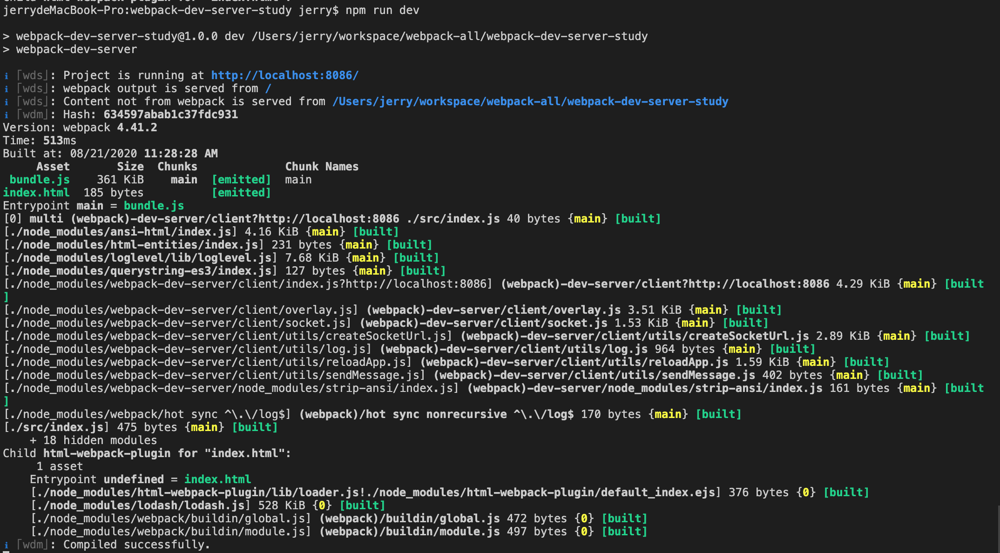
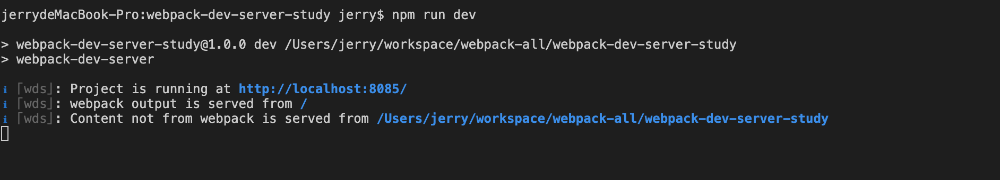
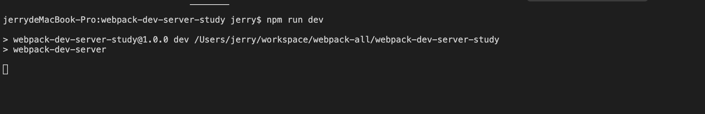
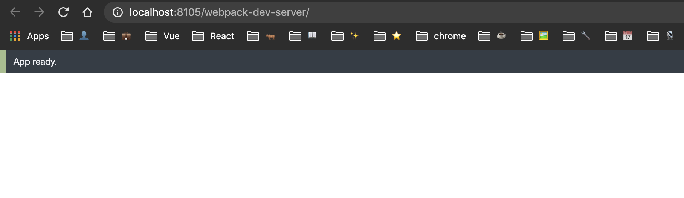
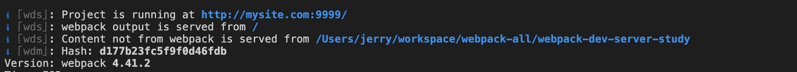
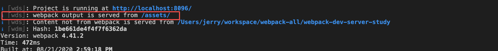
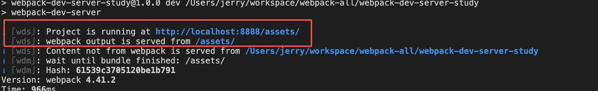
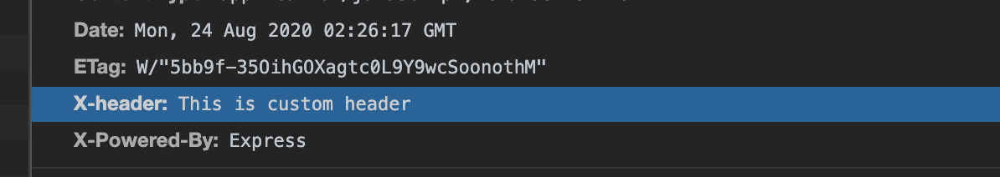

# DevServer

在开发过程中，利用合理的 `devServer` 配置，可以有效的提高我们的工作效率。本节我们就来看看如果对 `devServer` 进行配置。

## 安装

在介绍具体内容之前，你需要先安装这个包：

```
npm install webpack-dev-server
```

接着配置一个 npm script 即可：

```json
{
  "scripts": {
    "dev": "webpack-dev-server"
  }
}
```

最后执行 `npm run dev`，你的应用就成功的运行在这个开发服务器上了。这时候如果你没有在 webpack 配置文件中配置 devServer 属性的话，会采用它的默认配置，比如默认端口是 8080 等。接下来我们细说它的各项配置。

## 配置

### port 🔑

服务器运行的端口号，默认 8080。


### open 🔑

是否自动的打开浏览器。设置为 true 的话，会自动的打开你的**默认浏览器**。

如果你想打开指定浏览器的话，比如你在 Mac OS 上想默认打开 Firefox，你可以设置：

```js
devServer: {
  open: 'Firefox'
}
```

:::tip
注意，这里的浏览器名称需要是你本地 app 的名称，比如谷歌浏览器在 Mac 上叫做 Google Chrome，在 Windows 上叫做 chrome。
:::

在 **webpack V5** 中，你也可以指定 open 属性为一个对象，它的配置和 [open](https://www.npmjs.com/package/open) 一样，比如我要配置默认打开 Chrome 浏览器，并且开启隐私模式，你可以这么设置：

```js
devServer: {
  open: {
    app: ['Google Chrome', '--incognito']
  }
}
```

### openPage

当打开浏览器的时候，指定要打开的页面。它可以是字符串类型的，也可以是数组，表示要打开一组页面。

```js
devServer: {
  openPage: 'index.html',
  // openPage: ['index.html', 'login.html'],
}
```

### compress

启用 gizp 压缩。它是一个布尔值。

```js
devServer: {
  compress: true
}
```

当你设置为 true 时，响应头会多出如下字段：
```
Content-Encoding: gzip
```
  
### writeToDisk

是否将打包生成的文件写入到硬盘中。我们知道，开发服务器下的生成文件是在内存中的，如果你想在本地看到开发环境下打包生成的文件是啥样的，可以将它设置为 true。

```js
devServer: {
  writeToDisk: true
}
```

**它会将生成的文件放在 output.path 中配置的路径中**。它的值也可以是一个函数，函数接收一个文件路径作为参数，返回一个布尔值来决定这个文件要不要写进硬盘，例如下面的配置，就只将 js 文件写进硬盘中：

```js
devServer: {
  writeToDisk: (filePath) => {
    return /\.js$/.test(filePath)
  }
}
```

### onListening

当 webpack-dev-server 开始监听端口上的连接时，要执行的操作。他是一个函数。

```js
devServer: {
  onListening: function(server) {
    const port = server.listeningApp.address().port;
    console.log('Listening on port:', port);
  }
}
```

### before 🔑

它是一个函数，在 webpack-dev-server 所有的内置中间件执行前执行。我们可以在函数中做很多有意思的事，比如数据 mock等。

```js
before(app) {
  app.get('/api/user/1', function(req, res) {
    res.json({ name: 'Jerry' });
  });
}
```

上面的代码，相当于 mock 了一个 `/api/user/1` 的接口，它返回一个 json 对象。你可以在你的业务代码中调用这个接口，例如通过 axios 请求：

```js
axios.get('/api/user/1').then(res => {
  // handle res
})
```


### after

它也是一个函数，在 dev-server 内部中间件执行完之后执行。你也可以在这里进行数据 mock，这里就不多解释了。它和 before 相当于两个钩子，一个在 dev-server 所有内置中间件执行前执行，一个在 dev-server 所有内置中间件执行之后执行。


### clientLogLevel

设置你 DevTool 上控制台的日志级别。我们在浏览器的控制台上，经常会看到一些日志信息或者一些编译警告或者错误信息，比如：

```
[WDS] App updated. Recompiling...
[WDS] App hot update...
[HMR] Checking for updates on the server...
[HMR] Nothing hot updated.
[HMR] App is up to date.
```

你可以通过设置不同的级别来限制控制台的输出：

```js
devServer: {
  clientLogLevel: 'error' // 只显示错误信息
}
```

类似的级别还有 info，debug，warn 等。**如果你嫌日志太多很烦，那么可以设置为 `silent` 来关掉日志（但是错误信息还是会展示）。**

### overlay

当 **编译报警告或者出错** 的时候，是否在浏览器上显示一个全屏的遮层来展示这些信息。注意这里显示的编译相关的信息，比如你的代码不符合某个 eslint 标准，或者代码少个括号等会引起编译出错的时候。比如如下代码：

```js
console.info('hello'
```

会报错：


当设置为 true 的时候，只会显示错误信息。如果你想显示警告信息和错误信息的话，可以设置成一个对象：

```js
devServer: {
  overlay: {
    warnings: true,
    errors: true
  }
}
```

### quiet

我们知道，当运行 `npm run dev` 时，命令行会打印出很多日志：




你可以通过设置 quiet 为 true 来禁用掉日志。**注意，此时警告和错误信息也不会显示了，所以这个属性还是慎用。**

```js
devServer: {
  quiet: true
}
```




### noInfo 

它也是一个日志输出的控制。noInfo 的作用是不输出 webpack 的打包信息，但是对于错误和警告还是会输出的。关于它和 quiet 的优先级，读者可以自行尝试一下。

```js
devServer: {
  noInfo: true
}
```



### stats

**这个选项可以让你精确地控制显示什么 bundle 信息，它是用来控制 bundle 信息的显示的。** 如果你不想使用 noInfo 和 quiet 来配置的话，这也是一个不错的选择。你可以参考 [stats](https://webpack.js.org/configuration/stats/) 配置来更进一步的了解。比如你只想看到 bundle 的错误信息，那么可以配置：

```js
devServer: {
  stats: 'errors-only'
}
```

**注意，它在与 quiet 或 noInfo 一起使用时不起作用。**

### inline 🔑

inline = true, inline 模式；inline = false，iframe 模式。

**devServer 的实时预览功能，实际上依靠的是一个注入进页面的代理客户端与 devServer 之间的通信来实现的。如果你开启了 inline 模式，这个脚本就会注入进你的 bundle 来负责与 devServer 通信，构建信息也会实时的显示在浏览器控制台上。**


相反的，如果你设置成 false，那么 devServer 将无法直接控制你正在开发的网页，这时候它会在你的页面上加一个 iframe，通过 iframe 的刷新来实现实时预览的效果。不过这时候你要通过 http://localhost:8080/webpack-dev-server/ 去访问你的应用。




**推荐采用默认值，即使用 inline 模式来实时预览。**


### public

一般用不到。但是如果你的本地开启了代理，将你的服务转向了另一个地址，那么这个配置项就起作用了。比如：

```js
devServer: {
  public: 'mysite.com:9999'
}
```

默认打开的地址就是 mysite.com:9999 了。




### publicPath 🔑

这个是用来配置你打包后的文件路径的。比如你的服务器运行在 http://localhost:8080 上，然后 `output.filename` 设置为 bundle.js。默认情况下，`devServer.publicPath` 为 '/'，所以你可以通过 http://localhost:8080/bundle.js 来访问你打包后的文件。

你也可以自己设置具体的路径：

```js
devServer: {
  publicPath: '/assets/'
  // publicPath: ''
}
```

可以看一下日志：



这时候你应该通过 http://localhost:8080/assets/index.html 来访问页面，你的 bundle.js 文件也是在 http://localhost:8080/assets/ 这个目录下。

我们可以将 public 和 publicPath 结合起来配置，例如：

```js
devServer: {
  port: 8888,
  public: 'localhost:8888/assets',
  publicPath: '/assets/'
}
```




有两点需要注意一下：

1. publicPath 的值永远要以 / 开头，以 / 结尾
2. **publicPath 的值最好和 output.path 保持一致**


### https

设置为 true 表示开启 https。你也可以指定自己的证书：

```js
devServer: {
  https: true,
  key: fs.readFileSync('/path/to/server.key'),
  cert: fs.readFileSync('/path/to/server.crt'),
  ca: fs.readFileSync('/path/to/ca.pem'),
}
```

### http2

它是一个布尔值，表示是否开启 http2 传输（基于spdy）。**这个属性在 node v10+ 上无效。**

### index

打开的 index 文件的名称。默认是 index.html。当你默认的文件名不是 index.html 的时候，指定它会很有用，比如结合 HtmlWebpackPlugin 来配置：

```js
{
  plugins: [
    new HtmlWebpackPlugin({
      title: 'DevServer Test',
      filename: 'hello.html'
    })
  ],
  devServer: {
    index: 'hello.html'
  }
}
```

这样的配置能保证我们正确的打开 index 文件。


### allowedHosts

配置哪些主机访问我们的服务。

```js
devServer: {
  allowedHosts: [
    'baidu.com',
    '.hello.com'
  ]
}
```

### disableHostCheck

设置为 true 的话表示禁用主机检查，这时候你可以接收来自任意主机的请求。**非常不推荐设置为 true，因为这容易让你收到 DNS 重绑定攻击。**

### host 🔑

指定要使用的主机。

这个配置非常有用，项目开发的时候，我们常常遇到这样的情况，你本地改了一个东西，还没上测试环境，想让别人先看看效果，你就需要别人访问你电脑上运行的应用，这时你需要配置：

```js
devServer: {
  host: '0.0.0.0'
}
```

你将你的 ip 发给你的同事，它就可以通过 ip:port/path/to/app 来访问你电脑上的服务了。这时候你的 disableHostCheck 需要设置为 true，因为别人是通过你的 ip 来访问的。

### useLocalIp

是否使用本地 ip 打开浏览器。默认是 false。

要想这个属性起作用，你的 host 属性要么是本地的 ip，要么是 0.0.0.0。这个属性很少用到，实在要配置的话，参考如下：

```js
devServer: {
  host: '0.0.0.0',
  useLocalIp: true
}
```

### hot 🔑

开启热模块更新（HMR）

### hotOnly 🔑

当构建失败的时候，也不要刷新浏览器，依旧使用 HMR。通常我们一起设置：

```js
devServer: {
  hot: true,
  hotOnly: true
}
```

### contentBase 🔑

我们知道，devServer 通过 HTTP 服务暴露出来的文件分为两类。一类是 webpack 打包出的文件，一类是本地的静态文件。前者我们可以通过 publicPath 来指定服务的地址，后者就要靠我们的 contentBase 来指定了。比如：

```js
devServer: {
  contentBase: path.join(__dirname, 'public')
}
```

这就把项目根目录下的 public 文件夹作为服务文件的路径了。如果这时候你项目根目录下有一个 public 文件夹，文件夹里有一个 hello.txt 文件，那么你就可以通过 http://localhost:8091/hello.txt 来访问这个文件了。

如果你有多个文件夹需要指定，也可以配置成数组：


```js
devServer: {
  contentBase: [path.join(__dirname, 'public'), path.join(__dirname, 'assets')]
}
```

### contentBasePublicPath 🔑

**这是 webpack V5 新增的特性。** 它给你的 contentBase 里面服务的内容加上访问前缀。比如：

```js
devServer: {
  contentBase: path.join(__dirname, 'public'),
  contentBasePublicPath: '/ppp'
}
```

你在浏览器的访问路径前面就要加上 ppp 前缀：http://localhost:8091/ppp/hello.txt。如果你 contentBase 配置的是数组，那么你这个也要配置成对应的数组。

```js
devServer: {
  contentBase: [path.join(__dirname, 'public'), path.join(__dirname, 'assets')],
  contentBasePublicPath: ['/public', '/assets']
}
```

### watchContentBase

告诉 dev-server 去监听 devServer.contentBase 路径下的文件。如果设置为它 true 的话，那么该目录下任意文件的修改都会出发页面的刷新。

```js
devServer: {
  contentBase: path.join(__dirname, 'public'),
  watchContentBase: true
}
```

（我结合上面的 hello.txt 试了，我修改 hello.txt 文件后，页面并没有刷新。不知道是哪里出了问题，待研究。）

### watchOptions

文件监听相关的控制。可以参考 watchOptions 章节，他们的配置是一样的。

### headers

给所有的响应添加响应头。

```js
devServer: {
  headers: {
    'X-header': 'This is custom header'
  }
}
```

结果：



### liveReload

控制浏览器是否实时刷新。默认情况下，当监测到文件改变时，dev-server 会刷新页面。要想 liveReload 生效的话，devServer.hot 要为 false，或者 devServer.watchContentBase 为 true。

```js
devServer: {
  liveReload: false
}
```

### socket 相关

这个我们几乎很少去配置，做一个了解即可。

```js
devServer: {
  socket: 'socket', // 要监听的 Unix socket
  sockHost: 'mysocket.test', // 告诉连接到 devServer 的客户端使用提供的 socket 主机
  sockPath: '/mysocket', // 访问 socket 的路径
  sockPort: 8080 // 告诉客户端使用这个端口去连接 devServer
}
```

### historyApiFallback 🔑

当使用 HTML5 History API 的时候，index.html 还要承载着 404 的请求。通过设置这个属性为 true 可以解决这个问题：

```js
devServer: {
  historyApiFallback: true
}
```

这时候，你访问一个不存在的路径，也会去请求 index.html 文件的内容。

这个属性还支持更高级的配置：

```js
devServer: {
  historyApiFallback: {
    rewrites: [
      { from: /^\/$/, to: '/views/landing.html' },
      { from: /^\/subpage/, to: '/views/subpage.html' },
      { from: /./, to: '/views/404.html' }
    ]
  }
}
```

有兴趣的话可以自己尝试一下。

### proxy 🔑

想必这个属性大家都很熟悉，开发过程中经常会需要配置它来实现跨域。详细的配置可以参考 [http-proxy-middleware](https://github.com/chimurai/http-proxy-middleware#options) 这个包，这里我们介绍常见的几种。

当你的后端部署在 35.123.18.192 上的时候，你可以这么配置：

```js
devServer: {
  proxy: {
    '/api': 'http://35.123.18.192'
  }
}
```

这时候，如果在代码中请求 /api/users ，这个请求会被代理发送到 http://35.123.18.192/api/users。

当你不想要发送 /api 这个前缀的时候，你可以使用 pathRewrite 来改掉它，这时候要将路径对应的值设置成对象：

```js
devServer: {
  proxy: {
    '/api': {
        target: 'http://35.123.18.192',
        pathRewrite: {
          '^/api': ''
        }
    }
  }
}
```

这里配置的 pathRewrite 表示，如果一个请求路径以 /api 开头，统一的将 /api 去掉，也就是说 `axios.get('/api/users/')` 实际上会发送：`http://35.123.18.192/users` 这个请求。你也可以通过这个 pathRewrite 做一些有意思的事，比如这个场景：后端某个接口没写完，它要给你一个 mock 接口，你就可以在这里配置重写规则了，比如：

```js
pathRewrite: {
  '/users': '/fake-users'
}
```


如果你想代理多个路径到同一个目标服务器上，你还可以使用 context 属性来配置：

```js
devServer: {
  proxy: [{
    context: ['/auth', '/api'],
    target: 'http://localhost:3000',
  }, {
    context: ['/v2/auth', '/v2/api'],
    target: 'http://localhost:4000',
  }]
}
```

默认情况下，使用无效证书运行在HTTPS上的后端服务器将不被接受。如果需要，可以像这样修改配置：

```js
devServer: {
  proxy: {
    '/api': {
      target: 'https://xxx.com',
      secure: false
    }
  }
}
```

如果你想选择性的代理一些请求，比如针对 API 请求走代理，针对 html 页面请求不走代理，你可以使用 bypass 来控制这种行为：

```js
devServer: {
  bypass(req, res, proxy) {
    if (req.url.indexOf('html') !== -1) {
      console.log('Skipping proxy for browser request.');
      return '/index.html';
    }
  }
}
```

bypass 是一个函数，它的规则是这样的：

- 如果返回 null 或者 undefined，使用代理来处理请求；
- 如果返回 false，那么这个请求结果为 404
- 返回一个路径，就去请求这个路径的资源，不走代理

默认情况下，原始的 Host 头是被一直保留的，也就是说，代理过去的请求头中的 Host 的值是最原始的。举个例子，我配置了 proxy 访问 35.123.23.24 服务器。应用在本地运行后，默认情况下，devServer 发送到远程服务器的请求头的 Host 字段，是 localhost，但是这个对于远端服务器来说，可能会被拒绝。所以有的情况下，你可以将 changeOrigin 设置为 true 来修改这种默认行为。

```js
devServer: {
  proxy: {
    '/api': {
      target: 'http://35.123.23.23',
      changeOrigin: true
    }
  }
}
```