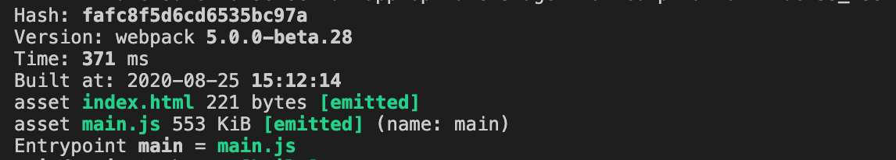
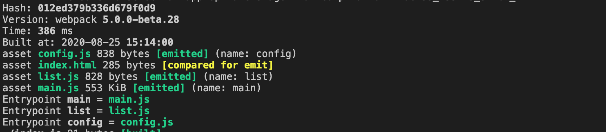
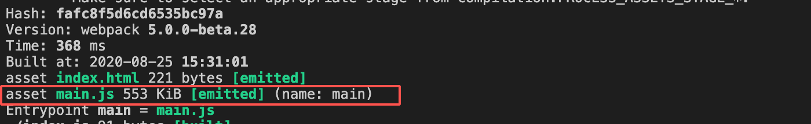
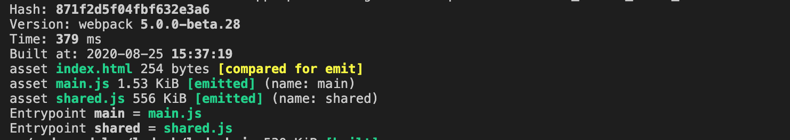
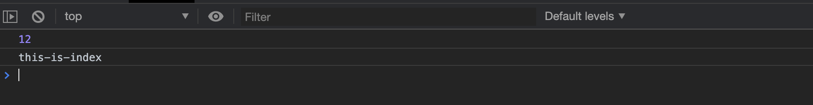
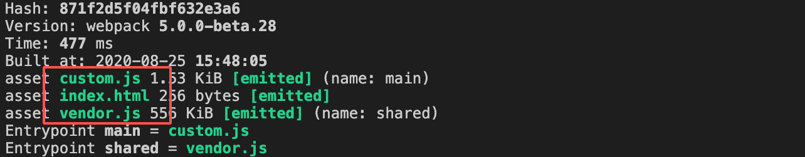

# Entry & Context

entry 对象的值确定了 webpack 打包的入口。context 则是一个目录的绝对路径，它包含着入口文件。本节我们来看看它们的配置。

## Context

它是一个字符串，并且必须是**绝对路径**。**webpack 会根据这个值去寻找入口文件和 loaders。**它的默认值是当前文件夹，但是还是建议你配置一下，因为这样可以让你的配置与你的当前工作目录相互独立。

```js
const path = require('path');

module.exports = {
  context: path.resolve(__dirname, 'src'),
  entry: './index.js'
}
```

配置了以后，webpack 查找 entry 中的入口文件时就会基于 context 的路径查找，也就是说，我们的入口文件是当前目录下的 src 目录下的 idnex.js。我们就可以不用在 entry 中配置 './src/index.js' 了。

## Entry


webpack 整个构建过程的入口。如果配置成数组的话，那么数组的每一项都会被当成入口起点被处理。

### 基础配置

```js
module.exports = {
  // SPA 的配置
  // entry: './src/index.js'

  // MPA 的配置
  entry: {
    main: './src/index.js',
    list: './src/list.js',
    config: './src/config.js'
  }
}
```

**命名规则**：

当 entry 的值是一个字符串或一个数组的时候，打包生成的文件名为 main.js。如果传入一个对象，那么对象的每一个 key 都会作为生成文件的名称，每一个 key 对应的值就是该文件打包入口。

我们看两个栗子。

1. 针对 SPA：

配置：

```js
const HtmlWebpackPlugin = require('html-webpack-plugin')
const path = require('path');

module.exports = {
  mode: 'development',
  context: path.resolve(__dirname, 'src'),
  entry: './index.js',
  plugins: [
    new HtmlWebpackPlugin({
      title: 'Webpack'
    })
  ]
}
```

打包结果：



可以在打包输出的日志上清晰的看到，只有一个 entrypoint。

2. 针对 MPA

配置：

```js
const HtmlWebpackPlugin = require('html-webpack-plugin')
const path = require('path');

module.exports = {
  mode: 'development',
  context: path.resolve(__dirname, 'src'),
  entry: {
    main: './index.js',
    list: './list.js',
    config: './config.js'
  },
  plugins: [
    new HtmlWebpackPlugin({
      title: 'Webpack'
    })
  ]
}
```

打包结果：



可以看到，针对每一个入口配置，都生成了单独的文件，它有三个 entrypoint。


### 高级配置

#### 分离业务代码和第三方库

webpack5 对 entry 的配置做了增强，你可以手动的分离业务代理和第三方库，也可以在 entry 中指定对应 chunk 的名称等。

我们根据一个栗子来看。假设我们项目中用到了 lodash，不做任何配置的话，它是会跟着主入口打包进我们的 main.js。我们还是使用上面 SPA 的 webpack 配置，这里我们看一下 index.js 的内容：

```js
import _ from 'lodash'

console.info(12)
console.info(_.join(['this', 'is', 'index'], '-'))
```

它引入了 lodash 包，然后打印了一些内容。看一下这时候的打包输出内容：



可以看到 main.js 的体积很大，但是我们的业务代码实际上只有几行，很显然它连 lodash 也一并打包进来了。但是现实情况下，针对与我们的第三方库，我们肯定是希望它是可以单独出来，这样也便于浏览器的缓存，因为他们几乎很少改变。在新版的 webpack 中，你可以这么配置：

```js{8,9,10,11,12}
const HtmlWebpackPlugin = require('html-webpack-plugin')
const path = require('path');

module.exports = {
  mode: 'development',
  context: path.resolve(__dirname, 'src'),
  entry: {
    main: {
      import: './index.js',
      dependOn: 'shared'
    },
    shared: 'lodash'
  },
  plugins: [
    new HtmlWebpackPlugin({
      title: 'Webpack'
    })
  ]
}
```

可以看到，我们把 lodash 单独分出来作为一个 shared 入口，然后将主入口改成了对象形式的。其中 import 表示入口文件，dependOn 表示这个 chunk 依赖于 名称为 shared 的 chunk，也就是我们配置的 lodash 打包出来的 chunk。看一下打包输出：



在浏览器上运行也是可以正常的打印出内容：



有了这项配置，我们的 shared.js 就可以被浏览器有效的缓存起来，也不必随着我们的业务代码改变而每次打包进去。

#### 重命名 chunk 名称

上面介绍了 chunk 的默认命名规则，如果你想在 entry 中指定对应 chunk 的名称的话，你可以通过指定 filename 来配置：

```js
module.exports = {
  mode: 'development',
  context: path.resolve(__dirname, 'src'),
  entry: {
    main: {
      import: './index.js',
      dependOn: 'shared',
      filename: 'custom.js'
    },
    shared: {
      import: 'lodash',
      filename: 'vendor.js'
    }
  },
  plugins: [
    new HtmlWebpackPlugin({
      title: 'Webpack'
    })
  ]
}
```

打包结果：



你也可以像在 output.filename 中配置的那样添加占位符：

```js
shared: {
  import: 'lodash',
  filename: '[name].[hash:8].js]'
}
```

:::tip
如果你在entry中配置了 chunk 的 filename，在 output.filename 中也配置了，那么 entry 中的优先级会高，读者可以自行尝试。
:::

#### 动态入口

entry 的值也可以是一个函数，它会根据函数的返回值来决定打包的入口。我们几乎用不到这个配置，做一下了解即可。

```js
module.exports = {
  //...
  entry: () => './index.js'
};
```

```js
module.exports = {
  // 可以从远程服务器获取配置
  entry: () => new Promise((resolve) => resolve(['./demo', './demo2']))
};
```