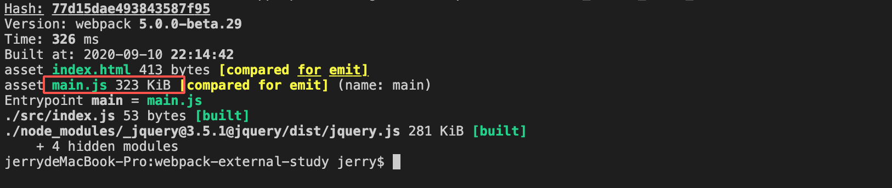
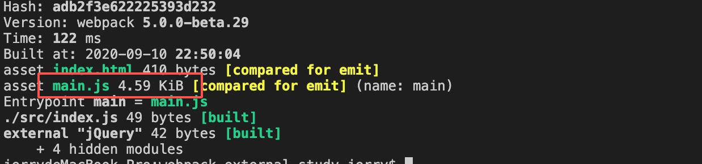
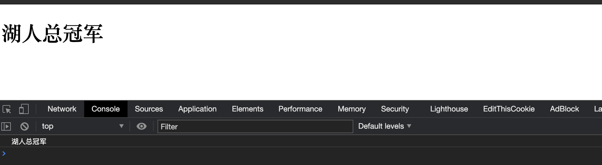
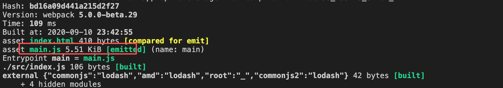
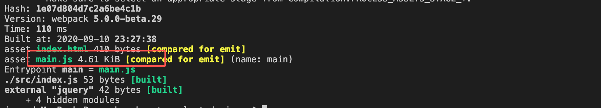
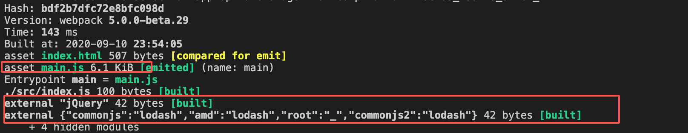
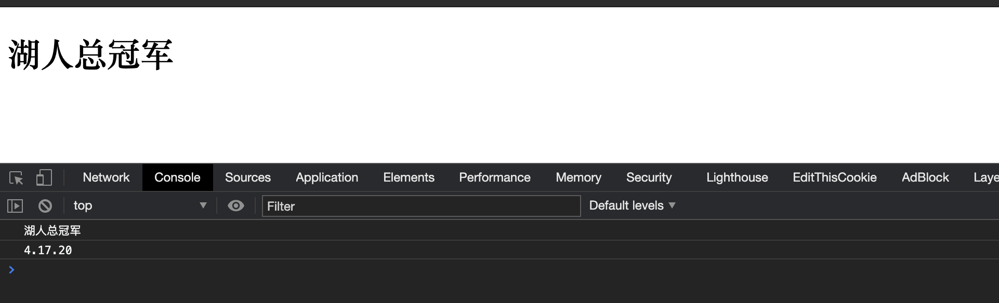
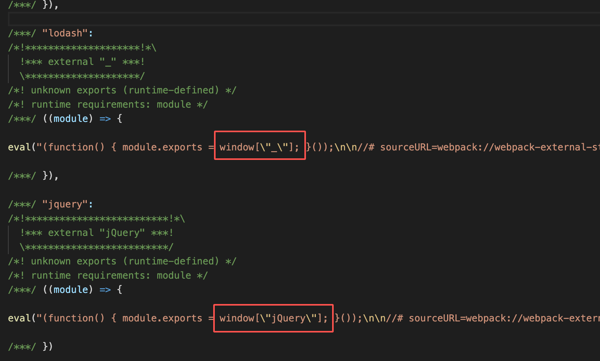
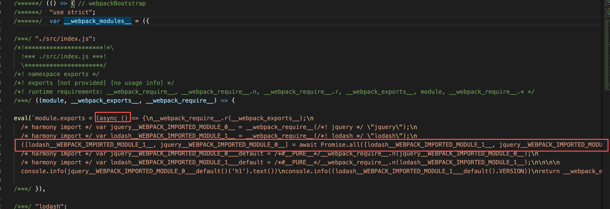
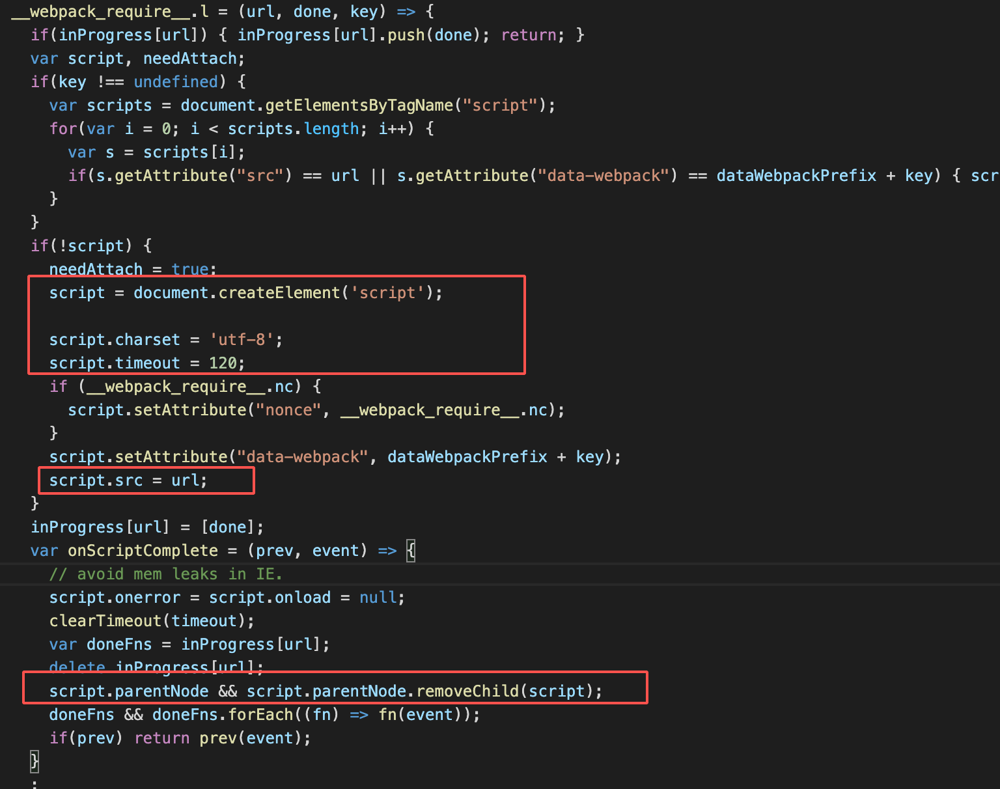

# externals 和 externalsType

当我们打包一个应用的时候，除了业务代码以外，通常还会将一些第三方的库打包进我们最终的 bundle，这就会使得这个 bundle 的体积很大。这个 externals 配置项可以将指定的依赖从我们最终的 bundle 中排除，也就是不打包这些依赖进最终的文件。当然，前提是你要在使用这个 bundle 的环境中提供这些依赖，因为应用运行时需要这些包提供的功能，否则你的应用就挂了。这个选项最常用的场景就是我们使用 cdn 抽离依赖库的时候。本节我们就来看看如何配置这个 externals 选项。

## 不用 external 的打包情况

在开始介绍之前，我们来看一下不用 externals 配置的情况，以 jQuery 为例，我们需要安装依赖：

```bash
npm install jquery -S
```

接着在 index.js 中使用：

```js
import $ from 'jquery'

console.info($('h1').text())
```

配置 webpack：

```js
const HtmlWebpackPlugin = require('html-webpack-plugin');

module.exports = {
  mode: 'development',
  entry: './src/index.js',
  plugins: [
    new HtmlWebpackPlugin({
      title: 'Externals',
      template: './index.html'
    })
  ]
}
```

这时候运行打包命令的话，会发现打包出的体积很大，因为它将整个 jQuery 都打进来了：



很显然，越多的依赖会造成打包文件的增大。这肯定是不好的，接下来我们就来看看如何配置 externals 来避免这个问题。

## externals 配置


在配置之前，我们要确保运行环境中包含对应的依赖。还是以我们的 jQuery 为例，我们需要在 index.html 中引入它：

```html{7}
<!DOCTYPE html>
<html lang="en">
<head>
  <meta charset="UTF-8">
  <meta name="viewport" content="width=device-width, initial-scale=1.0">
  <meta http-equiv="X-UA-Compatible" content="ie=edge">
  <script src="https://cdnjs.cloudflare.com/ajax/libs/jquery/3.5.1/jquery.min.js">
  </script>
  <title>测试external</title>
</head>
<body>
  <h1>湖人总冠军</h1>
</body>
</html>
```

这样就在运行时的环境中提供了 jQuery 了。我们再来看配置。它支持字符串、字符串数组、正则、函数和对象五种形式的配置。

### 字符串

这是最简单的一种配置类型：

```js
module.exports = {
  // 省略其它
  externals: {
    jquery: 'jQuery'
  }
}

```

其中 jquery 这个键表示的是我们在代码中引用的名称，也就是 `import $ from 'jquery'` 中的 jquery；而 "jQuery" 这个值则是我们运行环境提供的，我们知道在 script 标签中引入 jQuery 的话，会在全局环境上添加一个 jQuery 和 $ 的变量，所以这里的值写 "jQuery" 或者 "$" 都可以。

我们来看一下打包结果：



肉眼可见的减小了体积。我们打开 html 文件看看能不能正常运行：



没有问题！控制台正常输出了调用了 jQuery 方法的文本。


这里要补充一个知识点。这个被排除的依赖，也就是我们的 externals 中配置的，可以以这几种形式存在：

- root：作为全局变量
- commonjs：CommonJS 模块
- commonjs2：与 CommonJS 类似但是导出的是 `module.exports.default`
- umd：umd 模块

当使用字符串配置的时候，默认是 root 的形式，通俗的理解就是，我这个 jquery 已经在全局变量中存在了，你就不需要把它打进你的 bundle 里啦。

如果你想指定其它的形式，你可以加上对应的名称，比如你要将 `fs-extra` 这个包从输出文件中排除，然后在运行时引入，你可以这么配置：

```js
module.exports = {
  // ...
  externals: {
    'fs-extra': 'commonjs2 fs-extra',
  }
};
```

### 字符串数组

这种形式可以让你只使用某个 commonjs 模块中的某个子集，比如我想要 math 模块中的 subtract 对象，可以这么配置：

```js
module.exports = {
  //...
  externals: {
    subtract: ['./math', 'subtract']
  }
};
```

这个栗子会被转成类似这样的代码：`require('./math').subtract`。这个配置我们不常用。


### 正则

这个也很简单，满足正则的依赖就不会被打包了：

```js
module.exports = {
  //...
  externals: /^(jquery|\$)$/i // 排除了 jquery（不分大小写） 和 $
};
```

### 对象

配置成对象形式都有个前提，那就是你的 output.libraryTarget 的值必须是 'umd'，不然不起作用。

我们以 lodash 为例：

修改 index.js：

```js
import _ from 'lodash'

console.info(_.VERSION)

```

修改配置：

```js
module.exports = {
  // ... 
  output: {
    libraryTarget: 'umd'
  },
  externals: {
    lodash: {
      commonjs2: 'lodash',
      commonjs: 'lodash',
      amd: 'lodash',
      root: '_',
    }
  }
}
```

看一下结果：



也是可以正常的排除掉 lodash 这个包的。

### 函数

使用函数可以更灵活的配置。这个函数接受三个参数：

- context：包含 import 语句的文件所在目录。字符串类型。

- request：import 的包的路径。字符串类型。

- callback：一个函数用来决定需不需要排除这个依赖的打包。它也有三个参数：

  - error：在排除这个依赖时的错误信息。

  - result：用来描述这个外部模块。

  - type：如果没有在 result 中指定这个模块类型的话，可以用这个参数来指定，它是可选的。


看上去有点复杂，我们来看几个栗子：

```js
module.exports = {
  // ...
  externals: (context, request, callback) => {
    if (request.includes('jquery')) {
      // 排除 jquery 的打包
      // 注意这里的 jQuery 要是全局环境下的变量
      return callback(null, 'jQuery')
    }
    // 正常处理
    callback()
  }
}
```

这个会检查我们的 request 是否包含 jquery，包含的话就不打包它进 bundle。这就是将上面的字符串形式的改写成了函数形式的写法，我们也可以使用 callback 的第三个参数，来指定 jquery 模块的类型：

```js
module.exports = {
  // ...
  externals: (context, request, callback) => {
    if (request.includes('jquery')) {
      // 排除 jquery 的打包
      return callback(null, 'jQuery', 'root')
    }
    // 正常处理
    callback()
  }
}
```

打包结果都与之前配置都 string 形式都一样：



你可以指定 result 为 object 类型的：

```js
module.exports = {
  // ...
  externals: [
    function(context, request, callback) {
      // The external is a UMD module
      callback(null, {
        root: 'lodash',
        commonjs: 'lodash',
        commonjs2: 'lodash',
        amd: '_'
      });
    }
  ]
};

```

### 组合使用

上述五种类型的配置都可以一起使用，这时候你的 externals 要是一个数组，每一项都可以是不同的配置。我们基于上面两个栗子做个修改：

先改一下 index.js：

```js
import $ from 'jquery'
import _ from 'lodash'

console.info($('h1').text())
console.info(_.VERSION)
```

再合并配置到一起：

```js
module.exports = {
  // ...
  output: {
    libraryTarget: 'umd'
  },
  externals: [
    {
      lodash: {
        commonjs: 'lodash',
        amd: 'lodash',
        root: '_',
        commonjs2: 'lodash'
      }
    },
    (ctx, request, callback) => {
      if (request.includes('jquery')) {
        return callback(null, 'jQuery', 'root')
      }
      callback()
    }
  ]
}
```

打包后体积依旧很小：



运行代码，一切正常：




## externalsType 配置

这个属性是 webpack5 新增的，它是与 externals 同级的配置。它的作用主要是用来指定 external 的包的默认类型，但是有个限制：jsonp，amd，umd，system 这四种类型要求 output.libraryTarget 设置成相同的值。比如，如果你 externalsType 设置为 umd 的话，那么你的 output.libraryTarget 也必须是 umd，不然不起作用。它支持的所有类型如下：

- var（默认值）
- module
- assign
- this
- window
- self
- global
- commonjs
- commonjs-module
- amd
- amd-require
- umd
- umd2
- jsonp
- system
- promise
- import
- script

这些不同的类型会对打包生成的文件有不同的影响，主要在引入这些外部包的时候会有差异，我们来看几个栗子。

### window

```js
module.exports = {
  // ...
  externals: {
    lodash: '_',
    jquery: 'jQuery'
  },
  externalsType: 'window'
}
```

打包出的 main.js 中，可以看一下两个外部包的情况：



可以看到，是直接的使用挂在 window 上的 lodash 和 jQuery。

### promise

它其实跟默认值 var 类似，但是获取这些外部包的方式不同。配置成 var 的时候，是直接引入的；而使用 promise 的话，会异步的引入：



可以看到 `await Promise.all([lodash__WEBPACK_IMPORTED_MODULE_1__, jquery__WEBPACK_IMPORTED_MODULE_0__]))`，说明是异步的等外部包加载完了再去执行。

### script

这个属性很有用，有了它我们引用 cdn 的外部包的时候，就方便多了。设置了 externalsType 为 script 的话，你的 externals 里面的外部包都要是一个 url 地址，webpack 会根据你这个 url 生成一个 script 标签来引用这个库，当这个库被加载完的时候，这个 script 标签会被自动的删除。我们改写一下上面的栗子：

```js
module.exports = {
  // ...
    externals: {
    lodash: ['https://cdnjs.cloudflare.com/ajax/libs/lodash.js/4.17.20/lodash.min.js', '_'],
    jquery: ['https://cdnjs.cloudflare.com/ajax/libs/jquery/3.5.1/jquery.min.js', 'jQuery']
  },
  externalsType: 'script'
}
```

再删掉 html 中我们自己加的两个 script。

运行打包的话，我们可以在 main.js 中发现相关的处理代码：




你也可以指定只使用库中的某一个方法：

```js
module.exports = {
  // ...
  externalsType: 'script',
  externals: {
    lodash: ['https://cdn.jsdelivr.net/npm/lodash@4.17.19/lodash.min.js', '_', 'join'],
  }
};
```

使用：

```js
import join from 'lodash';
console.log(join([1, 2, 3], '-'));
console.log(window._.head(['a', 'b']));
```

但是我们都引入一个库了，只用它的一个方法未免太不划算了，而且 `import join from 'lodash';` 这样的方式会让人误解。所以这种方式我们也尽量避免去使用。