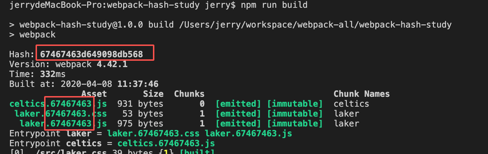
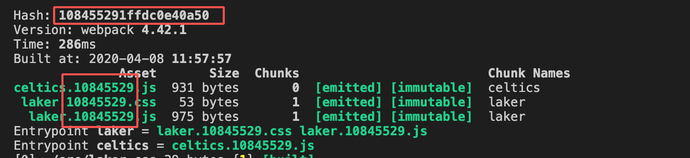
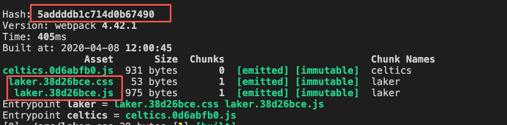
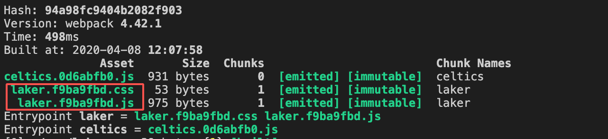
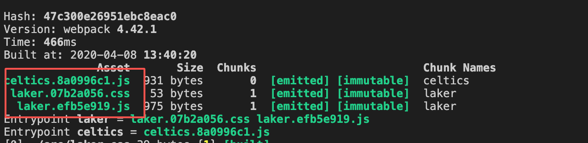
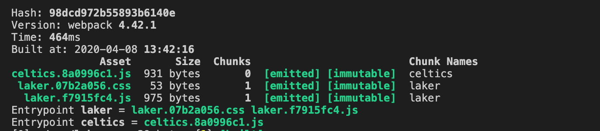

# 详解hash, chunkhash, contenthash

如果你使用`webpack`来构建你的前端应用，你会发现在打包后的输出文件中往往会出现形如 `名称+hash+后缀` 这样格式的文件，比如`main.8eaf1262.js`，`app.6d87fbf2.css`等。这个hash值是`webpack`给我们添加上的。它为什么要这么做呢？本节我们就来看看这个神奇的hash值。

## 为什么需要hash

我们知道浏览器都有缓存策略，它可以将一次请求的结果存在本地，用户在下次访问的时候，如果命中了某些条件的话，会直接从本地获取资源，这样可以节省带宽，提高响应速度，是一个性能优化的常见做法。

试想一下，如果我们的打包文件名称为`main.js`，张三第一次访问后，浏览器将这个文件缓存到本地30天，也就是说，30天内用户再次访问这个资源的话，都是访问本地的文件。那么问题来了，如果这30天内，我们的应用改版或者修复了某个bug重新上线后，由于名称还是`main.js`，缓存依旧有效，所以用户依旧拿不到最新的代码，是一个潜在的隐患。

当然，我们可以通过`url`的方式手动的强制刷新这个资源，比如`main.js?tag=1`，这样，由于跟前一次的请求不一样（多了query string），浏览器就不会去拿缓存，而是乖乖的去服务器获取资源返回给用户。但是，我们通过构建工具打包后的文件，给文件名加上这个query string的话显得很不合适，我们又不可能手动的去改我们的`index.html`，所以，一些优秀的工程师就想到了，将每一次的构建生成`hash`作为文件名的一部分。这样，如果文件修改了，对应的hash值变了，文件名就变了，`index.html`中的脚本引入的地址也会跟着变，这一系列的操作都由构建工具给我们弄好了，我们只需要关注于业务本身即可。

## hash的分类

在`webpack`中，使用hash很简单，只需要指定好打包后的文件名称就行了，比如在`output`中指定`filename`为`[name].[hash].js`，我们就会获得带有hash值的输出文件了。

`webpack`提供了三种类型的`hash`值，分别是`hash`，`chunkhash`，`contenthash`。我们来看看它们的使用场景。

- `hash`

`hash` 是与构建相关的。每一次的构建，所有的chunk都会获得相同的hash值，你改动了任一文件，都会导致整个应用所有的`hash`都跟着改变。

- `chunkhash`

我们知道，Webpack 启动后会从 Entry 里配置的 Module 开始递归解析 Entry 依赖的所有 Module。 每找到一个 Module， 就会根据配置的 Loader 去找出对应的转换规则，对 Module 进行转换后，再解析出当前 Module 依赖的 Module。 这些模块会以 Entry 为单位进行分组，一个 Entry 和其所有依赖的 Module 被分到一个组也就是一个 Chunk。最后 Webpack 会把所有 Chunk 转换成文件输出。

`chunkhash`是跟入口有关的，我们知道`webpack`打包会从我们的入口文件开始解析构建。如果某一个entry或者这个entry的某一个依赖改变了，那么这个`chunkhash`就会随之改变，但是不会影响不关联的`entry`。

- `contenthash`

`contenthash`顾名思义，就是跟文件内容相关的了。`webpack`会基于文件内容计算出特定的hash值作为文件名的一部分，它的值只受文件内容的约束。文件没有修改，它的`contenthash`是不变的。

## 案例分析

我们根据一个例子来看看这些hash的用法和区别，先把准备工作做一下。由于我们这里只看打包文件，所以就不准备html文件了，专注于构建结果即可。

- `laker.js` - 入口文件1，同时它引入了一个css文件和一个js文件
```js
import './laker.css'
import getSaying from './laker-fan.js'
const star = 'KOBE BRYANT'
function printMVP() {
  console.info(star, '=>>MVP')
}
getSaying()
```

- `laker.css`

```css
body{
  background-color: #fff;
  font-size: 20px;
}
```

- `laker-fan.js`
```js
export default function () {
  return 'We love you 3 thousand KOBE !'
}
```

- `celtics.js` - 入口文件2，没有任何依赖

```js
const titles = 16

function printChamps() {
  console.info(`We won ${titles} titles in total`)
}
```

再来看看我们的webpack配置文件 `webpack.config.js`：

```js
const MiniCssExtractPlugin = require('mini-css-extract-plugin');
const { CleanWebpackPlugin } = require('clean-webpack-plugin');

module.exports = {
  mode: 'production',
  entry: {
    laker: './src/laker.js',
    celtics: './src/celtics.js'
  },
  output: {
    filename: '[name].[hash:8].js'
  },
  module: {
    rules: [
      {
        test: /\.css$/i,
        use: [MiniCssExtractPlugin.loader, 'css-loader'],
      },
    ]
  },
  plugins: [
    // clean up dist
    new CleanWebpackPlugin(),
    new MiniCssExtractPlugin({
      filename: '[name].[hash:8].css'
    })
  ]
}
```

我们引入了`MiniCssExtractPlugin`插件来处理`css`文件，使其抽取出来成为单独的文件。所以，根据上面的配置，我们最终会得到三个输出文件。最后别忘了，在`package.json`中定义一下`script`，方便我们执行打包指令。至此，我们的准备工作完成了。


- `hash`的情况



我们看到，构建出的三个文件的hash都是相同的，跟最上面的hash保持一致，也即是这次构建过程中的产生的hash。如果我们此时修改`laker.css`：

```css {3}
body{
  background-color: #fff;
  font-size: 30px;
}
```
重新构建会发现，所有输出文件的名称都变了，因为hash值改变了：




- `chunkhash`的情况

修改我们的`webpack.config.js`文件：

```js
module.exports = {
  //...
  output: {
    filename: '[name].[chunkhash:8].js'
  },
  plugins: [
    // ...
    new MiniCssExtractPlugin({
      filename: '[name].[chunkhash:8].css'
    })
  ]
  //...
}
```

执行构建后：



可以看到，本次构建产生的hash值`5addddb1c714d0b67490`没有作用到任一个文件上去。相反的，输出文件中出现了两个`hash`值，这跟我们的`entry`相吻合，因为我们定义了两个入口。从两个入口出发，最终生成了两个chunk文件，和一个抽离出来的css文件。

我们试着修改一下`laker-fan.js`
```js {2}
export default function () {
  return 'We love you 3 thousand KOBE !!!!!!'
}
```
执行构建后：



跟上一次的构建比较可以看出，`celtics.js`的hash值没有变，因为它相关的文件没有任何变化。但是有一个问题，我们的css没有改变，但是重新构建后它的文件名却改变了，如何避免这种行为呢？

- `contenthash`的情况

我们可以通过指定`contenthash`来基于文件内容产生hash值，这样就可以确保每一次的构建只发生在修改过的文件上。我们修改`webpack.config.js`：

```js
module.exports = {
  //...
  output: {
    filename: '[name].[contenthash:8].js'
  },
  plugins: [
    // ...
    new MiniCssExtractPlugin({
      filename: '[name].[contenthash:8].css'
    })
  ]
  //...
}
```

执行构建后：



可以看到，每个输出文件的hash值都不一样，因为它们的内容不一样。我们试着修改`laker-fan.js`文件：
```js {2}
export default function () {
  return 'We love you 3 thousand KOBE ～～～～'
}
```

重新构建后：



可以看到，只有`laker.js`对应的chunk名称改变了，另一个入口文件`celtics.js`由于没有修改内容，所以hash值还是没变；抽取出来的css文件，虽然它被`laker.js`引入了，有了依赖关系，但是我们的hash计算方式是基于文件内容的，这次修改没有涉及css，所以它的输出文件的hash值还是没变的。
