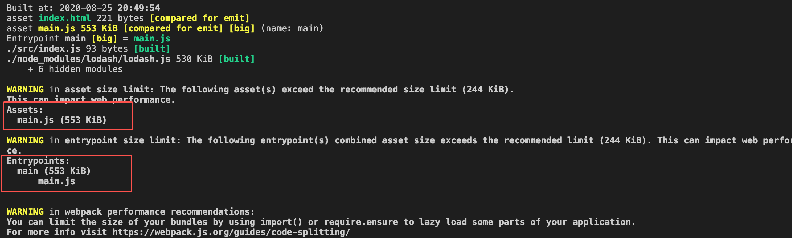
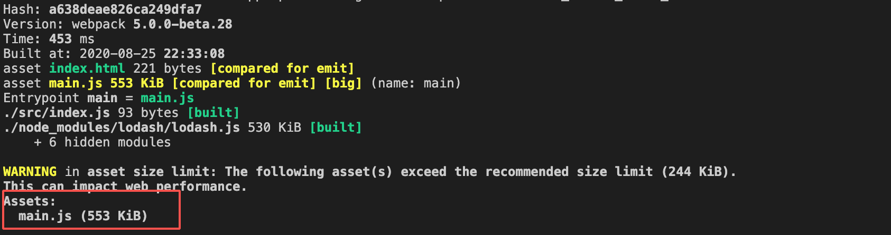
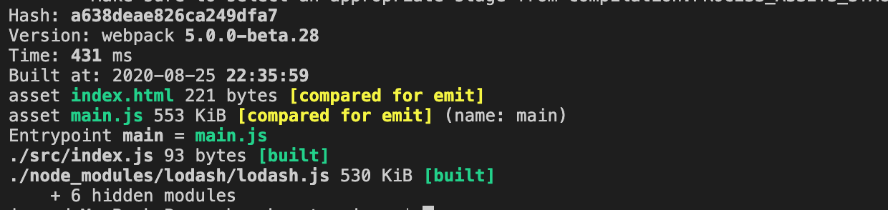

# Performance

当你的打包文件过大，超过某一个上限时，webpack 会给出相应的提示，这个属性就是来控制 webpack 如何给你提示的。它的配置非常简单。

## hints

控制提示的级别。它有三个值： `'error'`, `'warning'` 和 `false`。建议在开发环境下使用 warning，这样不影响我们的开发；在生产环节构建的时候使用 error，这样会避免将过大的资源部署到服务器上，影响用户体验。

```js
module.exports = {
  performance: {
    hints: 'warning'
  }
}
```

如果你不关心这些，可以设置为 false，这样就不会给你任何性能方面的提示了。我们使用 warning 来配置，然后测试一个包含 lodash 的应用打包后的情况：



可以看到它报了两个警告，一个是生成的 asset 超过上限，一个是 entry chunk 的大小超过上限。如果你不想做代码分割，单纯的想提高这个上限，请往下看。

## maxEntrypointSize

我们知道，通过入口文件打包后的资源，会在初始化页面的时候被用到，所以如果这个资源过大的话，肯定会影响页面的加载。这个属性就控制了入口文件打包后的资源大小，以字节为单位，默认是 250000，约等于 250kb。

我们设置的高一点再看看效果：

```js
module.exports = {
  performance: {
    hints: 'warning',
    maxEntrypointSize: 1024 * 700 // 700kb
  }
}
```



可以看到少了一个警告了，只剩下 assets 超过限制的警告。我们继续往下看。

## maxAssetSize

这里的 Asset 指的是任何 webpack 生成的文件。这个属性控制了单个资源的大小上限，也是以字节为单位，默认是 250000。

```js
module.exports = {
  performance: {
    hints: 'warning',
    maxEntrypointSize: 1024 * 700, // 700kb
    maxAssetSize: 1024 * 700, // 700kb
  }
}
```

看下结果：



可以看到，一个警告都没有了。

上述的两个属性，我这里只做为演示设置的值。在实际项目中，要根据具体的情况设置，并且结合代码分割，最大程度的提高打包质量，从而提高用户的使用体验。


## assetFilter

这个属性控制 webpack 对哪些文件做性能提示。它是一个函数，返回 true 表示给出性能提示。默认值是这个过滤掉映射文件的函数：

```js
function assetFilter(assetFilename) {
  return !(/\.map$/.test(assetFilename));
}
```

我们也可以自己定义这个函数，比如下面的就只对 js 文件做性能提示。

```js
module.exports = {
  performance: {
    assetFilter: function(assetFilename) {
      return assetFilename.endsWith('.js');
    }
  }
};

```

